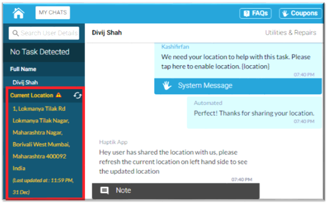
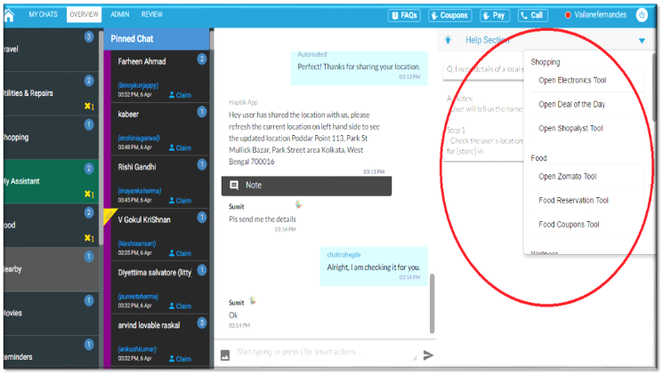

# (LHS) Left Hand Side

## User Profile

> You're viewing an older version of the documentation. Please visit the [new documentation](https://docs.haptik.ai/) for updated, comprehensive guides & resources on the topic

Here everything from User’s name, his current location, Mobile number, Address is displayed. If the user has not provided his information it will displayed as a Guest User.

Location in yellow

- At the Left hand side user’s profile section, you can see location in Yellow color.
- If user has not updated his location since 12 hours, it will automatically turn to Yellow.
- Always confirm the location with the user in this case.

# (RHS) Right Hand Side

Here various tools are integrated, which assistants can use to solve User’s queries. Currently Haptik uses Flights/Trains/Cabs/Nearby/Reminder/Recharge Tool. These tools can be expanded based on the requirement of the user.

