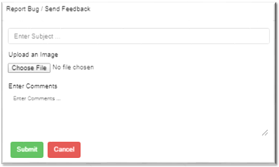
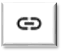
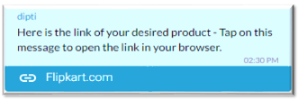
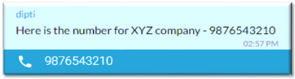
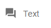
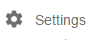

# Action Toolbar

> You're viewing an older version of the documentation. Please visit the [new documentation](https://docs.haptik.ai/) for updated, comprehensive guides & resources on the topic

Action toolbar is at the bottom of the athena right below the text field

## User Details 

User details are also available in the Action Toolbar. Just click on the face symbol and you can see a pop up window like the same which is shown at the left hand side. So on Athena User Profile is visible at the left hand side as well as at the Action Toolbar.

## Report Bug / Send Feedback 

If you are facing some issues in Athena click on the icon to send the associated logs to the technical team. If there is a snapshot please attach it and describe the issue in detail. The report directly goes to the technical team of Athena, they try to resolve it as soon as possible

## Report Inappropriate Chat 

Report inappropriate chat is used to flag a troll/spam user. Before marking troll you need to take consent of your team leader. User marked thrice as inappropriate won’t be able to use the Haptik app anymore from the associated account. You will get a pop up window this like when you click on the icon.

## Quick Links   

Quick links is the list of websites which we use in a particular channel. Depends on the channel the links will automatically get updated. Make sure that you always open websites by using these quick links and do not Google any website name. It is a quick and easy way to set context for a particular channel

## Notes 

Notes section is used to save link of the product suggested or information given from any website. These notes are shared with other assistants for a particular user. It is helpful for another assistant to get the details quickly by just checking notes. Even numbers are saved in Notes for reference. Make sure that you save notes wherever and whenever required.
The user won’t be able to see on the app as it is only for assistants. 

## User Info Link 

This tool will help you to get the link of the ongoing chat. As soon as you click on the tool it will take you to the next tab where the chat link will be visible. This is used for sharing chat link of users

# Smart Actions

To open smart action, click on  at the left hand side of the action toolbar.

Once you click on it, below window will pop-up

## Location Smart Action 

Location smart action is used to get the current location of the user. This is how it will appear on Athena as soon as user clicks on system message you will get automated pop up from HAPTIK APP. Do not use this for getting the address of the user as it just track the location of the user. 

## External Link Smart Action

Use external link smart action to send links to the user. At Enter URL you have to paste link and at the custom text mention about the link provided.

Pasting a link without using the smart action automatically converts it to one without the custom text.

## Map Smart Action

Map smart action is used to share map links from Google maps. Enter a  valid URL in the first slot and address in the custom text. 

## Call Smart Action 

Call smart action is used to send an easy link to the user.Make sure that you use call smart action as it is convenient for the user to make call on the give number. Remove all the special characters from the number.

## Text Smart Action 

Text smart action is used to send a format of message which he needs to send to any company.
Specifically used for DND, VAS, Dialer tune etc. You need to write the exact message which needs to be sent from user’s end.

## Email Smart Action 

Email smart action is used to draft an email for the user. If you know that email will be the only option to get solution, take initiative and draft an email for the user. This email will be sent from user’s email ID and not yours.

## Install Smart Action 

Install app smart action used to share Google play Store link with the user. Insert app link from official Google Play Store only.  This smart action is available only for Android users. For iOS users you can use external link smart action for sharing iTunes link.

## Rate Smart Action 

Rate smart action is used if user would like to rate our app on Google play store. If user is very happy with the services provided by us then you can share Rate smart action. Just click on RATE smart action and the sentence is framed automatically. Send it across to the user he will be redirected to Google play store.

## Share Smart Action 

Share smart action is used if user would like to share our app with his family/friends. Just click on SHARE smart action and the sentence is framed automatically.

## Setting Smart Action 

Settings smart action can be sent if user would like to make some changes in app. If he would like to turn off push notification or sound settings etc. Just click on SETTINGS smart action and the sentence is framed automatically.

## Update Smart Action 

If you see in the profile that user’s app is outdated send Update smart action. Make sure that you will help him with his query and at the end you request him to update the app. Just click on UPDATE smart action and the sentence is framed automatically.

