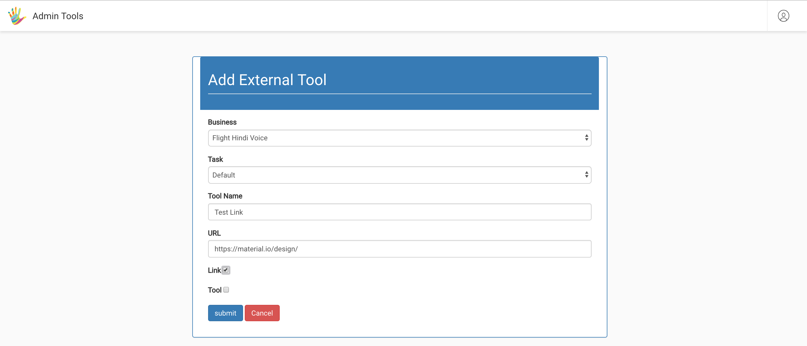
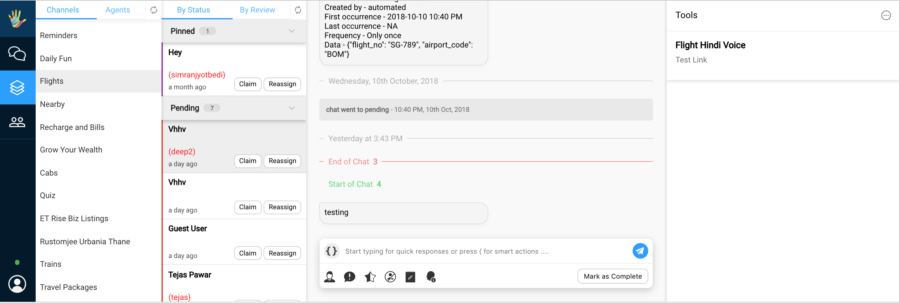
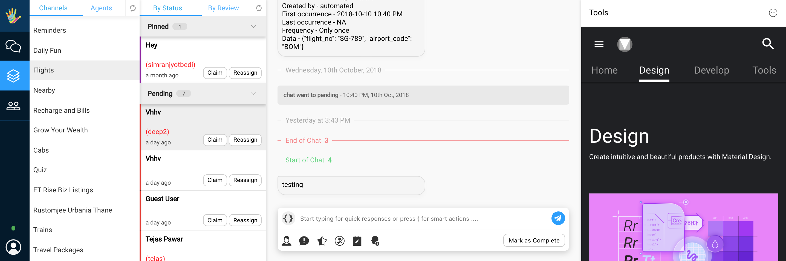

## Adding Custom Tools

#### Steps


* Go to: [a https://staging.hellohaptik.com/home/](https://staging.hellohaptik.com/home/ )
* Enter your login credentials
* Once logged in, you will see the below page (may vary based on permissions)


* Select Administrator, the below screen will apear (may vary based on permissions)


* On clicking on External Tools (highlighted), the below page will open


* As an example we have already added an external url (https://material.io/design/)
which should appear for Flight Hindi Voice Business as "Test External Link"

* On clicking "Add External Tool"
	- Business: Select you unique business name. (Should already exist)
	- Task: can be set to Default or None
	- Tool Name: can be any string (this is what will apear to the agents)
	- Url: an external link to your tool.
	- Select "Link"
	- Hit Submit



* On success, your tool will now appear for all agents allocated to your business.



* Simply Click on the tool, and the url will open on the RHS




#### Important Tech Note

* An external tool appears for a business, if a user wishes to use the same tool across multiple businesses, they can do so by adding a the same entry for the other business.

* Please make sure your `X-Frame-Options` is set to allow our host, So that your tool can open within our Iframe.

#### Important Design Note

* The RHS section, where the tool loads is restricted to exactly 26% of the page ~ 360px in width in most cases.
* Please make sure that the tool is responsive to all required screen resolutions


```json
Header set X-Frame-Options "allow-from https://staging.hellohaptik.com"
```

