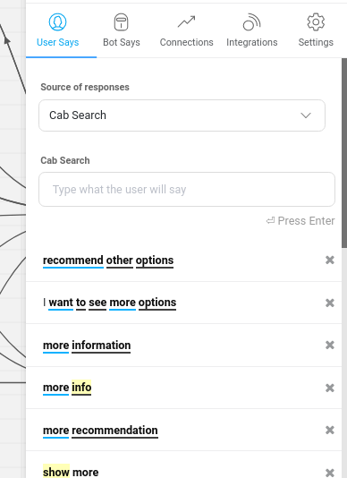
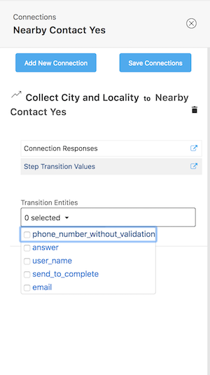
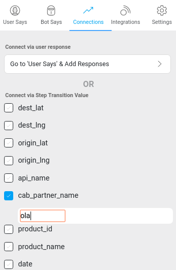

## Connections
This section will cover the following topics:  
[What are connections?](#what-are-connections)  
[Connections based on user inputs](#basis-message-input-by-user)  
[Connections based on an entity presence](#basis-an-entity-presence)  
[Connections based on particular entity values](#basis-a-particular-entity-value)  

### What are Connections? 
Connections represent the path a conversation takes from node to node. Depending on the response a user inputs to the bot, they traverse down a different connection to the appropriate next node. Bot builders must modify every connection they create to indicate which user inputs correspond to which nodes.  

The connections you create can prompt a user to transition from one node to the next in the following three ways:

### 1. Basis message input by user: 
This is when a conversation moves from one node to another based on a particular keyword/phrase or set of keywords sent by a user.

   - To set a connection based on a user input, click on the arrow linking the two nodes you need to link
   - Click on 'Connection Responses,' which will take you to the following screen:
   

   
   - Decide which type of user input you want to set as an indicator to transition to the next node. 
     - **Independent Responses**: Adding potential user inputs here indicates to the bot that a user may transition to this next node from any point in the conversation as long as their input sufficiently matches the responses input by the bot builder. 
     - **Responses from 'Previous_Node'**: This lets you limit the flow of conversation so that a user can only reach the next node if the bot has received a response from the specific preceding node.

### 2. Basis an entity presence: 
When you’ve added an entity to a conversation, you can define the transition from the node with the entity to the next as only being possible if the user has input a response that falls within the entity. This is particularly helpful when you are setting a conversational flow in which a user needs to input something like a phone number or email ID. All values within the entities are accepted, but the bot will be able to determine whether or not the user has input the correct type of value (i.e. a 9 digit number or a complete email address). 

   - To set a connection based on an entity presence, click on the arrow connecting the two nodes you're looking to connect. This will take you to the following screen: 

  

   - The entities from the first node should automatically appear in a drop down menu. Select from the list to complete the creation of a transition based on an entity presence. 

### 3. Basis a particular entity value
(a.k.a. a **Step Transition)**: The last type of transition that you can create is where a user may only move to the next node if a user inputs a specific value(s) from within an entity in the first node. 

   - To set a step transition value, click the arrow between the two nodes for which you're creating a connection. Select Step Transition Values, which will take you to this screen: 

     The entity (or entities) present in the first node will be listed in the left-hand column. In the column labeled Values, type the value from the entity (or entities) you want to set as the required transition value. 

