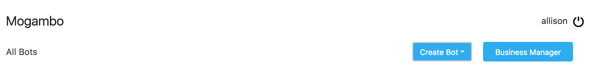

## Create a New Bot

To start building your first bot, log in to the [Haptik platform](https://staging.hellohaptik.com/home/) using the credentials that were shared with you via email. Once you've successfully logged in, navigate to the Bot Builder Tool. You will be directed to the bot builder homepage.

Click the "Create Bot" button, located in the upper right hand corner of the page:

Once you click this button, a pop-up will appear with prompts to configure your bot's basic details:

Fill the bot details according to the instructions given here:

- **Name your bot**: Give your bot a name. Note that bot names may not be replicated. 

- **Test Business**: If you aren't yet familiar with the organizational system used to classify bots, we recommend you read the full overview [here](http://haptik-docs.readthedocs.io/en/latest/bot-configuration/business-creation.html) before continuing with your bot building. *As a refresher, a business is a single bot or cluster of bots that can be deployed across a single partner or multiple partners.* This field is where you'll set the test business for your bot, which is a prerequisite to using the Test Chat feature in the bot building graph. When you test your bot in the graph, you'll be able to test not just the individual bot you're working on, but also the way a user can navigate between this bot and the other bots that are live within its business. Because bots can be deployed across multiple businesses, setting a test business becomes mandatory because this determines which business the test chat feature will allow users to interact with. 

- **Test Partner**: Just like businesses, partners are another component of the platform's organizational hierarchy. *In short, a partner is the bot building tool's largest unit of organization, and is a single business or cluster of businesses that can be deployed in multiple locations (i.e. a website, Facebook Messenger, and so forth).* For the same reason as above, users must set a test partner to make it possible to use the Test Chat feature in the bot building graph. Since businesses may be deployed across multiple partners, the test partner must be set in order for the user to be able to dictate which partner level deployment they'd like to test in the graph.

Click "Ok" to go on to the next page, where you'll be prompted to input the stories and sub-stories that will make up your conversation flow.

To read more about how to plan for and create stories and sub-stories, jump to the [Creating a Story Flow](http://haptik-docs.readthedocs.io/en/latest/bot-builder/creating-story.html) section.
