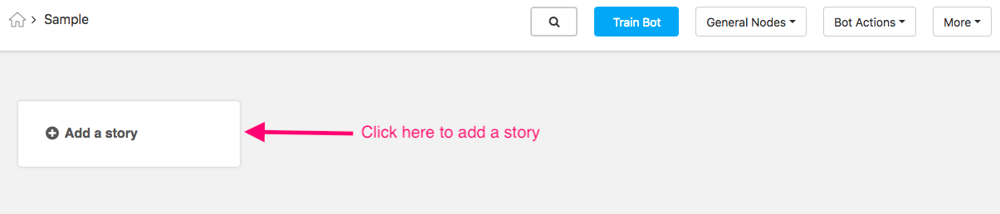

Creating a Bot
--------------

Glossary
^^^^^^^^

Story: A particular chat flow can be categorized as a story, for example hotel booking is a story. Hotel discovery is
a separate story in itself.

Sub Story: A minor segregation of story tasks, for example hotel booking could have sub-stories like get pricing,
book room, room facilities, etc.

Node: The smallest unit of a bot which will return a message or group of messages or make an API call or a combination
of any of the these based on the message sent by the user. Nodes cannot be connected across stories, stories are
completely independent.

1. Creating a story
"""""""""""""""""""

To add a story just click 'Add a story' button and enter the name of the story in 'Enter Story Name' and click on the 'OK' button.

.. image:: input_story_dialog.png

Post creation of a story, the story will be displayed as depicted below.

.. image:: post_story_creation.png

2. Creating a sub-story
"""""""""""""""""""""""

Firstly go inside the story inside which the sub-story has to be added.
To add a sub-story just click 'Add Sub Story' button and enter the name of the sub story in 'Sub Story Name' and click on the 'Create' button.

.. image:: add_sub_story_button.png

.. image:: input_sub_story_dialog.png

Post creation of a sub-story, the sub-story will be displayed as depicted below.

.. image:: post_sub_story_creation.png

2. Creating a node
""""""""""""""""""

Enter the name of the node in the 'Name' field. Enter the system name in the 'System Name' field.
The system name is used by the system to uniquely identify the node. Only underscores and alphanumeric characters are allowed
in capital case. The status field can be made inactive if it needs to be disabled.

The 'Start Node' checkbox can be enabled if the node starts a conversation. Similarly the 'End Node' checkbox can be enabled
if the node ends a conversation. When an end node is reached, and that node does not have further connecting nodes, internally we mark
this conversation as 'complete' which helps indicating that a task was complete(visible on dashboard). Click on the 'Save' button once done.

Firstly go inside the story inside which the sub-story has to be added. To add a sub-story just click 'Add Sub Story' button and
enter the name of the sub story in 'Sub Story Name' and click on the 'Create' button.

.. image:: add_node_button.png

.. image:: input_node_dialog.png

Post creation of a node, the node will be displayed as depicted below.

.. image:: post_node_creation.png

Designing chatbot interactions
^^^^^^^^^^^^^^^^^^^^^^^^^^^^^^

The designer can model the conversation flow based on the type of interactions between the user and a chatbot.
These are segmented into structured and unstructured interactions.

* As the name suggests, the structured type is more about the logical flow of information which allows including display elements like menus, forms, etc to collect information precisely from the users. For instance, a customer
buying a product is prompted to fill an order form.
* The unstructured conversation flow includes freestyle plain text. Such as conversations with family, colleagues, friends and other acquaintances fall into this segment.

Let us take the use-case of building a hotel bot. End goals of the chatbot are:

* Fetch best hotel matching the mentioned criteria
* Make hotel booking

Grouping conversations
^^^^^^^^^^^^^^^^^^^^^^

Before designing conversations for a chatbot, identify and understand the goals of the chatbot. To be more specific,
understand why the chatbot is built and what pain points it essentially solves. Finding answers to this query will
guide you to create conversations aimed at meeting end goals.

We need to understand and visualize the complete flow of the chat and define the use-cases that our chatflow should cater to.
As next steps, let’s disintegrate the whole problem into smaller chunks of solutions which will be arranged logically to form a
whole flow for the chat.

Stories: Discovery, Booking

Sub-stories: Collect criteria for hotel match, Stay dates for booking
Linking can happen across sub-stories. Sub-stories are used only as visual guide to categorize the chat flow.

Nodes: Input criteria, Filter hotels based on criteria, Input stay dates, Send stay dates

Now let's take an example of cab booking flow. We can decide on the next steps only when certain things are present
i.e. origin and destination. You can create two different nodes here as FETCH_ORIGIN and FETCH_DESTINATION. As you need
two different copies out here based on the previous state having it on the same node would need the integration function
to have an if-test to check for origin or destination presence and respond accordingly. This complicates the flow and
doesn't behave as a proper state machine. This is how we make the node design decision for our bot flow.