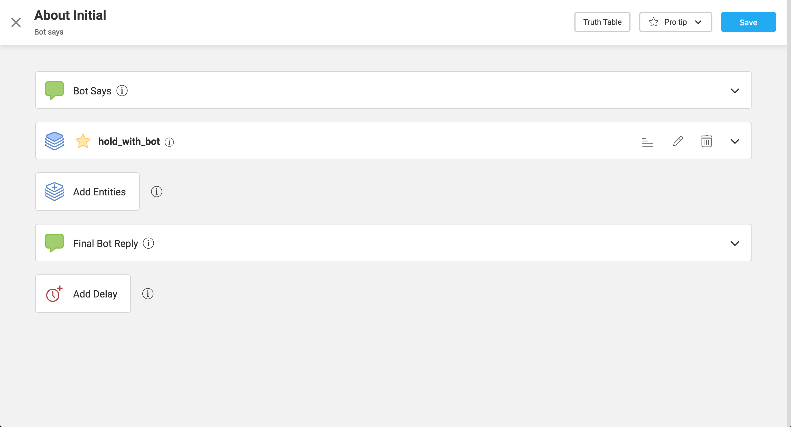
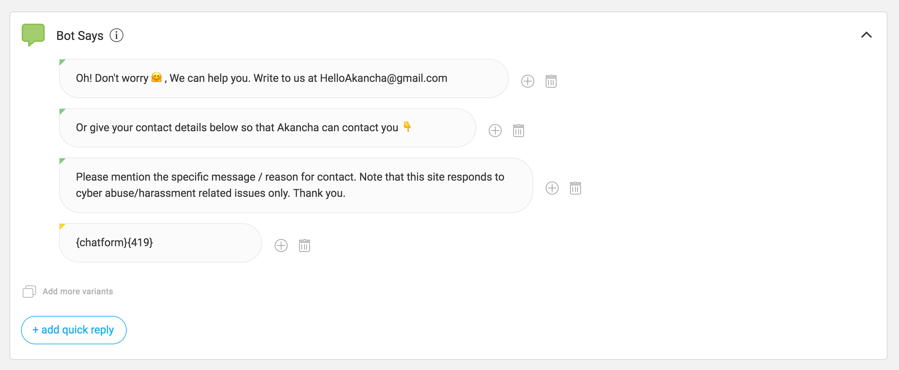

## Bot Says

Once you've completed the User Says component of a node, you'll need to define the node's **Bot Says** component. Bot Says is where nodes store the replies that are deployed in response to what the user has input, as detected by User Says. Bot Says also houses **variants** and **entities**.

To get started with adding some Bot Says responses, navigate to a specific node and click on either Bot Says or Entities. (See Screenshot Below)

Once you arrive at the Bot Says page, you'll see the following interface. This interface might differ slightly depending on the state of the node and the responses added to it. 

 

Bot Says supports three types of responses:

1. **Initial Bot Says**: The initial bot reply. It's the first message that the bot sends out when the node is activated. (**Note** that this is not active when there is only one entity present. For multiple entities, consider it to be the opening message. For more on the possible entity scenarios that can arise, see "Scenarios" section below. The initial bot says looks like: 

 

2. **Entities**: If you want to gather any sort of user input that isn't confined to a very limited set of possible responses, you'll need to create an entity. An entity represents the set of values from which a user’s response must come in order for that user to progress onwards in a conversation. Depending on the context of the conversation, the required response can either be a single value or limited group of specific values from the entity, or any value from within the entity. Entities are always added in connection with the bot’s query the required response is associated with, so that they may detect whether the required response was given. Entities look like:

3. **Final Bot Reply**: Once all the entities/data has been collected, the bot finally replies with the final bot reply. Think of it as the closing message for the node. 

   **Now that you know the three types of responses a bot can make, a quick word on adding entities**: 

   > **To add an entity to a node:**
   >
   > - Select the node onto which the entity is to be added and click on the Entities button on the side panel. 
   > - Click on "Add Entities"
   > - Bot builders can search by the name of the entity they want to add, or by the particular word that needs to be detected. If they choose the latter method of search, all existing entities that are capable of detecting that word/variant will appear as the search result.
   > - Click on one of the existing entities to add it to your node.
   >
   > - Can't find an entity that suits your purpose? Learn how to create an entity from scratch, HERE.
   >
   > **Depending on the complexity of the Bot Says component of the node, which of the preceding components a bot builder will have to add varies.**
   >
   > - *If there are no entities in the Bot Says*, this will be where a bot builder will input the replies that will come from the bot. *
   > - *If there is only one entity in Bot Says*, there is no Initial Bot Says, as the entity response will serve as the bot reply. 
   > - *If there are multiple entities in Bot Says*, there will be an Initial Bot Says, as well as entity responses between each entity that prompt users to input the answers required to move ahead.

Each of the above three types of response (initial bot reply, entities, and final bot reply) are composed of **variants,** **chat bubbles**, **quick replies**, and **mandatory words**:

- **Variants**: A bot response can consist of multiple variants. Each variant is an independent message. All variants should imply the same meaning. The bot rotates through them randomly with different users. This way, the bot avoids being repetitive even when asked the same question.

- **Chat Bubble** variant can consist of multiple message bubbles. This is where all the messages go. Each message is a separate *text* from the bot. Instead of putting a long message into just one message bubble. It is good practice to split it into multiple bubbles to make it feel more like a natural conversation.

  
  - Each of theses message bubbles can contain either text or HSL.There’s an indicator at the corner of each bubble to indicate if the HSL (if entered) is valid or not.
    - **Green** - Valid
    - **Red** - Invalid
    - **Yellow** - Deprecated
    - In addition the message can also contain certain *variables* or dynamic values. Click on the protip for an always up to date list.

- **Quick Replies:** are often cases where, in addition to providing the bot response, a bot builder will also want to include prompts for how to reply back to the bot again. We call these pre-defined prompts Quick Replies. For example, for a yes or no question, you can add "yes" and "no" as quick replies so that when the bot addresses the question to the user, the user is automatically buttons saying "yes" and "no," which they can select from quickly. 

- Bot builders can add **Mandatory Words** that function as tags. These specific responses will only match if the tags match exactly. Use these tags when: 

  - You have multiple nodes that are similar to each other
  - You want to trigger a node only if a specific keyword exists

  Note that bot responses are *not* required to involve mandatory words. These tags are circumstance specific. 
