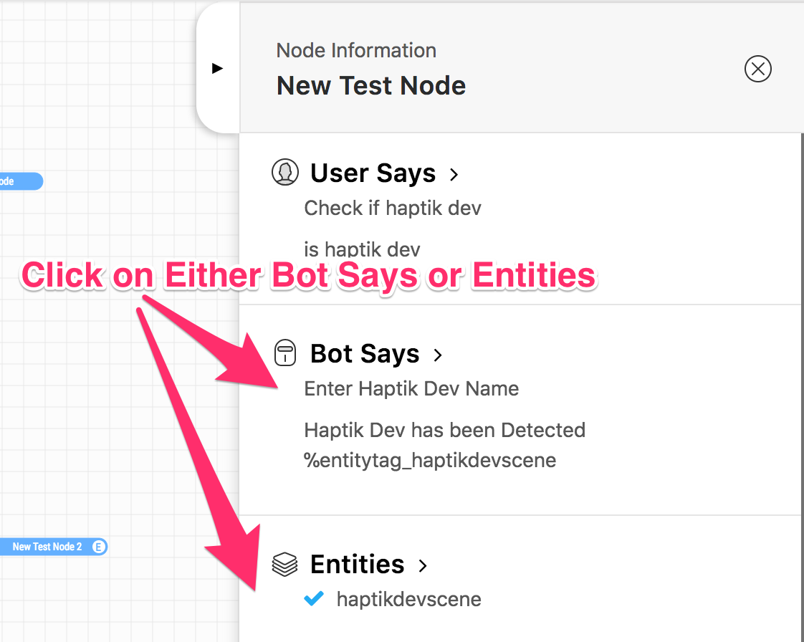
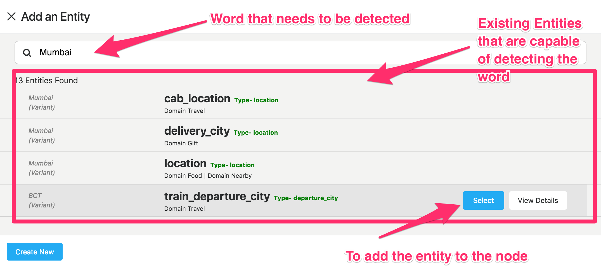

Entities
-----------------------

Entities represent a class of object or a data type that is relevant to a user's purpose. By recognizing the entities that are mentioned in the user's input, one can choose the specific actions to take to fulfill an intent.
Basically some specific data which needs to be detected from a user's input

**For Example**

* The 'email' entity allows the detection of an email id.
* The 'phone_number_without_validation' entity detects a 10 digit number.

1. Adding an Entity To a Node
^^^^^^^^^^^^^^^^^^^^^^^^^^^^^

* After selecting the node on which the entity is to be added, click on bot says or entities

* Click on Add Entities
* One can search for a particular word that needs to be detected, all existing entities that are capable of detecting that word/variant will appear as the search result

* Simply click select on one of the existing entities to add it to your node

2. Creating a New Entity
^^^^^^^^^^^^^^^^^^^^^^^^^^^^^
* Click on Create Entitiy if the existing entities can not solve your purpose, or if the search result is empty

.. image:: entities_create_click.png

* Enter the name (must be a lower case, underscrore separated text) and description of an Entity, please make this as relavent as possible because it will help you better search for your entity in the future

.. image:: entities_create_new_step1.png

* Enter the details of the data dictionary, one can use 'tab' to quicky add words and variants, once variants for a particular word are entered, press enter to store and to add new words and variants

.. image:: entities_create_new_step2.png

* The 'Backup' button will download the current data set for a dictionary.
* The 'Upload New Dictionary' button will upload data from a csv into the dictionary

* Format for upload and backup:
  word1|variant1,variant2,variant3
  word2|variant4,variant5,variant6

* Any other format will be rejected
* Click next step once you are satisfied with your dictionary
* In the final step you can add a default message that the node should respond when the entity is detected

.. image:: entities_create_new_step3.png

* On clicking of save, the entity will be created.
* You can add the newly created entity to the existing node, or you can edit the newly created entity

3. Editing an Existing Entity
^^^^^^^^^^^^^^^^^^^^^^^^^^^^^

* Only text type entities are modifyable, error message will be displayed and save will be disabled for all other entity types
* One can only edit the descrption w.r.t step-1 basic info, the name and entity type is not modifiable
* Dictionary can be edited provided that dictionary is not being used by anyother entity, an error message will appear if that is the case
* Bot responses step-3 are modifyable
* Click on save to update the entity
