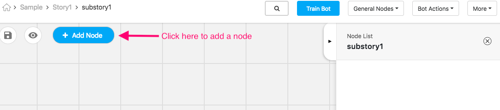
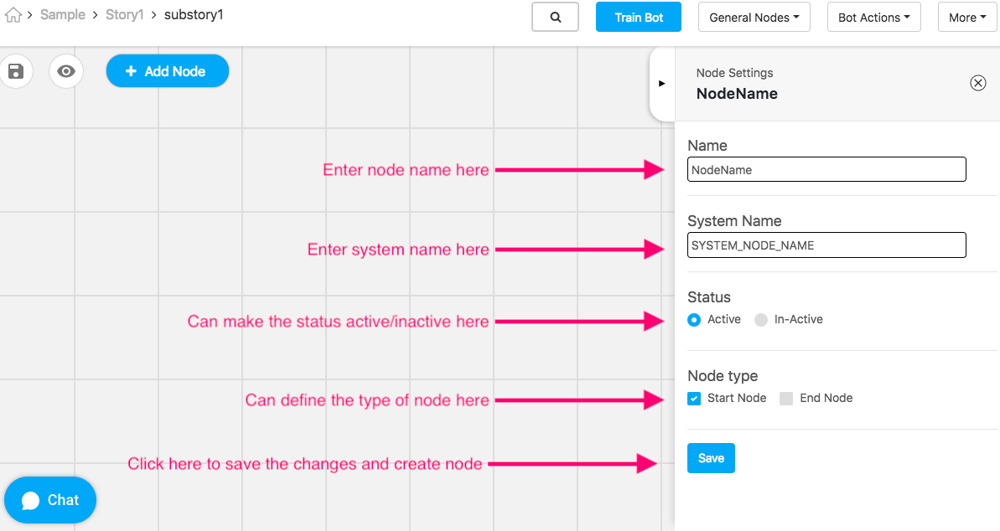
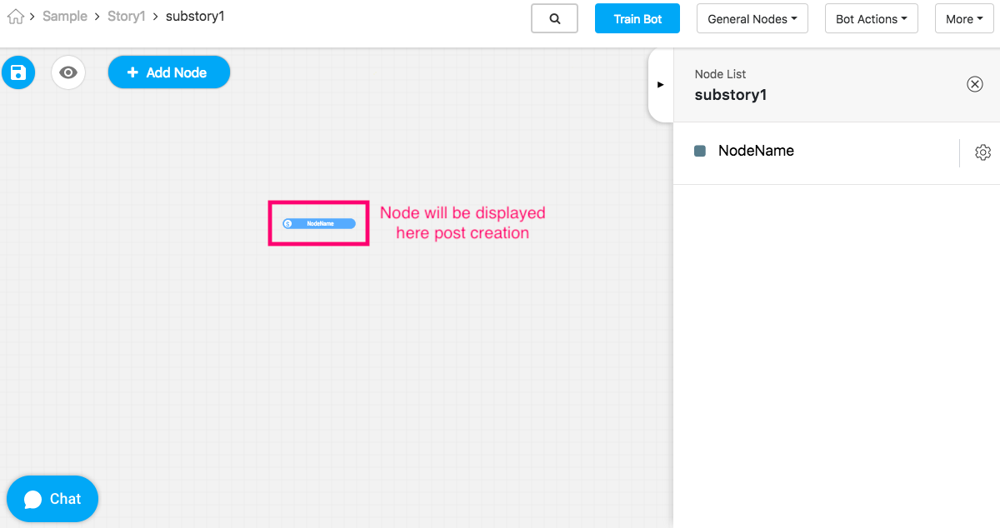

 You're viewing an older version of the documentation. Please visit the `new documentation <https://docs.haptik.ai/>`_
 for updated, comprehensive guides & resources on the topic

Nodes
---------------------------
On this page, we'll cover the following topics:

What-is-a-node_

Subcomponents-of-nodes_

Creating-a-node_

.. _What-is-a-node:
What is a Node?
^^^^^^^^^^^^^^^

**Nodes** are the interlinked building blocks of a bot. Each node acts like a gatekeeper who detects user inputs, sends out appropriate responses, and directs users to the next node. They are the points where conversation converges or diverges basis the information users input to the bot. Nodes are comprised of several important sub-components, which house important pieces of information. Read on in this section to learn more about the significance of the components **User Says, Bot Says,** and **Entities,** and **APIs**.

To jump straight to reading about any of the sub-components of nodes, click on the link below. Otherwise, keep reading below to learn about how to get started creating nodes.

.. _Subcomponents-of-nodes:
Subcomponents of Nodes
^^^^^^^^^^^^^^^^^^^^^^

.. toctree::
   :maxdepth: 2

   user-says
   bot-says
   entities
   integrating-custom-code

.. _Creating-a-node:
Creating a Node
^^^^^^^^^^^^^^^
You will create your nodes inside the Mogambo graph. To make a node, click into the sub-story graph where you'd like your node to appear, and click on the 'Add Node' button on the top left-hand corner of the graph, as depicted here:

This will cause a sidebar, as shown below, to appear on the right-hand side of the graph.

You'll need to add the following inputs:

- **Name**: The label that will appear on the node on the Mogambo graph.
- **System Name**: The system name is used to uniquely identify the node in the backend. Only underscores and capital case alphanumeric characters are allowed in this field.
- **Status**: Indicate whether the node will be active or inactive. When you are first making a bot, we'll assume all the nodes you create are active. Instances when you will deactivate nodes will arise later on.
- **Node Type**: Use node type to indicate if a node is a Start Node or an End Node. Start Nodes indicate that this is the node that will initiate a conversation, while an End Node is the last node in a conversation. When an end node is reached, and that node does not have further connecting nodes, we internally mark this conversation as 'complete,' which helps when tracking user activity.

Click 'Save' when done.

Post creation of a node, the node will be displayed as depicted below:

