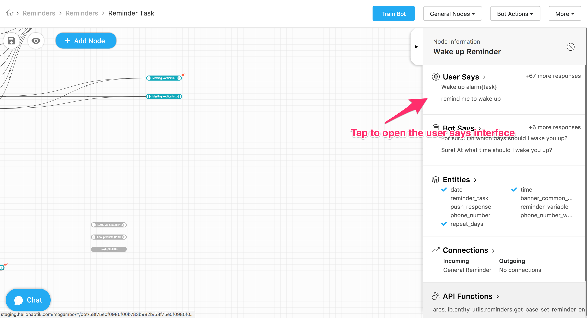
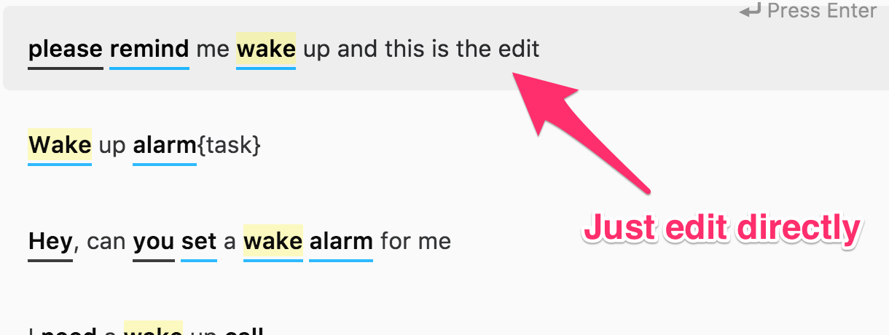
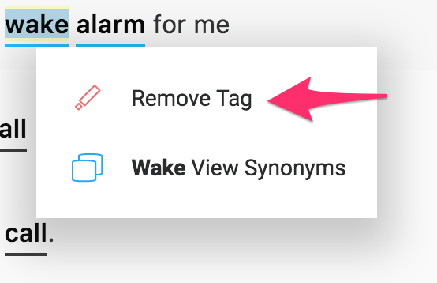

#### User Says

**User Says** is where the node identifies that the user has given an input that warrants this particular node's response. The node identifies this by comparing the keywords in the user's input to the keywords in the intent associated with this node. If the keywords are similar enough, users proceed to this particular node. 

To open up the User Says of a node, click on the User Says tab on the right-hand sidebar as indicated below:

 

There are several actions bot builders must take to train their bot to be able to detect when users have given a response associated with the node: 

- **Define the user** **intent**: This is where bot builders construct the set of synonymous responses users are most likely to make in reply to the bot's previous messages. Remember, a user intent is not a single sentene - rather, it is a set of replies with the same meaning, but different wordings. An example of an intent is as follows: 

  > **Ex.** A user wants to indicate to the bot that he would like to book a cab. The intent associated with this sentiment is: 
  >
  > - I want to book a cab
  > - Find me a taxi
  > - I'd like to make a cab booking
  > - And so forth

  Whether you add user intents under the *Independent Responses* tab or the *Responses from XYZ Node* depends on what sort of connection you want to create between this node and the previous node. See the CONNECTIONS section for more information about this. 

  - **To add a new intent**, just start typing into the input box situated at the top to add a User Response (see screenshots below). Just hit enter, and it will add it to the list. To save your changes and exit back to the graph click on the Save and Exit button on the top right corner to exit.

 

  - **To modify an intent**, click on the user response you’d like to edit and go ahead and make any changes you’d like to make. To disable a user response, simply click on the cross on the right side of the user response. This will dim the response along with strikethrough. Make sure you hit save to actually save your changes to the Back End.

 
 

- **Enable/disable** **synonyms**: In addition to defining the various manners of wording phrases that would comprise an intent, bot builders must also define sets of synonyms a user could employ in a phrase. By selecting words from phrases in an intent and defining the synonyms that fit, users create synonym clusters that are then enabled for users. 

  - **To add synonyms,** highlight a word in your input user response that has appeared with a black underline. When you highlight the word, the context menu will open. Select *Search Synonyms*. 

    The synonyms overlay opens:

    Select the meaning that best fits the context. Synonyms are now enabled for the word. You can edit the synonyms list at this point. Note that you would be editing the global synonym dictionary. These synonyms would be added for **all** other bots that are using the same word. Please edit this list with extreme caution.
    

    Close the overlay and hit Save and Exit to save your changes. 

  - **To delete synonyms**, select a word(s) with a blue underline so that the context menu opens. Click on *View Synonyms*: 

    Delete the eneabled checkbox in the left pane to disable the synonym: 

    Hit save to save your changes. 

  **NOTE!** When you enable/disable synonyms for a particular word in a user response, they’re applied across all user responses in that section. You’ll notice that when you enable synonyms for call for example, all occurences of the word call get underlined blue. (This does not apply for tags)

- **Add or remove** **tags**: Tags are what we call the keywords that the bot uses to identify the user's intent. Bot builders must manually set tags. Tags are highlighted with a yellow color.

  - **To add a tag,** select an untagged word so that a context menu opens. Select the *add tag* option. Once you've added the tag, hit save to save your changes. 

  - **To remove a tag,** select a tagged word so that a context menu opens. Select the *remove tag* options. Hit save to save your changes. 
  

