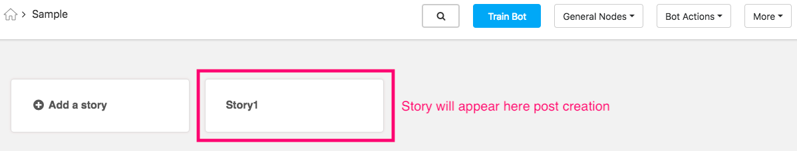

## Creating a Story Flow

Once you've configured your bot, you'll need to set up the stories and sub-stories that make up your chat flow. We've given a description of these units of organization here, but you can also see the Designing Bots section for more details about the role of stories and sub-stories in the creation of chatflows. 

- **Stories** are chatflows that usually align with the overall goals of the chatbot. For example, a trip aggregator website wants to build a chatbot with the goal of helping users: 

  - Book flights
  - Find and book hotels
  - Make restaurant reservations

  Each of these major tasks would be classified as a story.

- **Sub-stories** are the smaller tasks that help accomplish the broader story goals. Continuing our trip aggregator example from above, the sub-stories within the "Find and book hotels" story could include:

  - Collect user preferences (location, amenities, dates, etc.) for hotel match
  - Hotel booking
  - Booking payment
  - Information about hotel aggregator's other services

You can use the framework of stories and sub-stories as a skeleton for building out the chat flows for your entire bot. One important thing to remember is that while sub-stories may be linked, stories may not. 

#### Creating a Story

To add a story, just click 'Add a Story' button: and enter the name of the story in 'Enter Story Name' and click on the 'OK' button. 

Enter the name of the story in 'Enter Story Name' and click on the 'OK' button:

Post creation of a story, the story will be displayed as depicted below. 

#### Creating a Sub-story

Go into the story inside which the sub-story needs to be added. To add a sub-story, click 'Add Sub-story' button. 

 Next, enter the name of the sub-story in 'Sub Story Name' and click on the 'Create' button. 
 
 

Post creation of a sub-story, the sub-story will be displayed as depicted below. 

 

When you are done creating all the sub-stories your conversation requires, click the substory you want to start building. 
