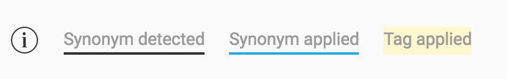

Nodes
-----

What is a Node?

User Says
^^^^^^^^^

An intent is a set of sentences that all carry the same meaning. They can be very different in terms of language but still denote the same meaning. When a user sends a message to your bot, our pipeline compares it to the phrases in your intents. Then it checks if it’s close enough to one of them. This allows the bot to decide what the intent or purpose of that message and allows our bots to respond accordingly.

Example:
- Are you a bot?
- That typing speed makes me think you're a bot !
- Am I speaking to a human?

The above sentences are all different, but at the same time their meaning/intent is the same. They ask the same question, *Are you a bot?* You can then set an appropriate response to the intent so if the bot recognizes the intent, you can prepare a user says response such as *I’m both human and robot*.

For example:

Are you a bot?
You reply so fast, I’m sure you must be some kind of robot.
Am I speaking to a human or not?
are all different, but they all ask the same question that we can can sum up as: Are you a bot? Well, that would make a great intent! If your bot is able to recognize this question, you can prepare a smart reaction, like “I’m a robot and I’m proud of it “.

As the name suggests, it is used to detect phrases that the user might say.
To reach the user says interface for a particular node, click on the User Says option on the right hand side or alternatively right click on a node and tap on User Says.

.. image:: user_says_nodes.png

.. image:: user_says_interface.png

The User Says interface allows you to

* Add/Modify/Disable different **user says** options,
* Add/Remove Tags,
* Enable/Disable synonyms

**The relevant sections below detail these features and how to use them .**

1. Adding User Says Responses
""""""""""""""""""""""""""""""
To add a user says just start typing into the input box situated at the top to add a User Response (see screenshot below)
Just hit enter, and it will add it to the list. To save your changes and exit back to the graph click on the Save and Exit button on the top right corner to exit.

.. image:: user_says_adding_user_response.png

2. Modifying/Deleting User Says Responses
"""""""""""""""""""""""""""""""""""""""""
To modify an existing user response, simply click on the user response you'd like to edit and go ahead and make any changes you'd like to make. To disable a user response, simply click on the cross on the right side of the user response. This will dim the response along with strikethrough. Make sure you hit save to actually save your changes to the Back End.

.. image:: user_says_modifying_user_response.png
.. image:: user_says_deleting_user_response.png

3. The context menu
"""""""""""""""""""""""""""""""""""""""""
The context menu allows you to add/delete synonyms and tags. To open the menu, select a word from an existing user response. The moment you select it, a popup with the relevant options shows up.

.. image:: user_says_context_menu.png

4. Adding/Deleting Tags
"""""""""""""""""""""""
**What are tags ?**

Every sentence needs to have some unique keywords from within the phrase. These are used by our engine to identify the right context in which the message is to be presented. Gogo, the bot gives priority to these words
**Tags are highlighted with a yellow color.**

**To add a tag**

* Select an untagged word(s)
* The context menu opens
* Select the *add tag* option
* Hit Save to save your changes

.. image:: user_says_add_tags.png

**To remove a tag**

* Select a tagged word(s)
* The context menu opens
* Select the *remove tag* option
* Hit Save to save your changes

.. image:: user_says_remove_tags.png

4. Adding/Deleting Synonyms
"""""""""""""""""""""""""""
**What are synonyms ?**

Sometimes you might want to capture different user responses with essentially the same meaning. For example, the statements *I want to read a book* and *I want to read a textbook* are essentially the same since book and textbook are synonyms. You can select certain words and enable synonyms for that word. All the words in that synonym cluster are then enabled for the user.

Words with their synonyms enabled have a **blue** underline under them. Words that can potentially have synonyms but are not enabled are underlined **black**.

**To add a synonym**

* Select a word(s) with a black underline
* The context menu opens
* Select on *Search synonyms*

  .. image:: user_says_context_search.png

* The synonyms overlay opens

  .. image:: user_says_search_synonyms.png

* Select the meaning that best fits the context
* Synonyms are now enabled for the word
* You can edit the synonyms list at this point, not that you would be editing the global synonym dictionary. These synonyms would be added for **all** other bots that are using the same word. Please edit this list with extreme caution.

  .. image:: user_says_edit_synonyms.png

* Close the overlay & hit Save & Exit to save your changes

**To remove a synonym**

* Select a word(s) with a blue underline
* The context menu opens
* Click on *View Synonyms*

  .. image:: user_says_context_view.png

* Deselect the enabled checkbox in the left pane to disable the synonym

  .. image:: user_says_disable_synonym.png

* Hit Save to save your changes

**NOTE: When you enable/disable synonyms for a particular word in a user response, they're applied across all user responses in that section. You'll notice that when you enable synonyms for call for example, all occurences of the word call get underlined blue. (This does not apply for tags)**

Bot Says
^^^^^^^^

Entities
^^^^^^^^

Integrating Custom Code
^^^^^^^^^^^^^^^^^^^^^^^
Once a particular node has been detected and the mandatory entities have been collected, these entities can be given to custom code to execute your own business logic. There are 3 different ways to execute this business logic.

1. API Functions
""""""""""""""""

*This is internal to Haptik Developers*

2. Webhooks
"""""""""""

A node can be configured to call a webhook once the required entities have been collected.

To deploy a live webhook that can receive webhook events, your code must be hosted on a public HTTP server that has the following:
- A Valid SSL Certificate
- An open port that accepts ``GET`` and ``POST`` requests

Select the API Functions section
Select the type as WebHook
Add the endpoint of the webhook

Specify the security challenge that will be verified

TODO: Insert Images for the above

**Request Parameters**

.. code:: json

   {
      "node":"system name of the node",
      "event":"API_INTEGRATION",
      "user":{
         "user_name":"haptik username",
         "full_name":"",
         "device_platform": 5
      },
      "entities":{
         "product_id":[
            {
               "detection":"message",
               "original_text":"71",
               "entity_value":"71"
            }
         ],
         "email":[
            {
               "detection":"user_profile",
               "original_text":"test@test.com",
               "entity_value":"test@test.com"
            }
         ],
         "product_name":[
            {
               "detection":"default",
               "original_text":"headphones",
               "entity_value":"headphones"
            }
         ]
      }
   }

.. list-table::
   :widths: 15 10 30
   :header-rows: 1

   * - Name
     - Type
     - Description
   * - node
     - String
     - Unique system name of the calling node
   * - event
     - String
     - event type e.g. API_INTEGRATION
   * - user
     - Dictionary
     - Dictionary containing user data
   * - entities
     - Dictionary
     - The entities dictionary will have a key for each entity that is detected e.g. movie_name, venue, phone_number, etc. The value for each entity is a list of dictionary as shown below.

**entity output format**

.. code:: json

   [
       {
           "entity_value": entity_value,
           "detection": detection_method,
           "original_text": original_text
       }
   ]

Consider the following example for detailed explanation:

"I want to order from mcd"

* entity_value: This will store the value of entity (i.e entity value) that is detected. For example, Mc’Donalds.
* detection: This will store how the entity is detected i.e. whether from message, structured value or fallback value.
* original_text: This will store the actual value that is detected. For example, mcd.

**Request Headers**

.. list-table::
   :widths: 15 30
   :header-rows: 1

   * - Header
     - Description
   * - Content-Type
     - application/json
   * - X-Hub-Signature
     - sha1=signature  (The HMAC hex digest of the response body. This header will be sent if the node is configured with a secret. The HMAC hex digest is generated using the sha1 hash function and the secret as the HMAC key.)

**Response Parameters**

A ``200 OK`` HTTP Response must be sent back to the Haptik Servers, Failing which a bot break response will be sent to the user. Webhook response must be sent in 30 seconds or less, failing which a bot break response will be sent to the user.
The following additional fields can be specified by the Webhook to control behaviour of the bot and send messages to the user.

.. code:: json

   {
   	 "response": [
	   	 "message1",
	   	 "message2",
	   	 ....
	   	 ],
	 "response_message_type": 16,
   	 "status": True/False,
   }

.. list-table::
   :widths: 15 10 30
   :header-rows: 1

   * - Name
     - Type
     - Description
   * - response
     - Array
     - List of messages to be sent to the user
   * - response_message_type
     - Integer
     - Message Type of the Message. Please refer the Message Type Documentation
   * - status
     - Boolean
     - If status is True, then the decorator will assign the response to success_response. If status is False, then the decorator will assign the response to failure_response.

**Validate Webhook**

The HTTP request will contain an X-Hub-Signature header which contains the SHA1 signature of the request payload, using the secret_key entered for the node, and prefixed with sha1=. Your API can verify this signature to validate the integrity and origin of the payload.

**Sample python code for webhook**

.. code-block:: python

   #!/usr/bin/env python
   """
   Simple HTTP server in python for handling haptik webhooks.

   Usage::
       ./test_server.py [<port>]

   """
   import cgi
   import json
   import hmac
   import hashlib
   from BaseHTTPServer import BaseHTTPRequestHandler, HTTPServer

   class WebhookServer(BaseHTTPRequestHandler):
       def _set_headers(self, status_code, content_type):
           self.send_response(status_code)
           self.send_header('Content-type', content_type)
           self.end_headers()

       def do_GET(self):
           self._set_headers(status_code=200, content_type='text/html')
           self.wfile.write("<html><body><h1>Test Server</h1></body></html>")

       def do_POST(self):
           content_type, pdict = cgi.parse_header(self.headers.getheader('Content-Type'))

           if content_type != 'application/json':
               self.send_response(400)
               self.end_headers()
               return

           length = int(self.headers.getheader('Content-Length'))
           if not length:
               self.send_response(400)
               self.end_headers()
               return

           body = self.rfile.read(length)
           data = json.loads(body)
           secret_key = 'test'
           hash_value = hmac.new(secret_key, body, hashlib.sha1).hexdigest()
           sha1_signature = 'sha1=' + str(hash_value)
           request_signature = self.headers.getheader('X-Hub-Signature')
           if sha1_signature != request_signature:
               self.send_response(401)
               self.end_headers()
               return
           entities = data['entities']
           product_name = entities['product_name'][0]['entity_value'] if entities.get('product_name') else None
           if product_name == 'speaker':
               message = 'The Wireless Radio Alarm Clock Speaker can be yours only for Rs.1599'
           elif product_name == 'powerbank':
               message = 'The Ambrane Powerbank can be yours only for Rs.1799'
           else:
               self.send_response(400)
               self.end_headers()
               return
           response = {"status": True, "response": [message]}
           self._set_headers(status_code=200, content_type='application/json')
           self.wfile.write(json.dumps(response))

   def run(server_class=HTTPServer, handler_class=WebhookServer, port=80):
       server_address = ('', port)
       httpd = server_class(server_address, handler_class)
       print 'Starting test server...'
       httpd.serve_forever()

   if __name__ == "__main__":
       from sys import argv

       if len(argv) == 2:
           run(port=int(argv[1]))
       else:
           run()

3. Code Upload
""""""""""""""
-*Coming Soon*
