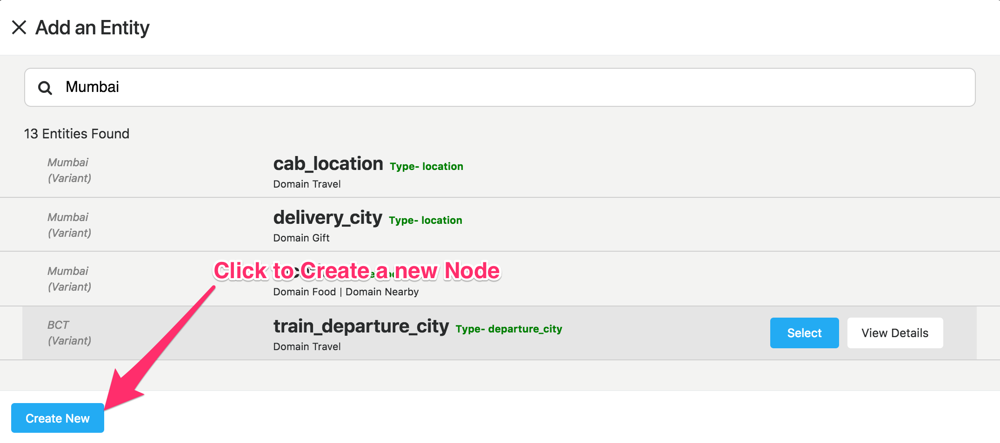
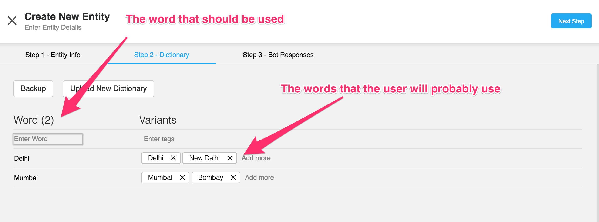
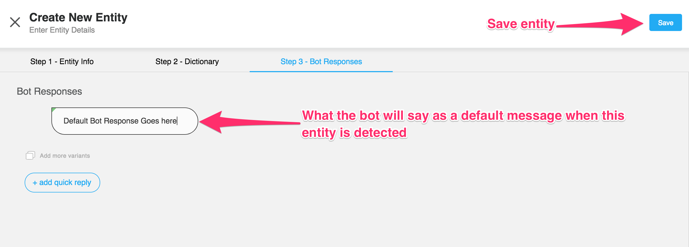

Nodes
-----

A node is a singular intent of a user. A node can be used to collect one or more entities based on that particular intent as well as execute a piece of custom code with the data that was collected.

User Says
^^^^^^^^^

An intent is a set of sentences that all carry the same meaning. They can be very different in terms of language but still denote the same meaning. When a user sends a message to your bot, our pipeline compares it to the phrases in your intents. Then it checks if it’s close enough to one of them. This allows the bot to decide what the intent or purpose of that message and allows our bots to respond accordingly.

Example:
- Are you a bot?
- That typing speed makes me think you're a bot !
- Am I speaking to a human?

The above sentences are all different, but at the same time their meaning/intent is the same. They ask the same question, *Are you a bot?* You can then set an appropriate response to the intent so if the bot recognizes the intent, you can prepare a user says response such as *I’m both human and robot*.

For example:

Are you a bot?
You reply so fast, I’m sure you must be some kind of robot.
Am I speaking to a human or not?
are all different, but they all ask the same question that we can can sum up as: Are you a bot? Well, that would make a great intent! If your bot is able to recognize this question, you can prepare a smart reaction, like “I’m a robot and I’m proud of it “.

As the name suggests, it is used to detect phrases that the user might say.
To reach the user says interface for a particular node, click on the User Says option on the right hand side or alternatively right click on a node and tap on User Says.

.. image:: user_says_nodes.png

.. image:: user_says_interface.png

The User Says interface allows you to

* Add/Modify/Disable different **user says** options,
* Add/Remove Tags,
* Enable/Disable synonyms

.. image:: user_says_legend.png

**The relevant sections below detail these features and how to use them .**

1. Adding User Says Responses
""""""""""""""""""""""""""""""
To add a user says just start typing into the input box situated at the top to add a User Response (see screenshot below)
Just hit enter, and it will add it to the list. To save your changes and exit back to the graph click on the Save and Exit button on the top right corner to exit.

.. image:: user_says_adding_user_response.png

2. Modifying/Deleting User Says Responses
"""""""""""""""""""""""""""""""""""""""""
To modify an existing user response, simply click on the user response you'd like to edit and go ahead and make any changes you'd like to make. To disable a user response, simply click on the cross on the right side of the user response. This will dim the response along with strikethrough. Make sure you hit save to actually save your changes to the Back End.

.. image:: user_says_modifying_user_response.png
.. image:: user_says_deleting_user_response.png

3. The context menu
"""""""""""""""""""""""""""""""""""""""""
The context menu allows you to add/delete synonyms and tags. To open the menu, select a word from an existing user response. The moment you select it, a popup with the relevant options shows up.

.. image:: user_says_context_menu.png

4. Adding/Deleting Tags
"""""""""""""""""""""""
**What are tags ?**

Every sentence needs to have some unique keywords from within the phrase. These are used by our engine to identify the right context in which the message is to be presented. Gogo, the bot gives priority to these words
**Tags are highlighted with a yellow color.**

**To add a tag**

* Select an untagged word(s)
* The context menu opens
* Select the *add tag* option
* Hit Save to save your changes

.. image:: user_says_add_tags.png

**To remove a tag**

* Select a tagged word(s)
* The context menu opens
* Select the *remove tag* option
* Hit Save to save your changes

.. image:: user_says_remove_tags.png

4. Adding/Deleting Synonyms
"""""""""""""""""""""""""""
**What are synonyms ?**

Sometimes you might want to capture different user responses with essentially the same meaning. For example, the statements *I want to read a book* and *I want to read a textbook* are essentially the same since book and textbook are synonyms. You can select certain words and enable synonyms for that word. All the words in that synonym cluster are then enabled for the user.

Words with their synonyms enabled have a **blue** underline under them. Words that can potentially have synonyms but are not enabled are underlined **black**.

**To add a synonym**

* Select a word(s) with a black underline
* The context menu opens
* Select on *Search synonyms*

  .. image:: user_says_context_search.png

* The synonyms overlay opens

  .. image:: user_says_search_synonyms.png

* Select the meaning that best fits the context
* Synonyms are now enabled for the word
* You can edit the synonyms list at this point, note that you would be editing the global synonym dictionary. These synonyms would be added for **all** other bots that are using the same word. Please edit this list with extreme caution.

  .. image:: user_says_edit_synonyms.png

* Close the overlay & hit Save & Exit to save your changes

**To remove a synonym**

* Select a word(s) with a blue underline
* The context menu opens
* Click on *View Synonyms*

  .. image:: user_says_context_view.png

* Deselect the enabled checkbox in the left pane to disable the synonym

  .. image:: user_says_disable_synonym.png

* Hit Save to save your changes

**NOTE: When you enable/disable synonyms for a particular word in a user response, they're applied across all user responses in that section. You'll notice that when you enable synonyms for call for example, all occurences of the word call get underlined blue. (This does not apply for tags)**

Bot Says
^^^^^^^^
Bot Says is used to indicate what the bot can say to the user. It can be a simple bot reply or an HSL component. You can also collect entities (more on that later).

Getting Started
""""""""""""""""
To get started with adding some Bot Says responses, navigate to a specific node and click on either Bot Says or Entities. (See Screenshot Below)

.. image:: bot_says_adding-bot-says.png

Once you arrive on the Bot Says page you see the following interface. This interface might slightly differ based on the state of the node and responses added to it. (More on the different scenarios below)

.. image:: bot_says_bot-says-screen.png

Key Terms
"""""""""
The bot supports the following types of responses.

* **Entity**: Entities represent a class of object or a data type that is relevant to a user's purpose. By recognizing the entities that are mentioned in the user's input, one can choose the specific actions to take to fulfill an intent. Basically some specific data which needs to be detected from a user's input (**Explained in detail below**)

  .. image:: bot_says_entity.png

* **Bot Says**: The initial bot reply. It's the first message that the bot sends out when the node is activated. Note that this is not active when there is only one entity present. For multiple entities, consider it to be the opening message

  .. image:: bot_says_bot-says-card.png
  .. image:: bot_says_bot-says-card-expanded.png

* **Final Bot Reply**: Once all the entities/data has been collected, the bot finally replies with the final bot reply. Think of it as the closing message for the node.

  .. image:: bot_says_final-reply.png

* **Delay (Message)**: If the user is inactive for a specific set time, then the the bot replies with the Delay message. The delay can be set using the slider, **it can be set between 20 seconds and 20 minutes.**

  .. image:: bot_says_delay.png

Each of the above responses are composed of **variants**, **messages**, and **quick replies**

* **Variants**: A bot response can consist of multiple variants. Each variant is an independent message. All variants should imply the same meaning. The bot rotates through them randomly with different users. This way, the bot avoids being repetitive even when asked the same question.

  .. image:: bot_says_variants.png

* **Message (Bubble)**: A Variant can consist of multiple message bubbles. This is where all the messages go. Each message is a separate *text* from the bot. Instead of putting a long message into just one message bubble. It is good practice to split it into multiple bubbles to make it feel more like a natural conversation.

  .. image:: bot_says_message-bubble.png

  **Each of theses message bubbles can contain either text or HSL.**
  There's an indicator at the corner of each bubble to indicate if the HSL (if entered) is valid or not.

  * **Green** - Valid
  * **Red** - Invalid
  * **Yellow** - Deprecated

  In addition the message can also contain certain *variables* or dynamic values. Click on the protip for an always up to date list.

  .. image:: bot_says_protip.png

* **Quick Reply**: Once the bot responds with a particular message, there are often cases when you want to suggest certain *quick replies* by the user.

  For example for a yes or no question, you can just add Yes and No as quick replies, so when the bot asks the relevant question to the user, the user is automatically
  shown yes and no quick buttons to select and reply

  .. image:: bot_says_quick-reply.png

* **Mandatory Words**: These words function as tags. These specific responses will only match if the tags match exactly. Use these tags if

  - You have multiple nodes that are similar to each other.
  - You want to trigger a node only if a specific keyword exists

  .. image:: bot_says_mandatory_open.png
  .. image:: bot_says_mandatory.png

Scenarios
"""""""""
The flow goes from top to bottom in terms of evaluation. **The order of the entities matters** First the initial bot reply, then the entities, and then finally the final bot reply. The delay message is sent only after a certain level of inactivity. The initial/final bot replies might be not needed in some scenarios.

* **No Entities** - If it's a simple node that doesn't need to collect entities or data, a simple bot says is all that's needed. You won't be able to add a final bot reply as that would be redundant as there are no middle steps.

|
* **Only 1 Entity** - If there's only one entity, then there is no initial bot reply as that entite's responses serve as the initial bot reply.

|
* **Multiple Entities** - If there are multiple entities, then all the responses are required. (Intial Bot Says, Entity Responses as well as the final bot reply).

  **Here the order of the entities matter. To change the order simply click and drag the reorder handle.**

  .. image:: bot_says_drag.png

**Once done editing, make sure to hit the save button as the changes are not saved automatically !**

Entities
^^^^^^^^
Entities represent a class of object or a data type that is relevant to a user's purpose. By recognizing the entities that are mentioned in the user's input, one can choose the specific actions to take to fulfill an intent.
Basically some specific data which needs to be detected from a user's input

**For Example**

* The 'email' entity allows the detection of an email id.
* The 'phone_number_without_validation' entity detects a 10 digit number.

1. Adding an Entity To a Node
"""""""""""""""""""""""""""""

* After selecting the node on which the entity is to be added, click on bot says or entities

.. image:: entities_open_node.png

* Click on Add Entities
* One can search for a particular word that needs to be detected, all existing entities that are capable of detecting that word/variant will appear as the search result

.. image:: entities_add.png

* Simply click select on one of the existing entities to add it to your node

2. Creating a New Entity
"""""""""""""""""""""""""""""
* Click on Create Entitiy if the existing entities can not solve your purpose, or if the search result is empty

* Enter the name (must be a lower case, underscrore separated text) and description of an Entity, please make this as relavent as possible because it will help you better search for your entity in the future

.. image:: entities_create_new_step1.png

* Enter the details of the data dictionary, one can use 'tab' to quicky add words and variants, once variants for a particular word are entered, press enter to store and to add new words and variants

* The 'Backup' button will download the current data set for a dictionary.
* The 'Upload New Dictionary' button will upload data from a csv into the dictionary

* Format for upload and backup:
  word1|variant1,variant2,variant3
  word2|variant4,variant5,variant6

* Any other format will be rejected
* Click next step once you are satisfied with your dictionary
* In the final step you can add a default message that the node should respond when the entity is detected

* On clicking of save, the entity will be created.
* You can add the newly created entity to the existing node, or you can edit the newly created entity

3. Editing an Existing Entity
"""""""""""""""""""""""""""""

* Only text type entities are modifyable, error message will be displayed and save will be disabled for all other entity types
* One can only edit the descrption w.r.t step-1 basic info, the name and entity type is not modifiable
* Dictionary can be edited provided that dictionary is not being used by anyother entity, an error message will appear if that is the case
* Bot responses step-3 are modifyable
* Click on save to update the entity

