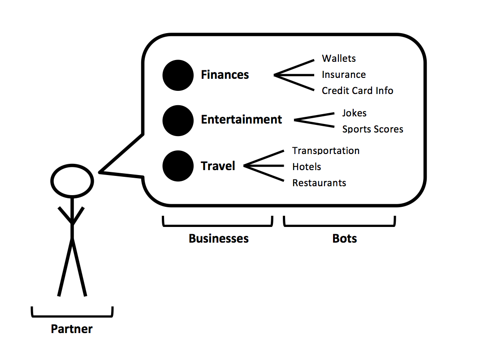
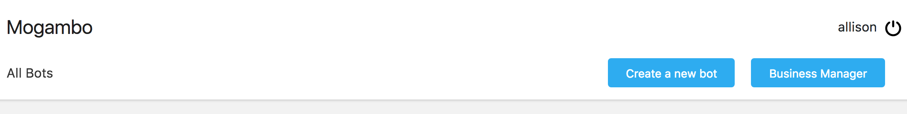
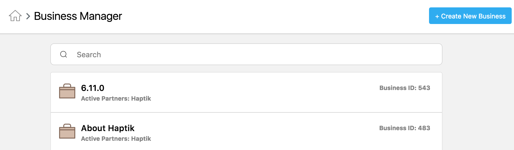
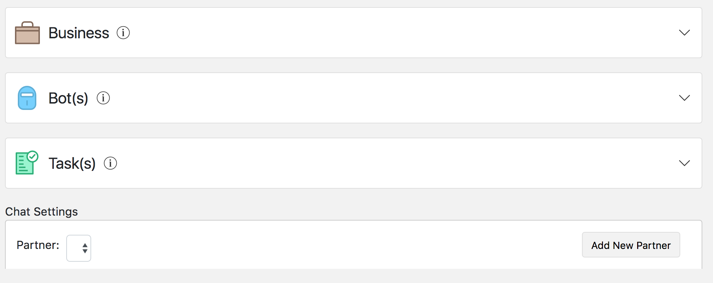
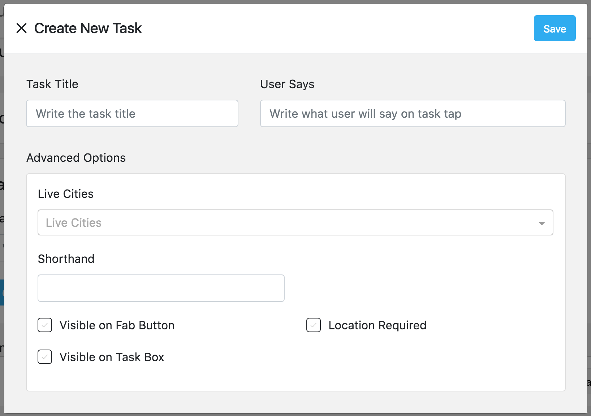

## Business Creation

To keep track of where your bots are being kept and being deployed, you’ll need to maintain a bot organization system. We’ve devised a three-tiered organizational system that will help you keep bots organized in such a manner that allows you to easily deploy bots across multiple channels. The three tiers of this system are called **bots**, **businesses**, and **partners**:

- The smallest unit of organization is the actual **bot**. Bots are clusters of chatflows that accomplish limited goals. You can think of a bot like a single tangent of a conversation (i.e. if the conversation is about technology, a bot would be the conversational tangent about blockchain). 
- Several bots can be grouped together into one **business**. Continuing the analogy from before, a business would therefore be the *topic* of a conversation (i.e. the business called "technology" would be comprised of several bots focused on various sub-topics related to technology, such as blockchain, servers, and so forth). While most businesses are comprised of multiple bots, it is also possible for a business to consist of only a single bot. 
- The largest unit of organization is a **partner**. A partner is a unit made up of several businesses. You can think of a partner like an assistant who is able to engage in several topics of conversation, such as technology, entertainment, and sports. Partners (along with their associated businesses and bots) can be deployed across various devices (mobile, web, Facebook chat, etc). Regardless of the place of deployment, however, a partner is always comprised of the same set of businesses (and their associated bots). 

The following image might help you envision this organizational system: 

Below are two examples of Haptik's two main partners that serve two different functions:

> The first partner is the Haptik Personal Assistant app, which anyone can download onto their phones and use to engage in conversations covering several topics (a.k.a. businesses), such as Finances, Reminders, and Daily Fun. Within each business, users can discuss various subtopics. which would be the bots. For example, the Finances business in the Haptik Personal Assistant app is comprised of bots that can engage in coversations about credit cards, financial scores, etc.

> The second partner is the Haptik company website chatbot, which is there to provide the general public with information about the company. This chatbot is comprised of businesses such as About Chatbots, Haptik Products, Case Studies, etc. Within the business called Haptik Products, users can interact with bots covering solutions for advertisers, solutions for enterprises, and so forth. 

#### How to Create a Business

To get started creating businesses, navigate to the Business Manager tab from the Mogambo homepage and click the Create New Business button on the page's top right-hand corner:

You'll be taken to this page, where you'll need to click the "Create New Business" button, located on the top right-hand corner of the page. 

 

You'll be taken to this page, where you now need to fill in information in four main sections:

 

- Business
- Bot
- Tasks
- Partner

For each of the aforementioned sections, follow the instructions as outlined below to correctly input the details that will define your business. 

#### Business

In this section, fill out information that will help you deploy this business in the future. 

- **Business Name**: How your bot will labeled. This is the best place to give this business a label referring to the overarching topic of its conversational capabilities. You can change the business name once you've saved it.
- **Business Via Name**: This is autopopulated. You cannot change the business via name. 
- **Preview Text:** The text that will be shown to users before they've started chatting with the bot. 
- **Order:** The order your bots will appear in the partner in which it's deployed. 
- **Active Cities**: Businesses can be activated or deactivated for various cities, in case you'd like to create geographically targeted clusters of bots. 
- **Enable OTP Verification**: Clicking on this box means users must be OTP verified to enter the channel. 

#### Bot(s)

In this section, you will assign the bots that will be live in your business. 

- **Active Bots**: When a user adds an input while conversing in this business, Active Bots will be the bots whose User Says will be searched for a relevant match to the user's input. 
- **Default Bots**: When a user adds an input, this is the first bot whose User Says will be searched for a relevant match to the user's input. Set the default bot to the conversation most relevant to the business.
- **Fallback Bots**: When user input doesn't match the User Says of any of the active bots, the Bot Says response will be automatically sent from the fallback bot. 
- **Enable Human Assistance**: Will make it possible for human chat assistants to intervene when bots in your business break. 
- **Enable Small Talk:** Allows certain common chitchat phrases to be understood and replied to. Know that the smalltalk module cannot be customized or changed.

#### Task(s)

Each business is equipped with a taskbar that will helps users understand what they can get out of the conversation. Each task will be linked to one or multiple bots. 

**Taskbar Header Message**: Before you can add tasks, add a header message. This message will be shown to users to help frame the purpose of this cluster of tasks. 

**Create New Task**: When you click this box, a new pop-up will appear, as below:

 

Fill out the details as outlined here: 

- **Task Title**: Give the task a label (bear in mind that these titles need to fit into a taskbar in a chatbox - so keep it short)
- **User Says**: What the user will say once the task is tapped. 
- **Live Cities**: Again, you can indicate if the bot is only supposed to be enabled in certain geographies or globally. 
- **Shorthand**: 
- **Visible on Fab Button**: The fab button is a shortcut visible at the partner level that lists various tasks that are accessible via businesses within the partner. Sort of like a list of favorite tasks.
- **Visible on Task Box**: Checking this box will make this task visible on the business's task box.
- **Location Required**: Enabling this box will require users to input their location to move ahead with the task. 

Click save. 

#### **Chat Settings** 

Finally, you need to assign the business a partner. As described above, partners are where clusters of businesses are deployed. 

To assign a new partner, click the "Add New Partner" button on the right side of the bar. You may add more than one partner. 

You're done! Click save on the top right-hand corner of the Create New Business Page and navigate back to the bot you'd like to build.

