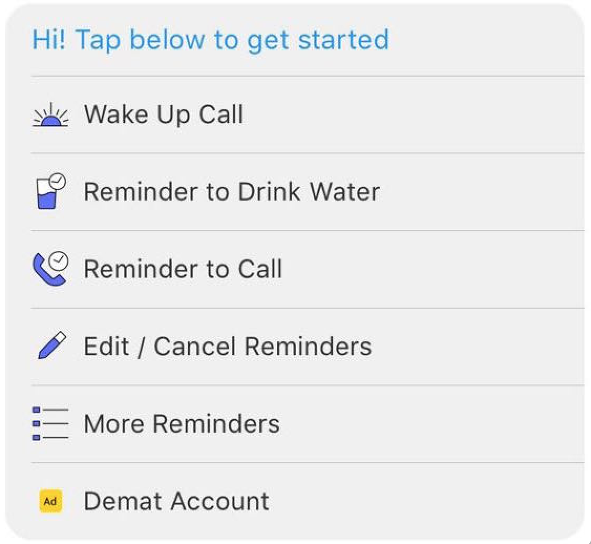

## Business Creation

> You're viewing an older version of the documentation. Please visit the [new documentation](https://docs.haptik.ai/) for updated, comprehensive guides & resources on the topic

#### Organizational Hierarhcy

The Haptik bot builder platform has a three-tiered organizational system that will help keep bots organized in such a manner that allows bot developers to easily deploy bots across multiple channels. The three tiers of this system are called **bots**, **businesses**, and **partners**:

- The smallest unit of organization is the actual **bot**. Bots are clusters of chatflows that accomplish limited goals. You can think of a bot like a single tangent of a conversation (i.e. if the conversation is about technology, a bot would be the conversational tangent about blockchain). 
- Several bots can be grouped together into one **business**. Continuing the analogy from before, a business would therefore be the *topic* of a conversation (i.e. the business called "technology" would be comprised of several bots focused on various sub-topics related to technology, such as blockchain, servers, and so forth). While most businesses are comprised of multiple bots, it is also possible for a business to consist of only a single bot. 
- The largest unit of organization is a **partner**. A partner is a unit made up of several businesses. You can think of a partner like an assistant who is able to engage in several topics of conversation, such as technology, entertainment, and sports. Partners (along with their associated businesses and bots) can be deployed across various devices (mobile, web, Facebook chat, etc). Regardless of the place of deployment, however, a partner is always comprised of the same set of businesses (and their associated bots). 

The following image might help you envision this organizational system: 

Below are two examples of Haptik's two main partners that serve two different functions:

> The first partner is the Haptik Personal Assistant app, which anyone can download onto their phones and use to engage in conversations covering several topics (a.k.a. businesses), such as Finances, Reminders, and Daily Fun. Within each business, users can discuss various subtopics. which would be the bots. For example, the Finances business in the Haptik Personal Assistant app is comprised of bots that can engage in coversations about credit cards, financial scores, etc.

> The second partner is the Haptik company website chatbot, which is there to provide the general public with information about the company. This chatbot is comprised of businesses such as About Chatbots, Haptik Products, Case Studies, etc. Within the business called Haptik Products, users can interact with bots covering solutions for advertisers, solutions for enterprises, and so forth. 

#### How to Create a Business

There are two ways to create a business. The first way is to create a business at the same time as you create a bot from the bot builder homepage. For more information about how to do this, jump to the page that describes how to create a new bot [here](http://haptik-docs.readthedocs.io/en/latest/bot-builder/creating-bot.html). 

The second way to create a business is through the business manager page. To get started creating businesses from the business manager, navigate to the Business Manager tab from the Mogambo homepage and click the "Create New Business" button on the page's top right-hand corner:

You'll be taken to this page, where you'll need to click the "Create New Business" button, located on the top right-hand corner of the page. 

 

You'll be taken to this page, where you now need to fill in information in four main sections:

 

- Business
- Bot
- Tasks
- Partner

For each of the aforementioned sections, follow the instructions as outlined below to correctly input the details that will define your business. 

#### Business

In this section, fill out information that will help you deploy this business in the future. 

- **Business Name**: How your bot will labeled. This is the best place to give this business a label referring to the overarching topic of its conversational capabilities. You can change the business name once you've saved it.
- **Business Via Name**: This is autopopulated. You cannot change the business via name. 
- **Preview Text:** The text that will be shown to users before they've started chatting with the bot. 
- **Order:** The order your bots will appear in the partner in which it's deployed. 
- **Active Cities**: Businesses can be activated or deactivated for various cities, in case you'd like to create geographically targeted clusters of bots. 
- **Enable OTP Verification**: Clicking on this box means users must be OTP verified to enter the channel. 

#### Bot(s)

In this section, you will assign the bots that will be live in your business. 

- **Active Bots**: When a user adds an input while conversing in this business, Active Bots will be the bots whose User Says will be searched for a relevant match to the user's input. 
- **Default Bots**: When a user adds an input, this is the first bot whose User Says will be searched for a relevant match to the user's input. Set the default bot to the conversation most relevant to the business.
- **Fallback Bots**: When user input doesn't match the User Says of any of the active bots, the Bot Says response will be automatically sent from the fallback bot. 
- **Enable Human Assistance**: Will make it possible for human chat assistants to intervene when bots in your business break. 
- **Enable Small Talk:** Allows certain common chitchat phrases to be understood and replied to. Know that the smalltalk module cannot be customized or changed.

#### Task(s)

Bot builders can define **tasks** for each business. Tasks are the activities that the chatbot can assist users with. On the web SDK, the tasks associated with each business can be viewed by the user while they are chatting in that particular channel. Providing this taskbox helps guide users to initiate conversations that the chatbot can handle most effectively. For example, a chatbot designed to help users set reminders might have the following taskbox:

Multiple businesses that are clustered together that have some sort of homescreen from which where multiple businesses can be accessed can also have something called a **fab button**. A fab button essentially serves the same purpose as a taskbox, but aggregates key tasks from each business and presents these the user from the homescreen.

You can edit a business' tasks from the business manager tab. Scroll down to the tasks toolbar and click:

When the editing fields open, you'll need to fill out the following information: 

**Taskbox Header Message**: This header will be shown to users to explain how to use the taskbox. In the sample taskbox above, the header is the text above the tasks that says, "Hi! Tap below to get started." 

**Create New Task**: When you click this box, a new pop-up will appear, as below:

 

Fill out the following details: 

- **Task Title**: Give the task a label. This is what will show up on the actual task button.
- **User Says**: When the user taps on a task, a user says message is generated and sent in tandem. Enter what the user says associated with this task will be in this field. 
- **Live Cities**: Indicate if this task should be live globally or only in certain geographies. 
- **Shorthand**: 
- **Visible on Fab Button**: As explained above, the fab button is a shortcut visible at a partner level (i.e. where several businesses are clustered together) that lists key tasks from each business. Check off this box if the task you're creating should be added to the fab button.
- **Visible on Task Box**: Check this box to make this task active on the taskbox associated with this channel. If you want to deactivate a task at any point, uncheck this box, and it will be removed from the taskbox.
- **Location Required**: Enabling this box will require users to input their location to move ahead with the task. 

Click save. You've created a task! 

#### **Chat Settings** 

This section is where you can deploy businesses across a single or multiple partners, and customize several chat settings for each partner. The section is located at the bottom of the business manager page and looks like this:

To make this business live on a new partner, click on "Add New Partner." A modal with the full list of partners you have permissions to access will appear. To make this business live on a partner, check off the box next to the partner name and exit the modal. 

To customize the settings for each partner the business is live on, click the dropdown next to "Partner:" on the top lefthand side of this section. Once you've selected a partner from this dropdown, the rest of the settings in this section will only be applied to how this business appears in that particular partner. You can apply the following customized settings:

- **Make this Business Active/Archived**: To make this business live on a partner, check off "Make this Business Active." If you want to temporarily make the business inactive on the partner, select "Make this Business Archived."
- **Make this Business Sponsored**:
- **Upload Business Icon**: When there are multiple businesses clustered together in a partner that are shown in a homescreen, you can assign each business an icon. Upload that icon here.
- **Task Title**: The taskbox that will appear for each business can be customized to the business's various partners. Select "Add Task" to start adding tasks to the business's taskbox on a particular partner. A modal with a list of all the tasks associated with the business will appaer; select the tasks you want to make live on a particular partner. Exit the modal. 
- **Bot Break Message**: This is the message that will be sent to users when the bot breaks.
- **Outlier Message**: This is the message that will be sent to users when a message is detected to be an outlier. 
