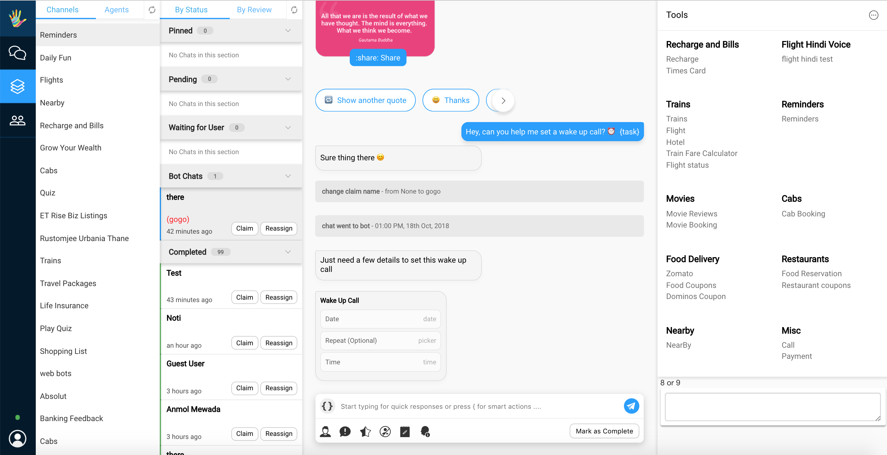

## Introduction

#### What Are Custom Tools

When a client wishes to use some of their internal tools within our agent dashboard for ease of access, the can do so.

The below example shows how we use out tools internally.



The RHS section is where all the tools, as defined by our clients will appear.

When a user selects a tool, the url associated to that tool will be loaded within that iframe.
Example: On clicking Reminders


The agent can then use the tool as its meant to be, and assit the user in accomplishing his/her task.


#### Important Note

* An external tool appears for a business, if a user wishes to use the same tool across multiple businesses, they can do so by adding a the same entry for the other business.

* Please make sure your X-Frame-Options is set to allow our host, So that your tool can open within our Iframe.

```json
Header set X-Frame-Options "allow-from https://staging.hellohaptik.com"
```

