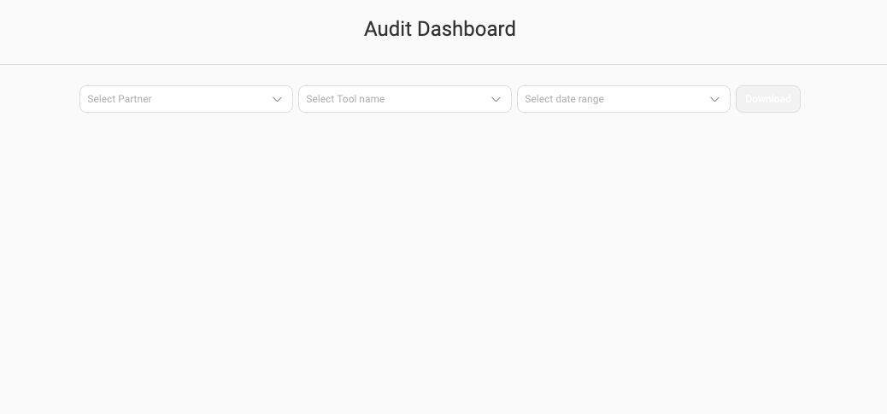
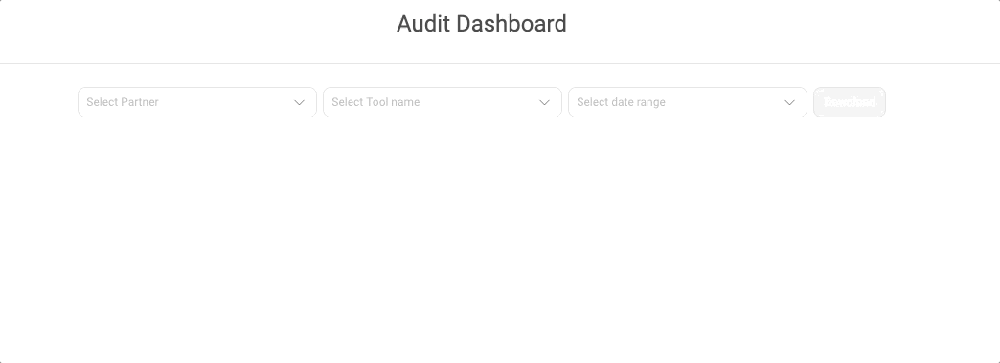
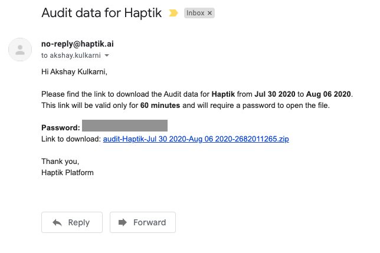
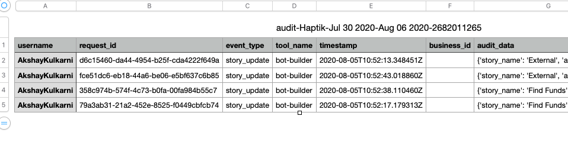

The Audit Dashboard tool allows users to download audit logs for each of the platform tools for a specified period of time. These audit logs give you information about what changes were made and by whom.

**Note**: The Audit Dashboard is only available to Partner Admins.

## Using the Audit Dashboard

* Partner Admins can select the partner, the tool and the date period for which they want to get the data.

* The Partner Admin will then recieve an email with a encoded zip file of the audit data along with the password to access the zip file.

* After opening the zip file, the Partner Admin will find a csv file of the requested logs.

