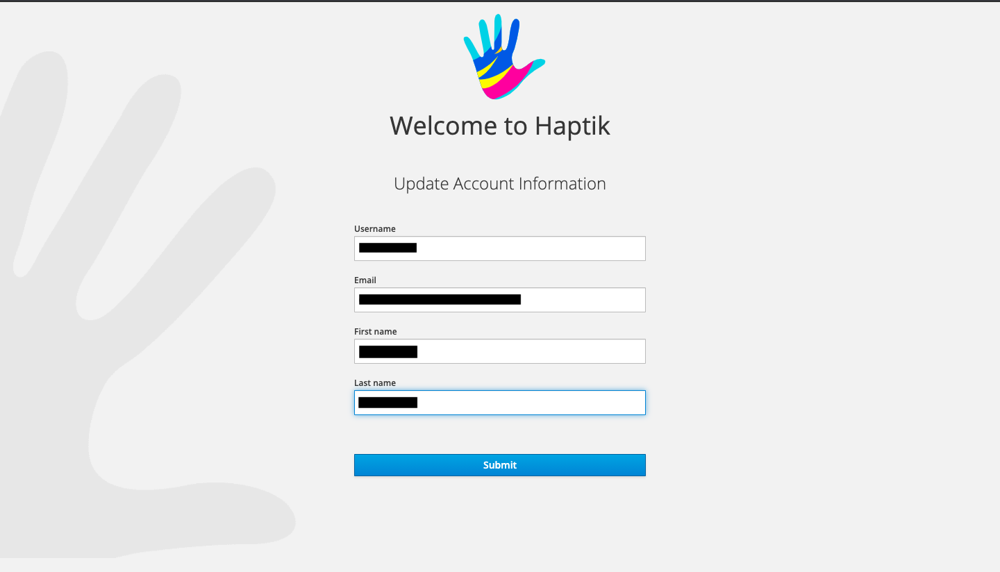

Azure AD integration with the Haptik platform allows the 
platform user to login with their existing Azure AD credentials.

## Steps to login with Azure AD credentials

1) Haptik platform user can go to the homepage and then login 
using Microsoft option with their Azure AD credentials. 
Once logged in, then the user will be shown a page to update Profile information. 
Over there the user can update the username and email which will be required for the Haptik Platform.
Only use lowercase alphanumeric characters for username. 
After this is done, then they will be redirected to the login page 
again since their account is not yet whitelisted. 
The user can then share the username, full name and email that they selected with the Haptik Platform Admin.

    
    
    
    
    

2) Haptik Platform Admin will then [create the user](permission-management.md#creating-new-user) in the system 
using the shared details.

3) Haptik Platform Admin will then inform the user that the access is granted. 

4) User will then login to the Haptik Platform using the Microsoft option with their Azure AD credentials.

   
