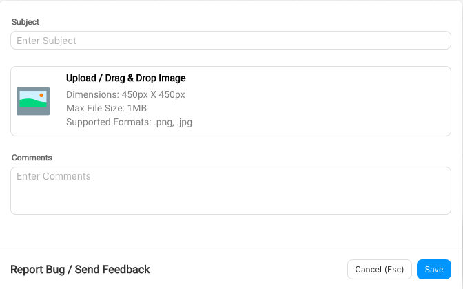

Toolbar is at the bottom on the message composer box right below the text typing area.

## Report Bug / Send Feedback

If you are facing some issues in our *Live chat* tool, click on the icon to send the associated logs to our technical team. If there is a snapshot, please attach it and describe the issue in detail. The report directly goes to a concerned representative, and they try to resolve it as soon as possible.

## Report Inappropriate Chat

Report inappropriate chat is used to flag a troll/spam user. Before marking troll you need to take consent of your team leader. User marked thrice as inappropriate won’t be able to use the Haptik app anymore from the associated account. You will get a pop up window to add a reason when you click on the *Report Inappropriate* icon.

## Notes

Notes section is used to save link of the product suggested or any other information given from any website. These notes are shared with other assistants for a particular user. It is helpful for another assistant to get the details quickly by just checking notes. Even numbers are saved in *Notes* for reference. Make sure that you save notes wherever and whenever required.

    The user won’t be able to see *Notes* on the app as it is only for assistants.

Please note *Assistant* and *Agent* is the same as the person replying back to the user queries on our chat window.

## User Details

User details are available in the Toolbar. Just click on the face symbol and you open a new window. Now you can access User's Profile Details like their Name, Email and Device/OS information etc.

## User Info Link

This tool will help you to get the link of the ongoing chat. As soon as you click on the tool, it will take you to the next tab where the *User Info* link will be visible. This is used for sharing chat link of users.
