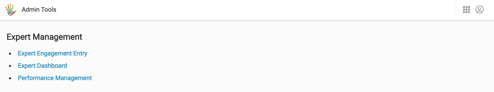
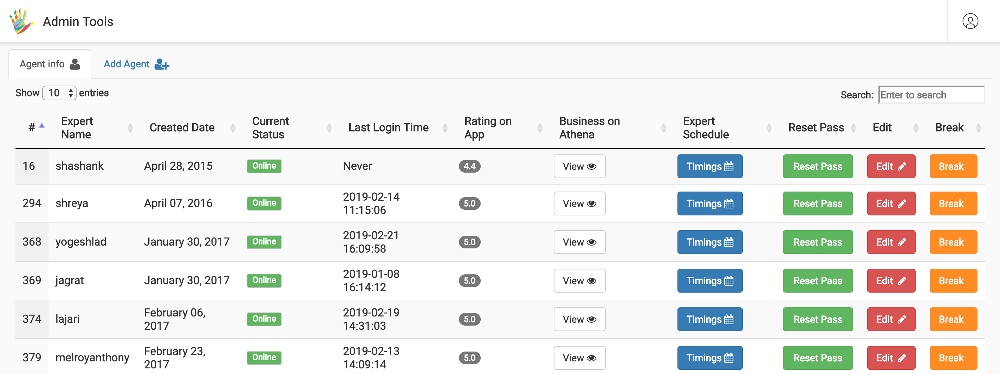
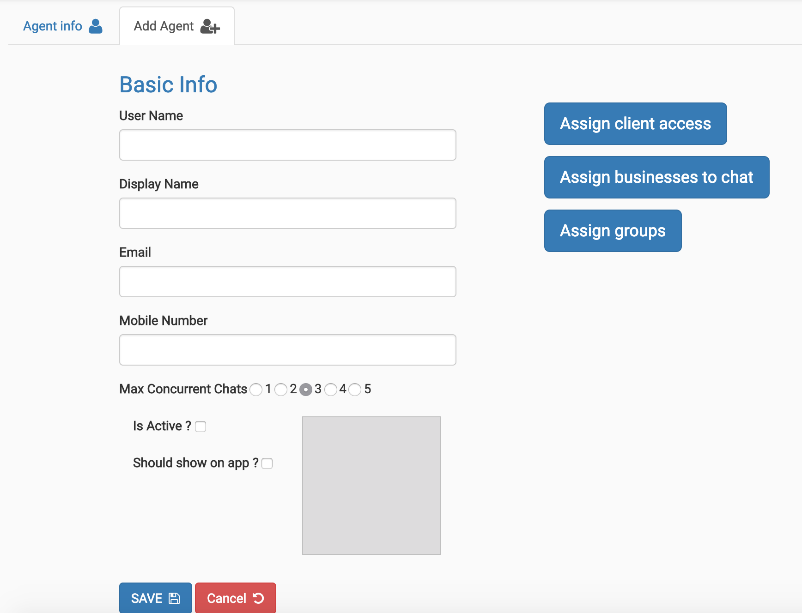
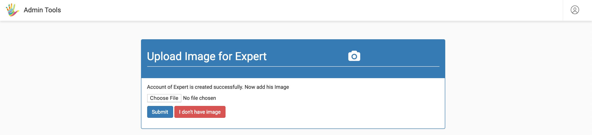
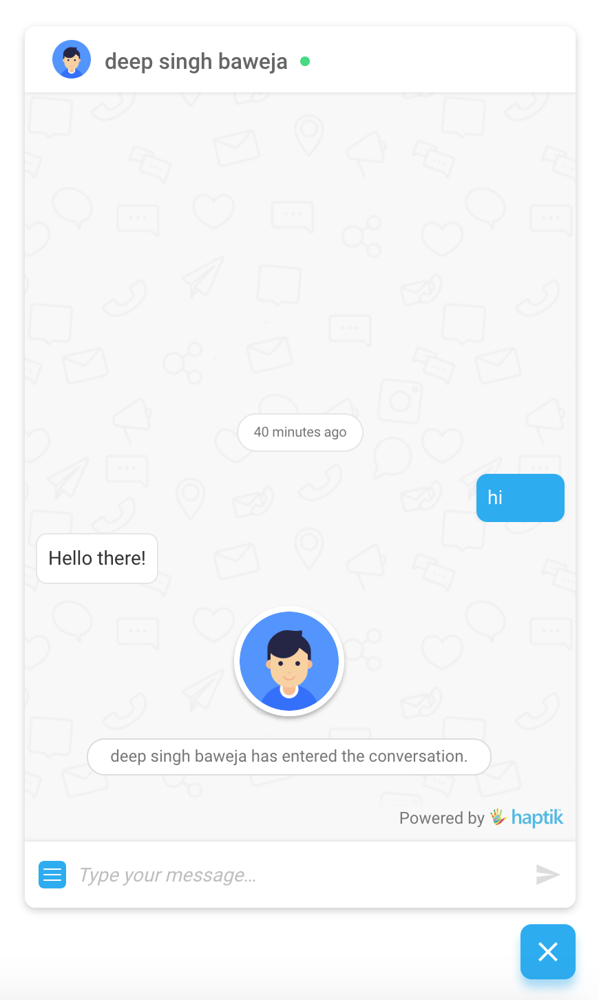
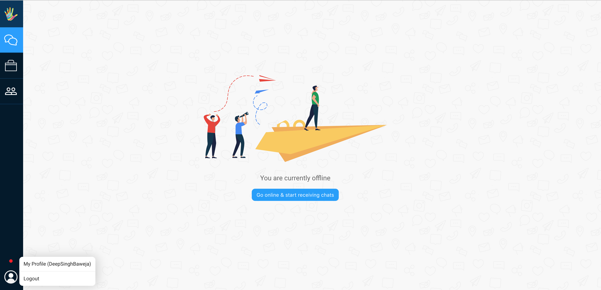

## Permission Groups

All our functionalities are linked to a permission.

A combinition of these permissions is what we term as 'Permission Groups' Agents can be assigned these 'Permission Groups' via the haptik administrator.

By default we have two configured **permission groups** for clients, namely:

### Enterprise Chat Assistant:

	- can receive chats
	- can mark chats as complete/waiting for user
	- can report an abusive/troll user
	- can logout

### Enterprise Chat Assistant TL:

	- can receive chats
	- can access business overwise
	- can modify/create a team
	- can add/edit chat disposition settings
	- review chats of agents
	- can assign a chat to an agent or a team
	- can claim chats for himself
	- can logout

>  Permissions that can be added on request 

	- Adding canned responses
	- Adding external tools
	- Receive daily expert performance csv

While these are the default set of permission groups avaiable, if a client wishes to have these permissions segregated differently, they can do so.
<!-- TODO: add a link to permission group editing here -->

## How to add agents with permission

### Log in to Haptik and select Select Administrator.

### Select Expert Dashboard under Expert Management as shown in the below screenshot.

>  Over here you can add/edit/view your agents.

### Click Add Agent tab.

On select you will see the below screen shot where you can start entering agent information.

Fields (LHS)

	- User Name: agent will log in using this value.
	- Display Name: agent name as displayed on our SDK's and Athena.
	- Email: email id which will receive the password once agent is saved.
	- Mobile Number: contact number of the agent.
	- Max Concurrent Chats: Max number of chats this agent can claim simultaneously.
	- Is Active: If unchecked, the agent cannot login.
	- Should show on app: not sure

Fields (RHS)

	- Assign Client Access: checkmark the client/s that this agent will receive chats from.
	- Assign Groups: select appropriate permission groups

### Click on Save. 

Your agent has been created.

### Upload Profile Picture (while creating agent).
You will then be redirected to a page where you can upload the agents profile picture.

>  This profile picture along with the display name value appears on our SDK's when an agent joins a conversation with a user.

An example of the agent image appearing on our JS-SDK (javascript software development kit) can be found below

You can choose to skip above step for later.

**Note:** Initial image will be optionaly uploaded by the lead, updating the image is handled directly from individual agent profile pages.

### Upload Profile Picture (using profile page).

An agent can access his user profile page by simply clicking on 'User Profile' as in below screen shot of our live chat tool.

Over here he can view his permissions and modify his display picture.

