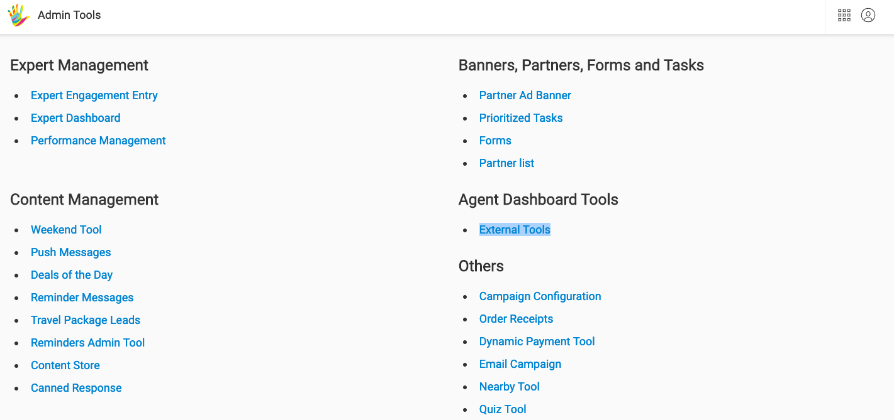
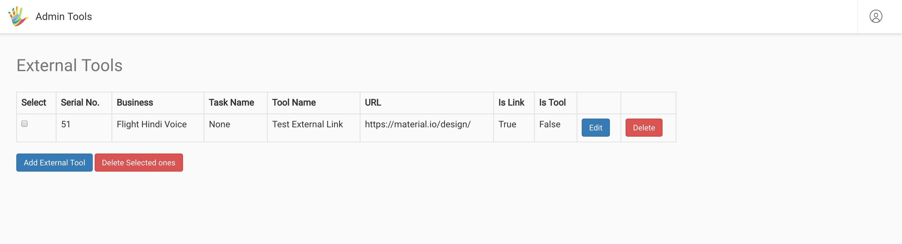
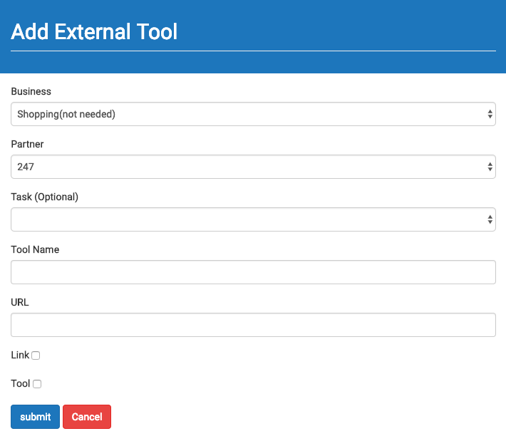
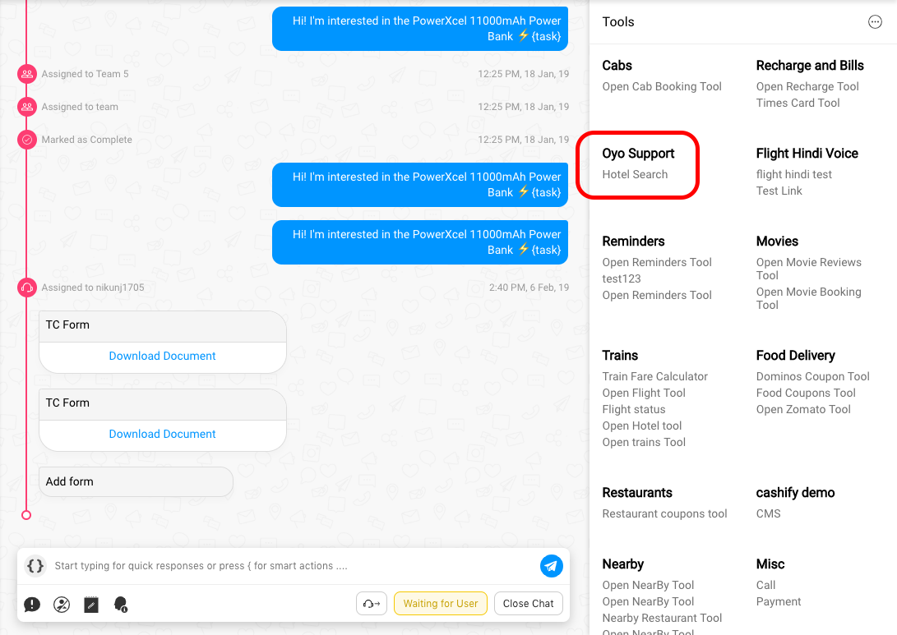
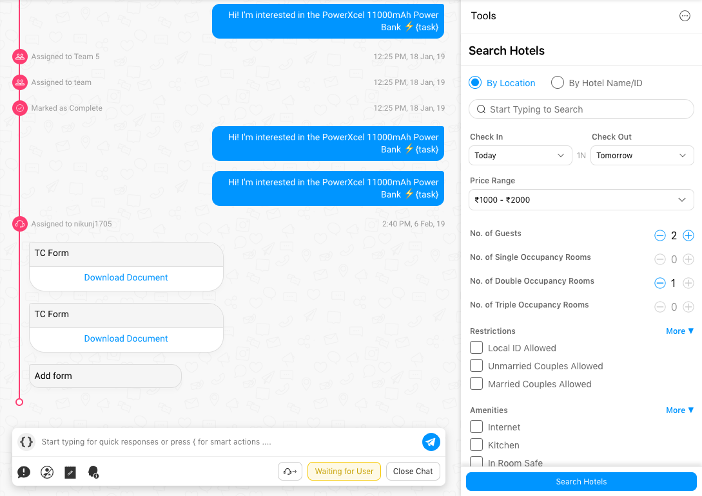

## Adding Custom Tools

### Steps

- Go to: [https://staging.hellohaptik.com/home/](https://staging.hellohaptik.com/home/)
- Enter your login credentials
- Once logged in, you will see the below page (may vary based on permissions)


- Select Administrator, the below screen will apear (may vary based on permissions)



- On clicking on External Tools (highlighted), the below page will open



    Ex: We added an external url (https://material.io/design/) which should appear
    for Flight Hindi Voice Business as "Test External Link".

- Now, click "*Add External Tool*", to land on the screen below. Here, you enter the following details:
        1. Business: Select your unique business name. (will be available in dropdown)
        2. Partner: Select your unique partner name. (will be available in dropdown)
        3. Task: Can be ignored, and left blank
        4. Tool Name: Can be any string (this is what will apear to the agents)
        5. URL: An external link to your tool
        6. Tick: "Link" or "Tool"
        7. Hit Submit



- On success, your tool will now appear for all agents allocated to your business.



- Simply click on the tool, and the URL will open on the RHS



### Important Design Note

- The RHS section, where the tool loads is restricted to exactly 26% of the page ~ 360px in width in most cases.
- Please make sure that the tool is responsive to all required screen resolutions

### Important Tech Note

- An external tool appears for a business, if a user wishes to use the same tool across multiple businesses, they can do so by adding a the same entry for the other businesses.

- Please make sure your `X-Frame-Options` is set to allow our host, so that your tool can open within our iframe.

```json
Header set X-Frame-Options "allow-from https://staging.hellohaptik.com"
```

## Using Athena SDK

Athena SDK gives you access to specific data of the User and Chat inside your Custom Tool.

Import the SDK via script tag
```html
<script src="https://toolassets.haptikapi.com/athena2/prod/athena-sdk.v2.1.js"></script>
```

then use this like
```javascript
const SDK = window.AthenaSDK;
```
### setConversationDetails(data, callbackFn)
This function will update the Conversation Details associated with the current Chat.

Args:
- **data** (object): The data that is to be set as Conversation Details for the User
- **callbackFn** (function): will receive a response object

Usage:
```javascript
const payload = { "product" : "software" }

SDK.setConversationDetails(payload, (response) => {
    // do something with data
});
```
Response format:
```json
{
    "success": true,
    "response": true,
    "error": "",
    "meta": {}
}
```

If there are any errors, the `success` flag will be `false` and the corresponding `error` message will be set.

### getConversationDetails(callbackFn)
This function will fetch the Conversation Details associated with the current Chat and return the data.

Args:
- **callbackFn** (function) will receive a response object

Usage:
```javascript
SDK.getConversationDetails((response)=>{
    // do some thing with response
})
```
Response format :-
```json
{
    "success": true,
    "response": {
        "product" : "software"
    },
    "error": "",
    "meta": {}
}
```

If there are any errors, the `success` flag will be `false` and the corresponding `error` message will be set.

### setUserDetails(data, callbackFn)
This function will update the User Details associated with the current User.

Args:
- **data** (object): The data to be updated in User Details for the User
- **callbackFn** (function): will receive a response object

Usage:
```javascript
const payload = { "email" : "john@gmail.com" }

SDK.setUserDetails(payload, (response) => {
    // do something with data
});
```

Response format:
```json
{
    "success": true,
    "response": true,
    "error": "",
    "meta": {}
}
```

### getUserDetails(callbackFn)
This function will fetch the User Details of the current User.

Args:
- **callbackFn** (function): will receive a response object

Usage:
```javascript
SDK.getUserDetails((response)=>{
    // do some thing with response
})
```
Response format:
```json
{
    "success": true,
    "response": {
        "email" : "john@gmail.com"
    },
    "error": "",
    "meta": {}
}
```

### getChatDisposition(callbackFn)
This function will fetch chat disposition data for the current business
Note: This is available in v2 of athena SDK

Args:
- **callbackFn** (function): will receive a response object

Usage:
```javascript
SDK.getChatDisposition((response)=>{
    // do some thing with response
})
```
Response format:
```json
{
  "success": true,
  "response": {
    "category": ["reason"]
  },
  "error": "",
  "meta": {}
}
```

If there are any errors, the `success` flag will be `false` and the corresponding `error` message will be set.

### setChatStatus(closingCategory, callbackFn)
This function will update the chat as completed, if closing categories are provided.

Args:
- **closingCategory** (object): Provide closing category object with reason, subReason and comment (can be empty), if it's required for that business. Otherwise, provide an empty object.
- **callbackFn** (function): will receive a response object

Usage:
```javascript
const closingCategory = {
    "reason" : "payment",
    "subReason" : "not reflected",
    "comment" : "please follow up asap!" 
}

SDK.setChatStatus(closingCategory, (response) => {
    // do something with data
});
```

Response format:
```json
{
    "success": true,
    "response": true,
    "error": "",
    "meta": {}
}
```

### Sample Integrations

You can refer to [this sample](https://toolassets.haptikapi.com/integrations/sample/index.v2.1.html) integration tool as a reference point.


### Expansion of the RHS Custom tool

We have an expand click that allows you the expand the RHS section so that agents can easily perform actions on an external tool. Once you switch the chat tab ie move to another chat, the RHS section moves from expand state to a default state (covering 26% width of your screen). 

