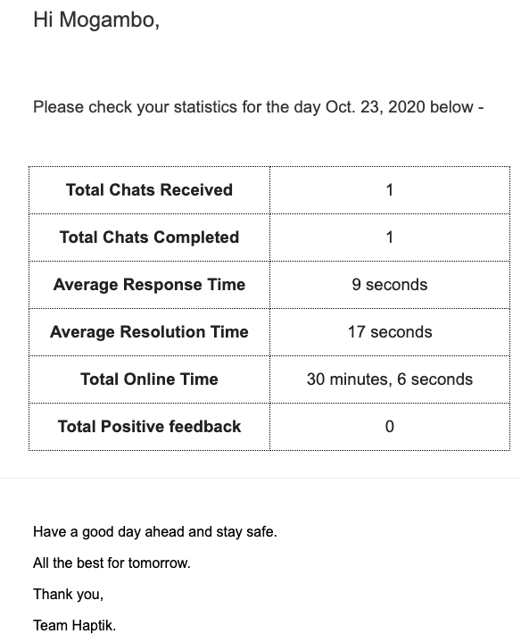

Agents receive their daily statistics over email at the end of the day. This mail talks about all important metrics pertaining to the conversations held throughout the day.

This is the sample mailer which goes -

      Hi <Agent-name>,

      Please check your statistics for the day <Date> below - 

      Chats received: Total number of conversations that the agent participated in, similar to the one shown on Team Analytics
      Online hours: Total number of hours that an agent was online on Smart Agent Chat tool
      Total positive feedback received: Total number of high-value (4 or 5) ratings received by the agent
      Average Resolution Time: Average time taken by the agent to resolve or re-assign the conversation
      Average Response Time: Average time taken by the agent to reply to a user query

      Have a good day ahead and stay safe. 

      All the best for tomorrow. 

      Thank you,

      Team Haptik. 
      
> Note: Resolution time is simply calculated from the user’s first message sent timestamp till the last agent/user message timestamp in a chat

Below is the screenshot of a mailer received by an agent -

> There is no extra permission required to receive this mail. All agents will receive this email who took chats that day.
