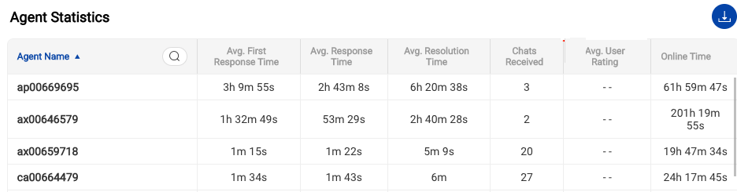

## Time Stats

1. **Avg. First Response Time** (FRT)

    FRT is the average of first response times taken by the agent to send the first response to end users. Only the chats whose first response was sent during the selected time range will be taken into account. Chats may have been created anytime (inside and outside the selected time range). Queue time is included in this metric. As we check this from first user message timestamp to the first agent response timestamp.
    
2. **Avg. Response Time** (RT)

    RT calculation is the average time taken by the agent to respond in a chat to all messages and not just the first message. Only the chats whose responses were sent during the selected time range will be taken into account. Chats may have been created anytime (inside and outside the selected time range). For the user’s 2nd, 3rd and so on messages, the response time is simply the delta in the user message timestamp and the agent’s response timestamp. 
    
3. **Avg. Resolution Time**

    This metric 'Average resolution time' should be the average time taken by the agent till there are no messages sent in a chat session. Only the chats that were completed during the selected time range will be taken into account. Chats may have been created anytime (inside and outside the selected time range). Resolution time is simply calculated from the user’s first message sent timestamp till the last agent/user message timestamp in a chat.
    

## Chat Stats

1. **Total Chats received** 
    
    All ongoing chats that started in the chosen time duration. This includes chats in waiting, queued as well the completed chats. The total of all chats in the selected time from the time-date picker.

2. **Completed by agents** 
    
    If chat disposition exists for a chat that means this conversation was marked complete via the agent. Total count of chats which were completed by agents in this particular team will be shown here.

3. **Abandoned by user**
    
    For all conversations with claim_name not “gogo“ and user_message_count = 0 that means all chats wherein user gets an agent assigned but the user drops-off before sending a message would be counted as an abandoned chat.
    
> Consider another scenario when in Conversation A - User chats with Agent 1 and Agent 1 logs out after replying back to user’s query. In the same Conversation A, user comes back and sends a message, now say this chat goes to Agent 2 and the user doesn’t return. Now, if the chat goes to complete state, we consider this chat as abandoned for Agent 2.

4. **Delayed**
    
    This metric gets us a count of all instances where the `first_agent_response_time` is greater than 'Delay Time value' as setup from the Team settings i.e. the delay message time value.
    

## Overview

1. **Avg. User rating**

    Average of all chats where the end user submitted a feedback and an agent was involved. Since this is a Team level view, we consider all agents in this team only, that is all chats where the agents from the chosen team took part.

2. **Total Number of agents**

    The value here gives us the number of agents in a Team. Also note that an agent could be part of multiple teams. 

3. **Time saved of agents**

    All chats where claim_name = "gogo" and add up all the "agent_resolution_time", that would be the total amount of time, gogo (Haptik bot) was responding instead of an agent.
    
> Please do not confuse this with the RoI calculations shared by the Customer Success manager. 

## Agent Statistics

1. **Agent Name**

   When the agent was created, the name here is the username chosen for this agent. 
   
2. **Avg. First Response Time** (FRT)

    FRT here is same as defined above in Time stats. Just the change being, this metric is for the single agent. And the metric above is on a Team level.
    
2. **Avg. Response Time** (RT)

    Response Time here is same as defined above in Time stats. Just the change being, this metric is for the single agent. And the metric above is on a Team level.
    
3. **Avg. Resolution Time**

    Resolution Time here is same as defined above in Time stats. Just the change being, this metric is for the single agent. And the metric above is on a Team level.
    
4. **Chats received**

    Similar to the Total Chats received, this metric is calculated at an agent level. And the Total chats received metric in Chat stats section above is at a Team level that is the Total chats received for the Team. 

5. **Avg. User Rating**

    User rating here is same as defined above in Overview section. Just the change being, this metric is for the single agent. And the metric above is on a Team level.

> Note that the User rating is calculated basis the last claim name for an agent. We have seen cases wherein the chat completes and then when user submits feedback, if the claim name has changed from the last agent to another agent, the feedback here will get assigned to this new agent. We will be taking a fix for this soon. As of now, we haven't accounted for this, as feedback was seen more at a conversation level. And for agents, feedback is a tertiary metric. The reason being the number of feedbacks submitted considered against the volume of daily chats is nominal. 

6. **Agent Online Time**

    When agents are receiving chats, we total this time i.e. to give you a sense of agent's online activity. This is a useful input to understand agent productivity. 
    
