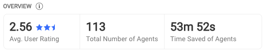
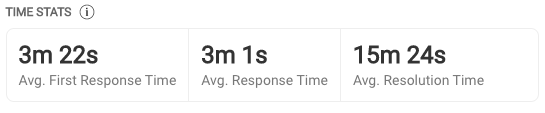
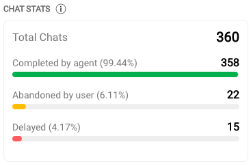
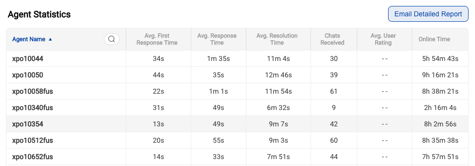
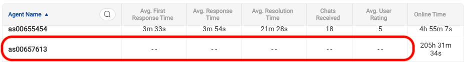
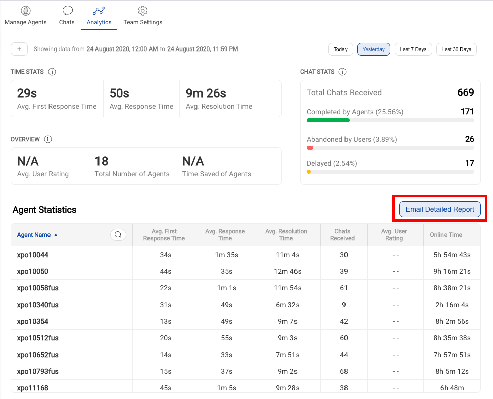

All Statistics shown on this page are chats which have been initiated in the selected timestamp.

## Overview

1. **Avg. User rating**

    Average rating of all chats where the end user submitted a feedback and an agent was involved. Since this is a Team level view, we consider all agents in this team only, that is all chats where the agents from the chosen team took part.

2. **Total Number of agents**

    The value here gives us the number of agents, who received at least a single chat in the Team. Only those agents who received any chat(s) are counted.

3. **Time saved of agents**

    All chats where an Haptik bot (gogo) took part, we add up the individual resolution time for all such chats, that would be the total amount of time, Haptik bot (gogo) was responding to the end user, instead of an human agent.

## Time Stats

1. **Average Agent First Response Time** (FRT)

    Average agent first response time is the average of first response times taken by the agent to send the first response to end users after a chat was assigned to the agent. Only the chats which were initiated by users during the selected time range will be taken into account. 
> Note: This metric does not include Queue Time for the chats

2. **Average Queue Time** (RT)

    AQT is the average of total amount of time, chats have stayed within a queue. Chats remain in queue for the below mentioned reasons
    
    1. A fresh chat has been initiated for a team, and there are no free agent slots avaiable.
    2. A chat has been re-assigned to an Agent who is currently at max concurrency.
    3. A chat was put in waiting state, when the user replied the chat got allocated back to the agent queue, but the agent was again at max concurrency.
    
    In all of the scenarios mentioned above, the chat will remain in queue untill an agent receives the chat. 
    
> Number of free slots per agent is the difference between chat concurrency set for the agent and the number of chats currently assigned to the agent.

3. **Average Response Time** (RT)

    RT calculation is the average time taken by the agent to respond in a chat to all messages and not just the first message. Only the chats which were initiated during the selected time range will be taken into account. In other words, the average time taken by an agent to consecutively respond to a single or multiple user messages in chronological order.
    
4. **Average Agent Resolution Time**

    This metric 'Average agent resolution time' should be the average time taken by the agent from the time when the chat was received till it was completed, re-assigned to, or marked as waiting. Only the chats that were initiated during the selected time range will be taken into account. Agent Resolution time is simply calculated from the user’s first message sent timestamp till the last agent/user message timestamp in a chat, without queue time.
    

## Chat Stats

1. **Total Chats Received** 
    
    All ongoing chats for a chosen Team view, that started in the selected time duration. This includes chats in waiting, queued chats and completed chats for the Team in question. The total number of all chats received i.e. `first_message_time` in the selected time duration from the time-date picker.

2. **Completed by Agents** 
    
    Count all chats that were closed by a human agent that means count all instances of manual clicks for closing a chat. Simply, total count of chats which were completed by agents in a particular team will be shown here.
    
> Note that this completed metric count is available starting from 24 March 2020 only, This does not include chats that were put in waiting, eventually auto-completed due to user inactivity.

3. **Abandoned by Users**
    
    This metric counts all conversations which transfer from a Haptik bot to a human agent and the user did not send any message after the human agent was assigned. That means all chats wherein user gets an agent assigned but the user drops-off before sending a message would be counted as an abandoned chat.
    
> Edge case scenario - Consider another scenario when in conversation A, user chats with agent 1 and this agent 1 logs out after replying back to user’s query. In the same conversation A, user comes back and sends a message, now say this chat goes to agent 2 and the user doesn’t return. Now, if the chat goes to the complete state, we consider this chat as abandoned for agent 2.

4. **Delayed**
    
    This metric gets us a count of all instances where the `First_agent_response_time` is greater than `Delay Time` value as setup from the Team settings section. 
    

## Agent Statistics

1. **Agent Name**

   When the agent was created, the username field for agent is shown here in this name column. You can find the agent name by using the search feature available here.
   
2. **Avg. First Response Time** (FRT)

    FRT here in the agent table is the sum of metric queue time and agent first response time as defined above in `Time stats` section. However, this metric is for a single agent, And the metric above in `Time stats` section is on a Team level.
    
3. **Avg. Response Time** (RT)

    Response Time (RT) is same as defined above in `Time stats` section. Just the change being, this metric is for the single agent. And the metric above is on a Team level.
    
> Note that FRT and response time metrics shown here for agents and team both include the queue time i.e. the time when the chat was in queue (pending) state. This response time value thus gives us the total time taken to respond to the user. 
    
4. **Avg. Resolution Time**

    Resolution Time here is same as defined above in Time stats. Just the change being, this metric is for the single agent. And the metric above is on a Team level.
    
> Note that resolution time metrics shown here for agents and team both do not include the wait time and the queue time. This resolution time value thus gives us the total time taken by an agent to handle a user chat end to end. 
    
5. **Chats received**

    Similar to the Total Chats received, this metric is calculated at an agent level. This includes chats that the agent completed, marked as waiting or chats that were re-assigned to the agent.

6. **Avg. User Rating**

    User rating here is same as defined above in Overview section. Just the change being, this metric is for the single agent. And the metric above is on a Team level.

> Note that the User rating is calculated basis the last agent who claimed the chat. There are scenarios wherein the chat completes and then user submits feedback. If the claim name had changed from the last agent to another agent, the feedback will get tagged to this new agent. Feedback metric is integral more at a conversation level. And for agents, feedback is a tertiary metric. The reason being the number of feedbacks submitted considered against the volume of daily chats is nominal. 

7. **Agent Online Time**

    When agents are receiving chats, we total this time i.e. to give you a sense of agent's online activity. This is a useful input to understand agent productivity. 
    

    
> When agents are in online state and they have pinned chats, they would not get new chats assigned, as they are capped at their concurrency limit. So, we could get scenarios wherein, we have agents online but they don't get new chats and other metrics such as FRT, Resolution Time etc. are absent. This happens because the agent is not closing chats and is capped at their concurrency. This concurrency cap is the maximum allowed chats count that an agent is allowed to take at any instant. 

You get the detailed agent report as per your timezone from a UI click. You can download the agent report. This is allowed for maximum of **30** days. Also there is a timezone drop-down using which you can choose the value as per the needs.

You would be able to download the detailed agent data report from the above shown screen. You can email the report to your id.

