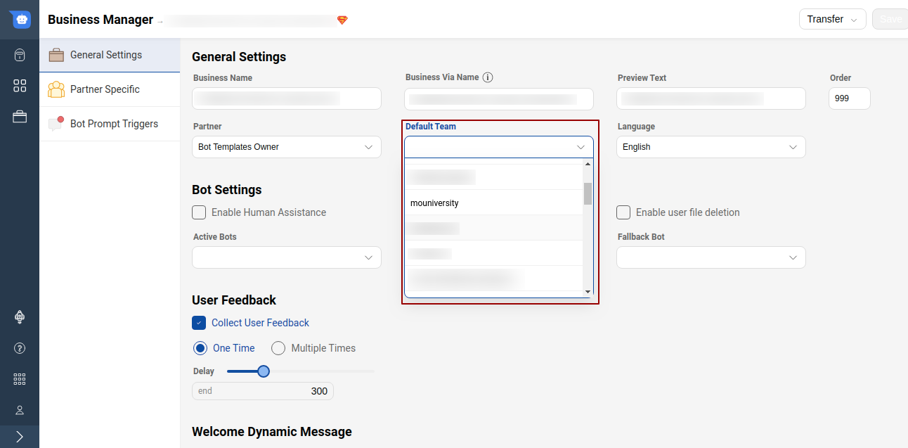

A user always talks to a Business. The user can use one of the many device platforms (Haptik SDKs, Messenger, Jio, etc.) to communicate with the Business.

    On the Business side, any replies could be sent automatically by a 
    1. Bot (Gogo) or 
    2. by an Expert/Agent from Athena.

To keep the transition from Bot to Agent smooth for best user experience, we allow multiple different ways a chat can be transferred from a Bot to a Human.

## Handover rules

### Adding Agent Chat Integration functionality on Bot:

There is a generic function for Agent Chat integration which needs to be added on a node from where the agent function is to be used.

**integration.utils.common.chat_force_pending**

On the Integrations tab of the node, select the type as Entity and Integration function and add the above function name in the integration field and then click on Save.

If an integration function exists, then we will transfer the chat to a team as per the integration function. 

### Human Assistance flag on Business Manager:

If the human assistance flag is on for a business, a chat will be moved to an agent whenever the bot doesn't understand the user's message. 

For a bot that already allows human assistance, set the *Handover Message Flag* field to *True* for your target business. This will send the bot break message first before moving the chat to a pending state. And eventually this chat gets assigned to an agent.

    Tip: In these automated methods, you cannot assign directly to an agent. We send it to a team first.

### Claiming a chat from Agent Chat tool:

You can send a chat to any specific agent using the *Reassign Chat* button from Agent Chat tool. 

For automated transitions, Business Manager in mogambo has a `Team Manager` section where you can configure the Team that the chat should be moved to.

    Tip: API integration functions can also specify the team to which a chat is to be sent.
    
### Settings to configure the bot and agents:

1. Go to the Teams page on Agent Chat tool and click on Create Teams

2. After creating the team, add a name for your team, add the owner in the respective fields and tap on the Create Button to create the Team.

Team Description is optional.

3. Now, assign agents for the Team created. For this -

- Open the team which you just created by selecting it from LHS.
- Tap on Manage Agents Tab on the top menu bar.
- Tap on Add agent Button.
- You can add looking for a username in the field.

Adding agents on a team -

Searching an agent in the Search Bar and adding them in the team

4. After the agent's name has been added, you can customize the messages that will be sent to users when agents are busy or are not online. For this, we need to understand the difference between the Delay message, message sent when no agent is online and message sent when users are not replying.

You can read more about it [here](https://docs.haptik.ai/agent-chat/teams#how-to-create-a-team).

5. Configure Teams on Business Manager - Once a team is created, it should be added to the Business Manager on the General Settings page, as follows.

- A list of created teams appears in the Default Team. Select the one which was created.
- Once the Team is added to Default Team, Click on Save.

 ## Queue Time Indicator
 
This helps us to set correct expectation and smoothen the transition from bot to agent for end users. We engage the end users in queue by sending a message with estimated queue time. We need to inform end users on Whatsapp, Facebook, Web or any other platform about when an agent would get assigned to them. So they can decide if they want to abandon chat or stay on chat. 

We send the below messages before an agent could respond back when users are waiting in the queue. Message 1 comes when estimated First Response Time is within 60 seconds. In message 2 below, we replace the 10 minutes with the median First Response Time value in the last 1 week for the Team. This value updates every 24 hours. And for First Response Time above or equal to an hour, we send the 3rd message copy to the user. 

1. We will be reviewing your query in a minute.
2. We will be reviewing your query in 10 minutes.
3. We will be reviewing your query soon. The current traffic indicates that it'll take about an hour.

This message is only sent if the chat is in the **Queue state**. We need to draft the Bot Break message or Agent Transfer message in a way that, post which when the user is still in queue, they will get this **Queue Time Indicator** message. Also, a **Delay message** is sent as configured in Team settings. 

In most scenarios, delay messages are sent after 60 seconds or the time you have configued in the Team Settings screen, so this is generally the order in which the user gets messages -

1. Bot Break or Agent Transfer message 
(Example - Sorry, the bot cannot handle this. This conversation will be transferred to an agent)

2. Queue Time Indicator message (as shared in the points above)

3. Delay mmssage (Sorry, our agents are busy. Please try again after some time)

If the user still stays, user sees the agent entering the chat.

------
