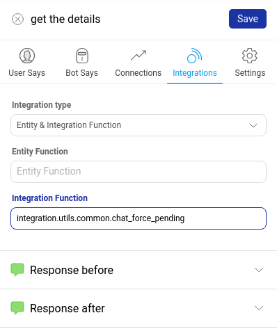
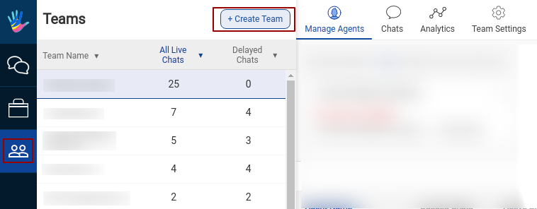

A user always talks to a Business. The user can use one of the many device platforms (Haptik SDKs, Messenger, Jio, etc.) to communicate with the Business.

    On the Business side, any replies could be sent automatically by a
    1. Bot (Gogo) or
    2. by an Expert/Agent from Athena.

To keep the transition from Bot to Agent smooth for best user experience, we allow multiple different ways a chat can be transferred from a Bot to a Human.

## Handover rules

### Adding Smart Agent Chat Integration functionality on Bot:

There is a generic function for Smart Agent Chat integration which needs to be added on a node from where the agent function is to be used.

**integration.utils.common.chat_force_pending**

On the **Integrations** tab of the node, select the type as **Entity and Integration function** and add the below function name in the integration field and then click on Save.

If this integration function exists, then the chat will be transferred to a team as per the integration function. This is how we achieve **Skill-based routing**.

### Human Assistance flag on Business Manager:

If the human assistance flag is ON for a business, a chat will be moved to an agent whenever the bot doesn't understand the user's message.

> Warning: Before the handover to agent, the bot might give a [**Smart Assist**](https://docs.haptik.ai/bot-builder/basic/smart-assist) message. In cases where we do not want this to happen, the Smart Assist can be disabled from the backend.

### Claiming a chat from Smart Agent Chat tool:

You can send a chat to any specific agent using the *Reassign Chat* button from Smart Agent Chat tool.

For automated transitions, Business Manager in Bot Builder has a `Team Manager` section where you can configure the Team that the chat should be moved to.

    Tip: API Integration functions can also specify the team to which a chat is to be sent.

### Settings to configure the bot with Smart Agent Chat tool:

1. Go to the Teams page on Smart Agent Chat tool and click on Create Teams

2. After creating the team, add a **name** for your team, add the owner (partner) in the respective fields and tap on the **Save** button to create the Team.

Team Description is optional.

You can change or add automated messages from **Team Settings**. To know more about **Team Settings**, click [**here**](https://docs.haptik.ai/agent-chat/teams#how-to-make-changes-in-the-team-settings).

3. Now, assign agents for the Team created. For this -

- Open the team which you just created by selecting it from LHS.
- Tap on Manage Agents Tab on the top menu bar.
- Tap on Add agent Button.
- You can add agents by looking for a username in the field.

Adding agents on a team -

Searching for an agent to be added in the team

4. After the agent's name has been added, you can customize the messages that will be sent to users when agents are busy or are not online. For this, we need to understand the difference between the delay message, message sent when no agent is online and message sent when users are not replying. You can read more about it [here](https://docs.haptik.ai/agent-chat/teams#how-to-create-a-team).

5. Configure Teams on Business Manager - Once a team is created, it should be added to the Business Manager on the General Settings page, as follows.

- A list of created teams appears in the Default Team. Select the one which was created.
- Once the Team is added to Default Team, Click on Save.

 ## Queue Position Indicator

This helps us to set correct expectation and smoothen the transition from bot to agent for end users. We engage the end users in queue by sending a message with their position in the queue. With this we inform our end users on Whatsapp, Facebook, Web or any other platform about how many people are currently ahead of them in the queue and thus they can decide if they want to abandon chat or stay.

We send the below messages before an agent could respond back to the user when they are waiting in the queue. When the user is first in the pending queue, we send the 1st message indicating that the user is next. Post that, for the position in queue ranging from 2-5 we send the 2nd message and replace the <X> with the number of users ahead of them in the queue. Post the position of 5, we send out the 3rd message.

1. You are next! We'll be reviewing your query right away.
2. We're assigning someone to you. You will receive a reply as soon as we close <X> conversations
3. You are in line. I'll send you a message as soon as we review your query. Just don't close this window.

This message is only sent if the chat is in the **Queue state**. We need to draft the Bot Break message or Agent Transfer message in a way that, post which when the user is still in queue, they will get this **Queue Time Indicator** message. Also, a **Delay message** is sent as configured in Team settings.

In most scenarios, delay messages are sent after 60 seconds or the time you have configued in the Team Settings screen, so this is generally the order in which the user gets messages -

1. Bot Break or Agent Transfer message
(Example - Sorry, the bot cannot handle this. This conversation will be transferred to an agent)

2. Queue Time Indicator message (as shared in the points above)

3. Delay message (Sorry, our agents are busy. Please try again after some time)

If the user still stays, user sees the agent entering the chat.

------
