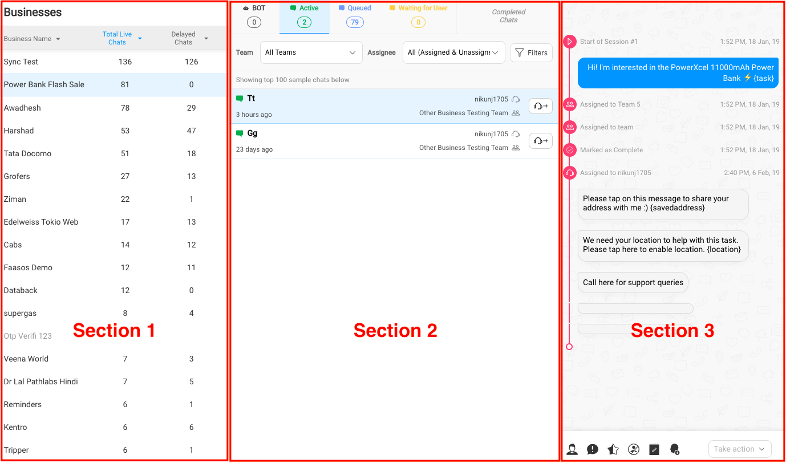
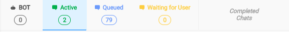
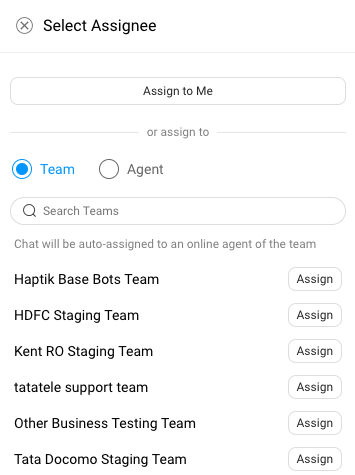
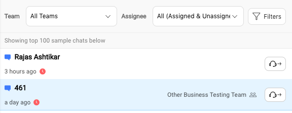
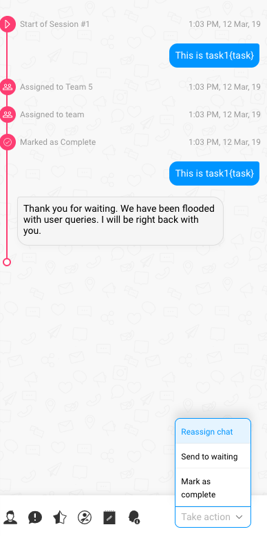

On the left-hand menu, you tap on the *Businesses* icon to land on this page.

You can think of this *Businesses* page being navigated from left to right in 3 sections. First you select a Business, then you select the chat list (ex: BOT, Queued). And then you could choose to access a chat detail view in third section. 

## Section 1: List of businesses

This section lists the businesses against 2 metrics

1. Total Live chats: As the name suggests, you get the count of live chats for this business at any instant.
2. Delayed chats: This gives you the number of *Delayed chats* for a business. When you create a *Team* for any business, you set the time value for which a chat is supposed to be considered delayed.

       Tip: Delayed chat time can be different for any team in a business. 
       
You can click on any business in this section, to render the chats for it, in the next section.

## Section 2: Chat lists

This section is divided into 5 sub-sections -

1. BOT
2. Queue
3. Active
4. Waiting for User
5. Completed Chats

Within a selected sub-section view, you can filter by Team or Assignee (both Assigned and Unassigned chats).

    Tip: You can also filter and Chats list to show only new users or to show only delayed chats.
    
For any chat in a list view, you can click the *Reassign chat* view to reassign a specific chat to a Team or an Agent. 

## Section 3: Chat detail view

Here, you get the detailed chat window for the selected chat in above section 2.

You can now access some smart actions and mark the chat complete or you could send this selected chat to *Waiting for User*.

