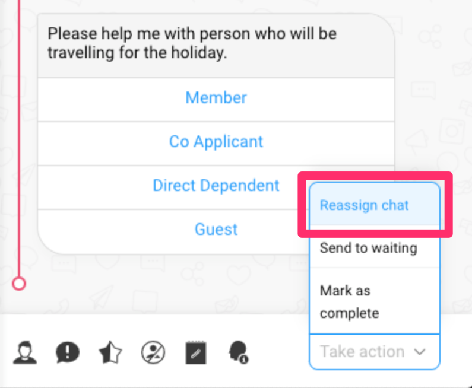
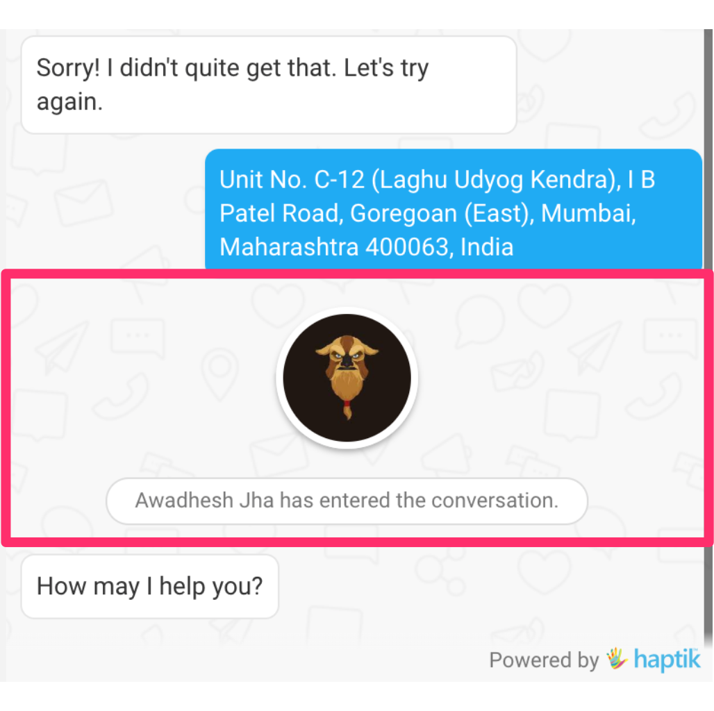
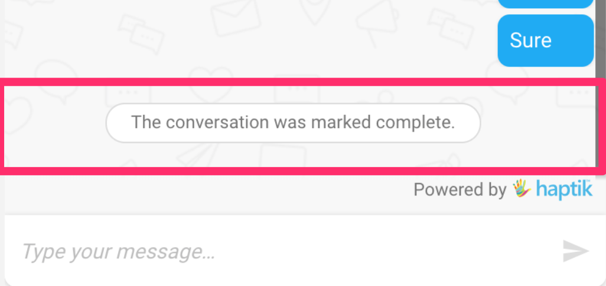
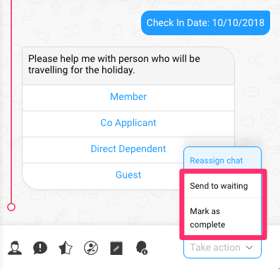
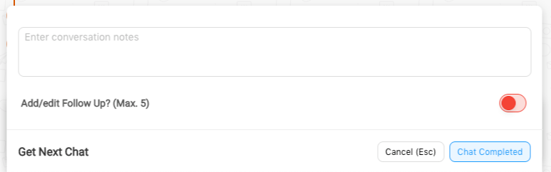
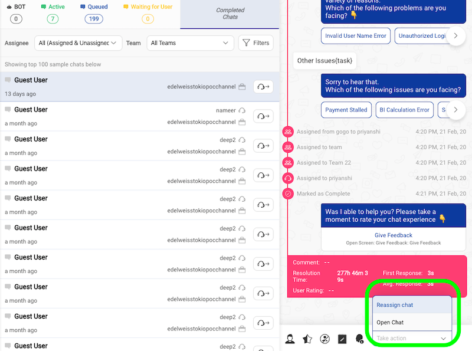
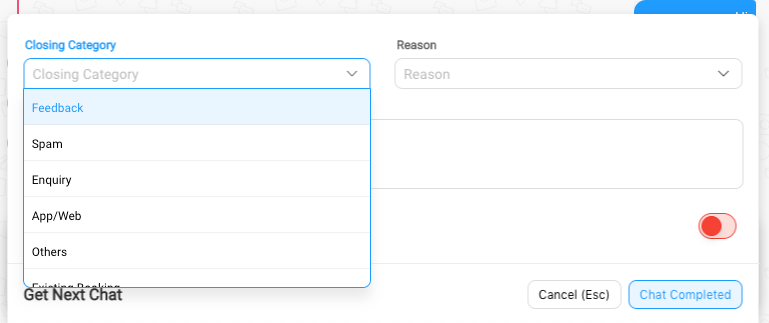
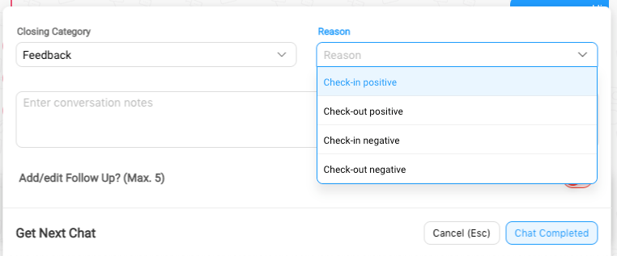
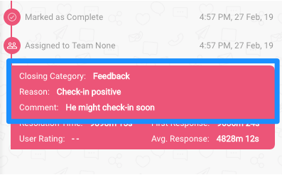

## Introduction

When we receive a message from the user, we send the message to a queue. We continuosly calculate the priority of the chats and assign it to an agent accordingly.

This priority is calculated dynamically and is based on a number of metrics.

## Queue Structure

When we receive a message from a user, we allocate it to Queues with a calculated priority.

- Team Queue
  - Every Team has its own dedicated queue.
  - Chats present in this queue are allocated to agents basis availability of agent slots.
  - Chats are added to this queue in the below scenarios
    - Bot Broke, and due to human assistance being enabled, the chat gets allocated to default team
    - This is an agent only solution, and all chats are added to the default team.
    - An integration function has manually transferred a chat to a Team
    - An Agent or Team Lead and re-assigned a chat to this team
    - When an agent goes offline, and he had chats present in his waiting bucket, those chats get re-assigned back to Team Queue with highest priority 
- Agent Queue
  - Every agent has his/her own dedicated agent queue.
  - Chats are added to this queue in the below scenarios
    - If an Agent or Team Lead, manually re-assigns a chat to an agent, and that agent was already handling chats at his maximum allocated concurrency.
    - If an Agent had marked a chat as "waiting for user", and the user returns, when the agent was already handling chats at his maximum allocated concurrency.

## Priority Calculation

The priority value and presence in ‘Team Queue’ or individual ‘Agent queue’ is calculated based on the below metrics:
- New User: The user has started a new conversation, and there are no previous conversations.
  - **If the bot is present and can handle the query** then the conversation continues with bot.
  - **If the bot breaks and human assistance is enabled for business** then the conversation is transferred to default team.
  - **If a bot flow triggers human assistance**, then the conversation is assigned to the default team, unless a particular team was specified via the integration function.
  - **If the bot breaks and human assistance is disabled for business** then the bot break message as defined on [Business Manager](https://docs.haptik.ai/bot-builder/basic/business) is sent as a response on the bot.
  - **If no bot present and human assistance is enabled for business** then the conversation is directly assigned to the default team.
- Returning User: The user has started a new conversation, and there are previous conversations.
  - For Bot or Bot + Agent solutions
    - Conversations always starts with the bot.
  - For Agent Only solutions
    - If the agent to whom this user spoke to earlier is currently online
      - if team is not exclusively provided, we assign to same agent
      - if team is exclusively provided and agent belongs to team, we assign to same agent
      - if team is exclusively provided and agent does not belong to the team, we assign to team, and decouple the relation between this agent and user
    - If the agent to whom this user spoke to earlier is currently offline, we clear the relation between this user and agent, and allocate the chat to the next available team/agent as specified or default team.
> When an agent logs out, we clear the relation between this agent and all users he/she might have interacted with earlier.

Apart from the above, one can choose between the two **Chat Assignment Algorithms** on Smart Agent Chat, you can read more about it [here](https://docs.haptik.ai/agent-chat/chat-assignment).

>  Our bot is a special agent, code named ‘Gogo’

## Manual Chat Assignment

> Smart Agent Chat also supports manual assignment of chats to agents. 

Team leads can manually assign/re-assign a chat. They can either assign it to themselves or a team or an individual agent. 

If the chat is assigned to a team, basis the [algorithm](https://docs.haptik.ai/agent-chat/chat-assignment#choosing-a-chat-assignment-algorithm) selected, the chat would be assigned to an available agent of that team.

- Open any conversation either on the teams or the businesses page
  
  

  <br/><br/>

- Click the reassign button on the composer.
  
  
  <br/><br/>

- Alternatively you can click the reassign button on the chat listing.
  
  
  <br/><br/>

- A right hand side drawer should popup allowing you to assign a chat either to yourself, to a team or to an individual agent.
  <br/><br/>
  

## Chat assignment - End user experience
The following section covers how an agent is assigned a chat.

> Once the chat is assigned to an agent, the user can see the handover to the agent on the SDK UI. <br/><br/>



## Closing & Completing Chats
When an agent has completed a chat, we ask for [closing categories](https://docs.haptik.ai/agent-chat/closing-categories) if they are enabled for the business, else we close the chat directly.

> Once the chat is marked as complete/closed, the user can see the completion message on the SDK UI. <br/><br/> 

### Automatic Closing of Chats
Chats are automatically closed if:
- No messages are exchanged between the agent and the user and the chat is either with the bot or is in **Waiting for user** state for **8 minutes**.
- If all agents were offline, and [**this**](https://docs.haptik.ai/agent-chat/teams#step-4---setup-team-offline-message) setting was enabled for the team.

### Manual Closing of Chats
Chats can be manually marked complete

- When the agent is ready to mark a chat as complete (close the chat). The agent can mark the chat either complete or send to waiting.

  

- Alternatively a team lead can also manually mark a live chat as complete by tapping on 1 of the two options in the composer inside the Businesses/Teams pages.

  

- The agent will have two options here
  - **Mark a chat complete**: This means that the conversation is complete and the user will not be sending more messages as a part of this conversation.
  - **Send to waiting**: Sometimes the conversation isn't complete. For example, the agent has replied but the user is taking some time to reply. In this case the agent can mark the chat as waiting. This removes the chat from the agent's queue freeing up the agent so that the agent can take fresh chats.

    > Once the user replies, the conversation is added back to the same agent's queue.
    > When an agent goes offline, all chats that are currently marked as waiting, will be moved back to team queue with the higest priority, and will be assigned to the next available agents.
  
  

- Once the agent marks a conversation complete, the conversation is removed from the agent's queue and the **MyChats** screen.

### Open/Re-assign Completed Chats

When Team Leads see chats that are wrongly completed, they can reopen/re-assign these chats to make sure user queries are resolved. 

On the Business/Team page, via Completed Chats, 
- If agents click on the `Reassign` option for any chat, then Completed chat is re-assigned to selected agent or team without user messages.
- If agents click on the `Open` option for any chat, then Completed chat is re-assigned to previous team if present, else default team without user messages.

Refer the green box in image below.

  
  
> This is the only case when you see completed chat assigned again automatically without user initiation.

## Disable Manual Closing Of Chat
The above mentioned functionality is enabled by default for every business. To disable it, one have to edit the flag under **Businesses > Business Settings > Show close chat button**.


To add to that, one can edit the flag only if they have access to the below mentioned feature.
```
athena_business_settings_edit
```
This should be added to the respective Permission Group as mentioned in [adding agents and permissions](https://docs.haptik.ai/agent-chat/adding-agents-and-permissions).

### Chat Closing Categories
When an agent marks a chat as complete. The agent can add some *completion notes* in the form of Closing categories.




<br/><br/>

Custom chat dispositions can be configured in the business settings under the business page.

This chat disposition data is shown as a part of the chat history when viewing the chat on the businesses/teams pages.
<br/><br/>

