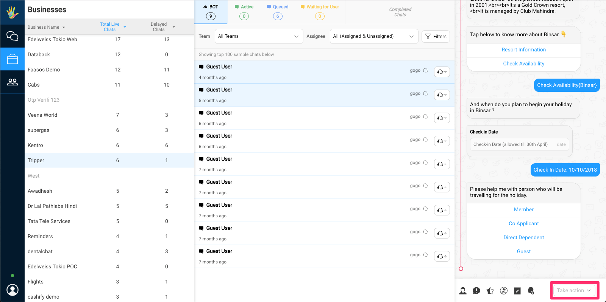
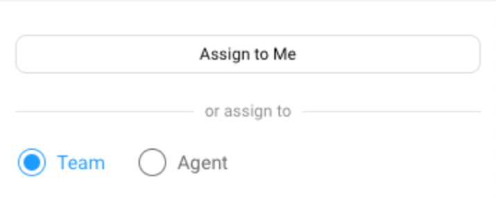
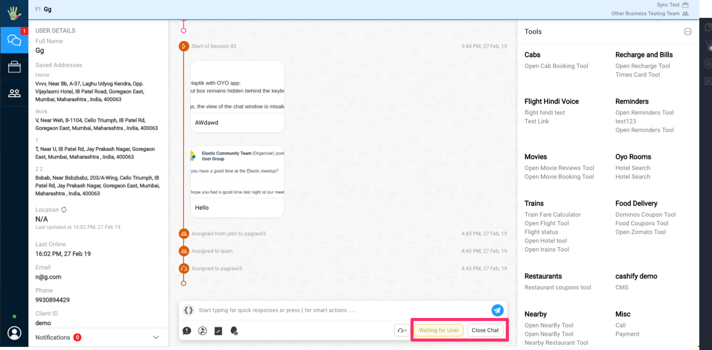

## Introduction

When we receive a message from the user, we send the message to a queue. We continuosly calculate the priority of the chats and assign it to an agent accordingly.

This priority is calculated dynamically and is based on a number of metrics.

## Priority Calculcation

When we receive a message from a user, We allocate it to Queues with a calculated priority.

### Queue Structure
- Team Queue
- Individual queue per ‘Agent’

### Queue Management
>  Our bot is a special agent, code named ‘Gogo’

The priority value and presence in ‘Team Queue’ or individual ‘Agent queue’ is calculated based on the below metrics:
- New user or returning user
- Existing Conversation or New Conversation
- Bot involvement in business, and no previous assigned agent 
  - **If the bot is present and can handle the query** then the conversation continues
  - **If the bot breaks and agent-assistance is enabled for business** then the conversation is transferred to specified team via defined integration functions or to the default team assigned in the bot builder
  - **If Bot breaks and agent-assistance is disabled for business** then the Bot break message or the outlier message as defined in business config is sent as a message by the bot
- Previously assigned agent
  - If the agent is ‘online’ or ‘offline’, then the chat is added to the agent's queue.
  - If the agent is 'away', the chat is treated as a fresh conversation.

> While these Queues are maintained in our Backend, conversation assignment for a particular agent is handled based on Activities performed on Athena by said agent.

## Chat assignment
The folowing section covers how an agent is assigned a chat on the agent chat tool. 

> Once the chat is assigned to an agent, the user can see the handover to the agent on the SDK UI.   

### Base Rules
- If a conversation is waiting on user or the user does not reply for 8 minutes, we automatically mark that conversation as completed due to user inactivity.
- A fresh message from an exisiting user would result in a new conversation
- Currently we allow a maximum of **3 chats** (default value) to be handled simultaneously per agent. We can change this value to anything between 1-5 per agent.

### Automatic Chat assignment
Agent chat tries assigning a chat automatically based on the following parameters.
- On login or switching to ‘online’
- Every time an agent marks a chat as ‘Complete’
- Every time an agent marks a chat as ‘Waiting for User’
- If the agent has less than 3 chats (default value), the chat is requested by the agent every 10 seconds (default global value, modification not in dev pipeline)
- If the agent has more than 3 chats (default value), then the platform doesn't request for more chats till the agent has less than 3 concurrent chats. **

> <b> ** </b> If the agent has some chats in waiting then the chat is put back in the agent's chat queue

### Manual Chat assignment (Claiming)
> Agent chat also supports manual assignment of chats to agents. 

Team leads can manually assign a chat. They can either assign it to themselves or a team or an individual agent. 

If the chat is assigned to a team, then the chat will first get assigned to the team, and then subsequently to an agent of that team.

- Open any conversation either on the teams or the businesses page
  
  
    

- Click the reassign button on the composer.
  
  
    

- Alternatively you can click the reassign button on the chat listing.
  
  
    

- A right hand side drawer should popup allowing you to assign a chat either to yourself, to a team or to an individual agent
  
  
    

- To assign, simply tap on the button relevant button. It should assign the chat to that entity.
  
  
    

## Closing & Completing Chats
When an agent has completed a chat, the chat is marked complete and the chat is closed. This process can happen automatically or the chat agent can manually close a chat.

> Once the chat is marked as complete/closed, the user can see the completion message on the SDK UI.    

### Automatic Closing of Chats
Chats are automatically closed if:
- Chats assigned to the agent which are currently in waiting when the agent logs out.
- No messages are exchanged between the agent and the user and the chat is either with the bot or is in waiting for user state for **8 minutes**

### Manual Closing of Chats
Chats can be manually marked complete

- When the agent is ready to mark a chat as complete (close the chat). The agent can mark the chat either complete or send to waiting.

  
    

- Alternatively a team lead can also manually mark a chat as complete by tapping on 1 of the two options in the composer inside the Businesses/Teams pages.

  
    

- The user will have 2 options here
  - **Mark a chat complete**: This means that the conversation is complete and the user will not be sending more messages as a part of this conversation.
  - **Send to waiting**: Sometimes the conversation isn't complete. For example, the agent has replied but the user is taking some time to reply. In this case the agent can mark the chat as waiting. This removes the chat from the agent's queue freeing up the agent so that the agent can take more chats.

    > Once the user replies, the conversation is added back to the same agent's queue.
  
  

- Once the user marks the conversation appropriately. The conversation is removed from the agent's queue and the My Chats page.

### Chat Disposition
When an agent marks a chat as complete. The agent can add some *completion notes* in the form of Chat disposition.

  

Custom chat dispositions can be configured in the business settings under the business page. More on that [here]()

This chat disposition data is shown as a part of the chat history when viewing the chat on the businesses/teams pages.
  
