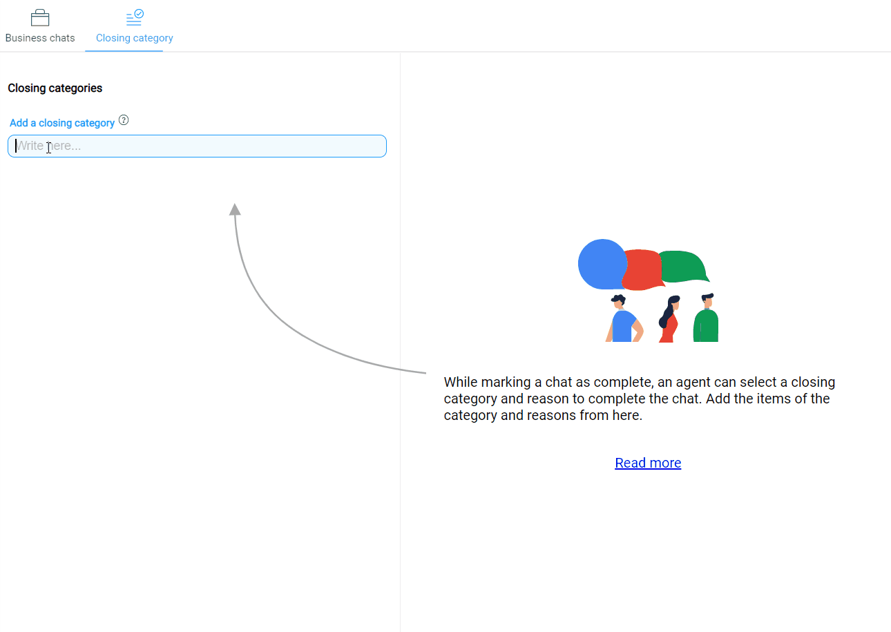
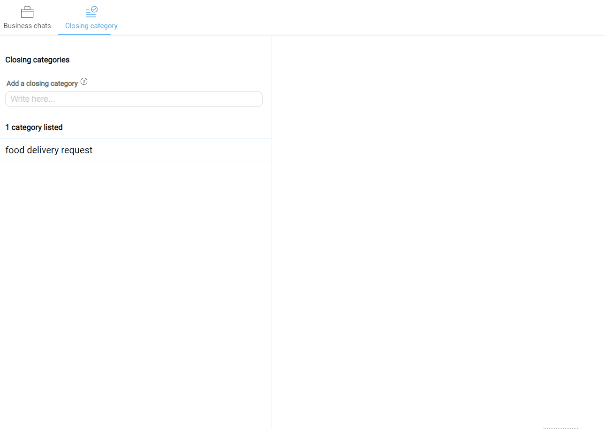

When an agent closes a chat with an user they have to select a closing category and reason for closing the chat. They can additionally add notes about the conversation. This data is useful to understand the types of requests users are making, the categories of questions the bot can't handle. 
Additionally, the conversation notes help any other assistant who might pick up the chat to get a quick context of the previous conversations.

## Why Closing Categories
As explained earlier the closing categories data can prove to be extremely useful for the long term success of the bot.

When we start building a bot, we might not have enough information about the types of conversations the users will try to have with the bot. 

For example you might build a bot to book flight tickets but most users might be trying to get support from your bot instead. The closing category data entered by the agents can then provide data to understand the types of conversations your user have. This data can then be used to try to automate these conversations.

## Creating Closing Categories
The Smart Agent Chat tool allows businesses to have custom closing categories for their bots. This enables businesses to gather customized data for their particular use case.

Any Smart Agent Chat tool user with the appropriate permission can create or edit the closing categories for that business.

The steps to create closing categories are:
1) Open the Smart Agent Chat tool.
2) Go to Businesses section from the left side menu.
   
3) Go to the closing category section from the top menu on the right section.
4) From here you can add a closing category bu using the category input field.

5) To add reasons for a category, you can click on the category and enter the reasons in the menu that opens up.

6) You can edit or delete the category or reason by clicking on the edit icon or the delete icon next to it.

