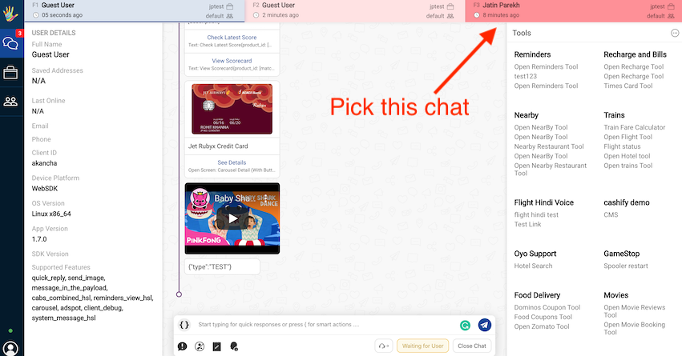

## Logging in

The Chat agent gets an email with credentials to the *Live Chat* tool. 

Using the credentials, a Chat agent logs in and clicks on **Smart Agent Chat**. Now, the Chat agent can essentially click on the *My Chats* tab i.e. the first option depicted in the left-hand menu.

## My Chats

In this tab the chat agent can start taking chats assigned to him/her personally. 

A chat agent can:
  * View his current live chats
  * Exchange messages with the user
  * Send [smart actions](https://docs.haptik.ai/agent-chat/smart-actions)
  * Mark [chat as complete or waiting for user](https://docs.haptik.ai/agent-chat/claiming-and-closing#closing-completing-chats)
  * Assign chat to a person or a team
  * Use [custom tools](https://docs.haptik.ai/agent-chat/adding-custom-tools)
  * Adding [disposition tags](https://docs.haptik.ai/agent-chat/claiming-and-closing#chat-disposition)
  
  When an agent is **offline**, he would not get the option of **Waiting for user** but only **Reassigning Chat** and **Closing Category** as compared to **online state**, where agents get to see all controls mentioned above.
  
  Depending on the permissions and features assigned to a Chat agent user, more actions could become accessible. 
  
>Tip: We also have a system to enforce Data level permissioning i.e. an agent user is allowed to view/edit data for which business can be controlled using this.

We have revamped the **MyChats screen** and currently it is in Beta phase. You can read about it in detail [**here**](https://docs.haptik.ai/agent-chat/newmychats).

## Chat Priority

In high traffic scenarios for customer support agents, there’s almost always two or three chats for agents to deal. So as soon as an agent finishes helping one customer, they move on to another chat. But user activity is not highlighted to the agent. We color code the chat tab to help agents prioritise a customer basis last user message sent time. This eliminates the agent side dilemma to figure chat priorities from their ongoing chats. Check out this feature in action on Smart Agent Chat and screenshot below.

>Tip: The tab refreshes as soon as a user sends a message. The snackbar timer starts and color gradient slowly turns red. The color turns max red at 300s (5 minutes) and this color would change to white again as soon as the user sends a message. 
