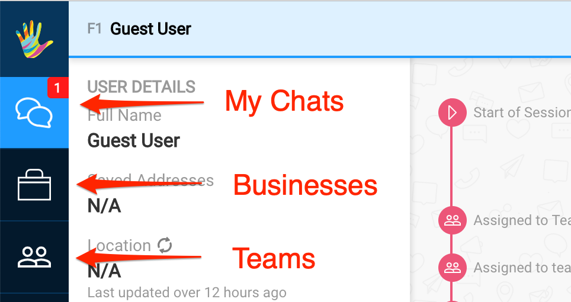
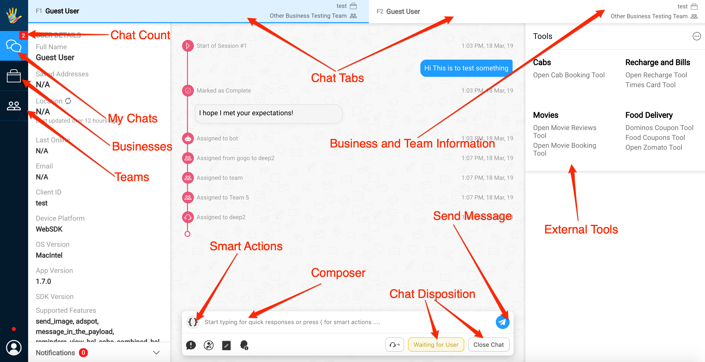
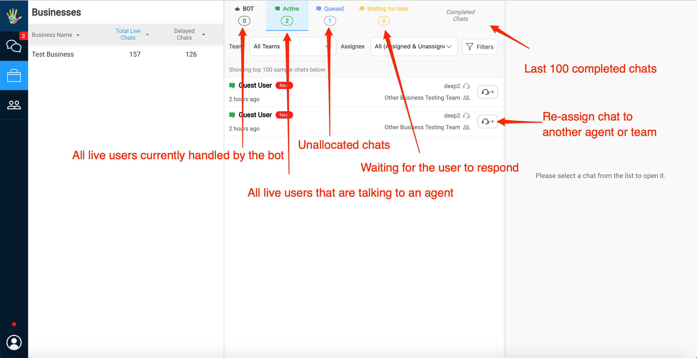
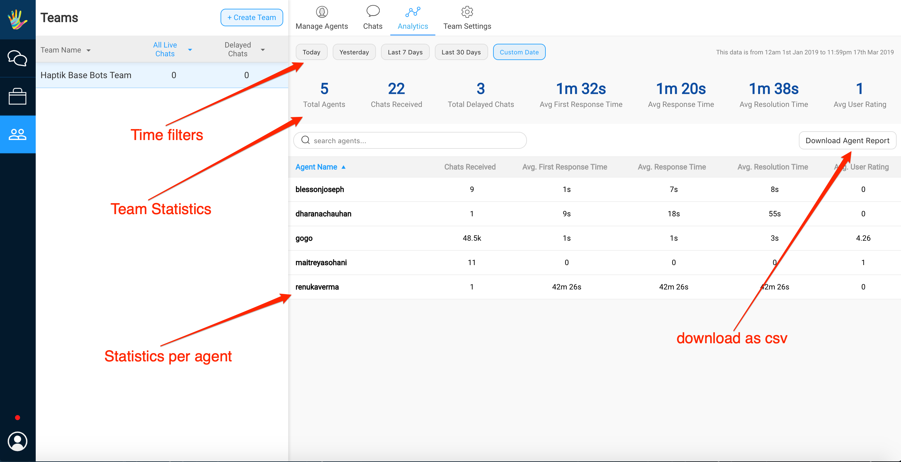
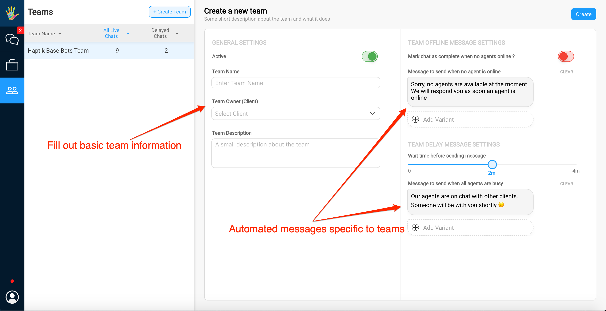

## Introduction

When a team lead logs in athena, he can essentially view three high level tabs as depicted in the image below

	- My Chats
	- Business Overview
	- Team Overview

The above three tabs are explained individually in detail below.

## My Chats

Over here a team lead can
	
	- view his current live chats
	- exchange messages with the user
	- send smart actions
	- assign chat to a person or a team
	- use external tools
	- mark chat as complete
	- adding disposition data
	- mark chat as waiting for user

## Business Overview

Over here a team lead can
	
	- can view all businesses allocated to logged in user.
	- view stats of chat distribution
	- can filter chats based on 'is new user', 'is delayed chat'
	- select and review existing, upcoming chats
	- select and review the last 100 completed chats
	- can view performance of team over a business
	- select and re-assign an existing claimed or unclaimed chat to an individual or a team allocated to business

## Team Overview

	- view stats of chat distribution per team
	- download stats as a csv
	- use time filters

	- can view all teams
	- create a new team
	- adding agents to a team
	- add/edit automated responses based on agent availability

Team leads can also

	- select and review existing, upcoming chats under chats, per team
	- select and re-assign an existing claimed or unclaimed chat to an individual or a team
