## How to use My Chats?

In this tab, an agent can start taking chats assigned to him/her personally. The screen is divided into multiple sections. We will call it LHS, Centre and RHS for ease of understanding.

### Left Hand Side of the screen

A chat agent can:
  * View agent's display name
  * View agent's status - Online or Take a Break
  * View his live chats stats (Completed, Waiting for user, My Queue, Team Queue)
  * View his active chats

#### Agent Details

The agent will be able to view his name and also his current status. 

You can also choose the change the status by clicking on **"Go Online"** or **"Take a break"**. 

Before changing the status to **Take a break**, a pop up would come to confirm the change.

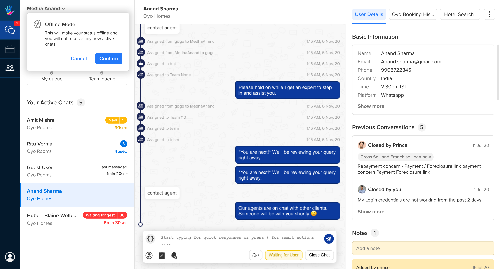

Before changing the status to online, a pop up would come to confirm the change.

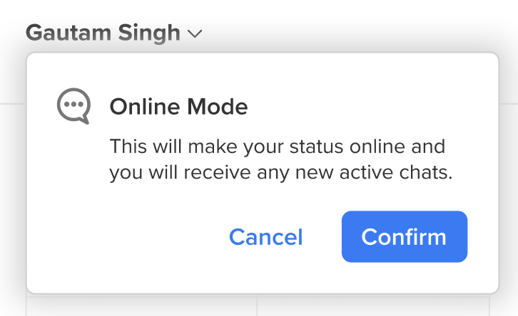

- **Online State**:
When an agent goes online,
  - The agent will start receiving new chats as per his available slots.
  - The agent could re-assign, mark as waiting, or complete any of the chats allocated to him

- **Take a break State**:
When an agent goes on a break,
  - The agent will no longer receive any fresh chats
  - The agent can no longer mark a chat as waiting
  - All chats that were already marked as waiting by him/her will be added to the team queue if the user replies back
  - The agent is expected to wrap up the chats that are already assigned to him

- **Logout State**:
When an agent logs out,
  - All chats that are currently assigned to him/her will be auto completed.

#### Live Chat Stats

This section will provide all numbers related to incoming, existing and completed conversations taken by the agent logged in.

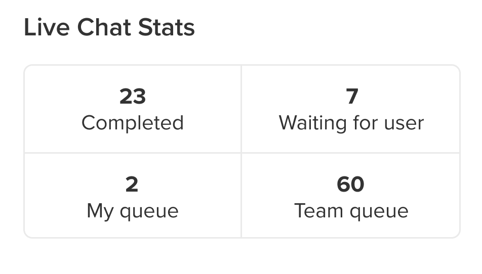

- **Completed**: Number of chats completed today, as per the agent's timezone.
- **Waiting for user**: Number of chats currently in waiting state, as marked by this agent.
- **Agent queue**: Chats that have been manually reassigned to the agent either by a fellow team mate or a team lead, or chats that were marked as waiting and the user has replied back.
- **Team Queue**: Chats that are currently waiting to be taken up by the agents of a team, basis their concurrency bucket(slot) availability.

> If an agent is part of multiple teams, we show the combined number for team queue.

#### Your Active Chats

This section will show all chats that are currently assigned to the agent.

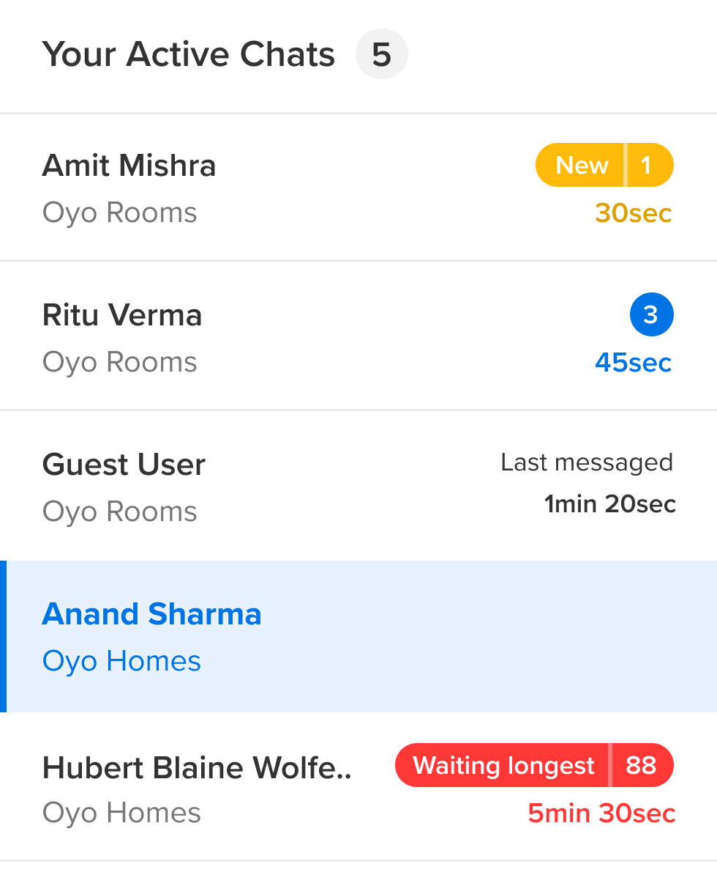

We show the following details -

- **User name**: This is the name of the user. If the user has provided his name, that would show up or it will be shown as **Guest User**.
- **Team name**: This is the name of the team to which this chat is allocated.
- **Business name**: This is the name of the Business to which this chat is allocated.

There are few tags which come on the chats depending on whether they have read or unread messages.

1. **Last messaged**: This will come up for read chats where agents have sent a response. 

2. **Message time**: This will either be the first user message time (among consecutive user messages) for unread chats, or the latest agent reply time for read chats, whichever is earlier.

3. **Waiting longest**: This is a tag used for unread chats which have not had a reply for over 5 mins, or the longest waiting chat. For an agent, there will always be a maximum of one chat tagged as waiting longest.

4. **New Chat**: This is a tag whenever a new chat comes in. As its a new chat, its in the unread category.

5. **Number tab**: This is a tag showing the number of messages that the agent has not yet read or responded to. Thus, this is for unread chats only.

**Max number of chats** displayed here would be based on agents concurrent count. 

On click, the chat gets selected in the center page and the tags go away only if the agent replies. Agent can click on chats, but the tag stays the same until the agent sends a message on the chat.

> Agents can use shortcuts like F1,F2,F3,F4,F5 to swap between chats.

### Centre of the screen

A chat agent can:
  * Exchange messages with the user
  * Check history of user's conversation with the bot and other agents
  * **Reassign chat** to a person or a team
  * Mark chat as **Complete** and **Waiting for user** 
  * Use [**Smart Actions**](https://docs.haptik.ai/agent-chat/smart-actions)
  * Take down [**notes**](https://docs.haptik.ai/agent-chat/action-toolbars#notes) during a conversation
  * Report a user as inappropriate
  * Send canned responses to users
  * Share a [**chat link**](https://docs.haptik.ai/agent-chat/action-toolbars#user-info-link) with others

#### Close Chat

Agents can close a chat by clicking on this button.

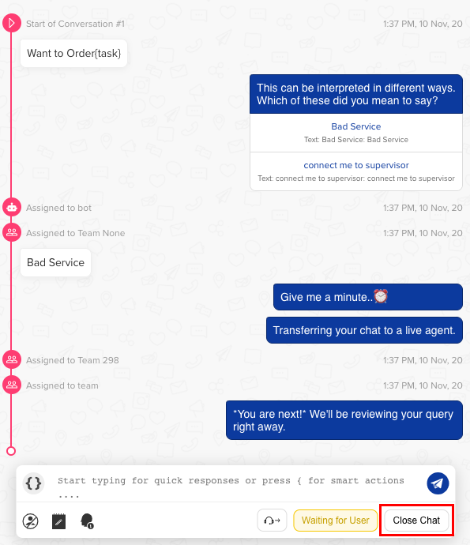

As an agent clicks on this button, a modal opens up showing few options like **closing categories** aka disposition tags and **follow up**.

You can read more about closing categories [**here**](https://docs.haptik.ai/agent-chat/closing-categories).

#### Waiting for user

As we know, an agent can take only a certain number of chats at once. We call that number **concurrency of chats**. This is specific to an agent. 

Many times we have seen a user stops replying in between a conversation, what shall an agent do in this case? This chat where the user has stopped replying keeps the agent's concurrency bucket blocked. To clear up the concurrency bucket without closing a chat, agents can use **Waiting for user** button. 

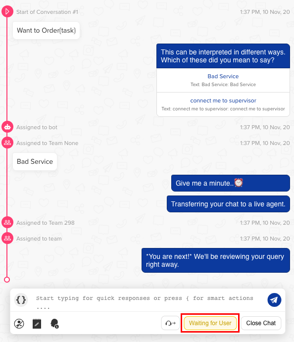

When the user will come back and respond on the chat screen, the chat will get reassigned to the agent and the agent can continue the conversation with the user.

This is what makes this button extremely powerful, it cleans up concurrency bucket of the agent at their demand without inserting any friction for the user.

#### Reassign chat

In situations where agents need additional help from his team members, they can use this button to reassign the chat to anyone specific among his team or whoever  free in his team. 

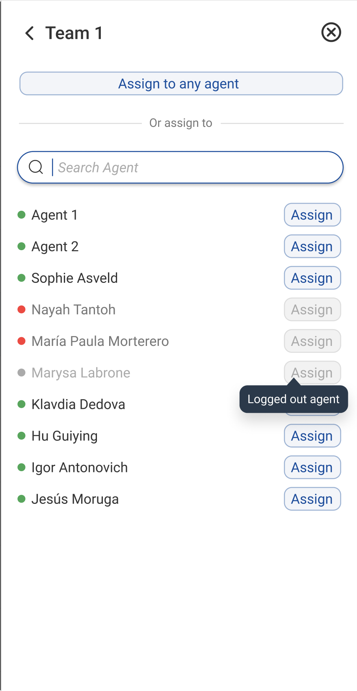

Once you click on the **Reassign Chat** button, a modal opens up on the right hand side of the screen where you can choose whom to reassign it to.

1. "Assign to any agent" will auto-assign the chat to an online agent of the team
2. The "Assign" button will be active only if the agent is online, which is indicated by green dot on the left side of agent's name 
3. In case the agent is offline (red dot) or logged out (grey dot), the "Assign" button will not be active and chat's can't be assigned to that particular agent

#### Report a user as inappropriate

Agents can mark a user as inappropriate by clicking on this icon as shown below -

We register/log a user being marked as inappropriate once every 2 hours per user. If the inappropriate count for a user is greater than 2, we send a blocked message to the user as shown below -

    Hi <User Name>, this is a system generated message to inform you that your access to 
    this chat service has been permanently disabled. You will not be able to use this 
    chat service any more as you have been flagged multiple times for inappropriate messages 
    sent to our Human assistants.

#### Canned Responses

Canned Responses are predefined responses uploaded prior, which can easily used by agents to reduce response time. They are ready-made responses which agents can customise according to the situation and need before sending it to the user.

> When an agent is offline, he would not get the option of **Waiting for user** but only **Reassigning Chat** and **Closing Category** as compared to online state, where agents get to see all controls mentioned above.

### Right Hand Side of the screen

A chat agent can:
  * View User Details
  * Use Custom tools
  * Previous Conversations
  * Notes
  
#### User Details 

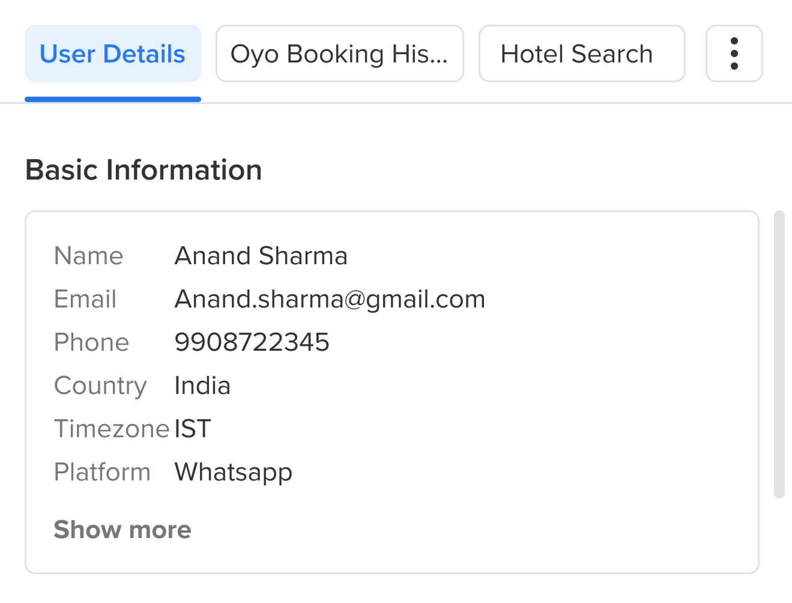

Understanding the basic details of the user like Name, Phone Number, Email, etc, help agents understand the background of the user and help users better. This section gives us all those details about the user.

#### Custom Tool 

Custom tools like ticketing system, CRM, search fields, etc. can be used by agents in this section to solve users queries further, while they continue to have conversations with users.

These external tools can also be expanded for better usability as shown in the image below -

If there are more than 2 or 3 tools, they will come stacked in a list as shown in the below image -

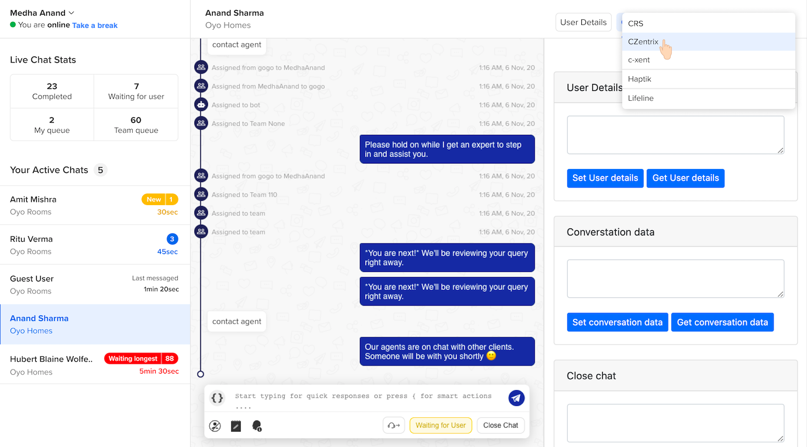

Depending on the permissions and features assigned to a Chat agent user, more actions could become accessible. 
  
> We also have a system to enforce Data level permissioning i.e. an agent user is allowed to view/edit data for which business can be controlled using this.

#### Previous Conversations

A user might have had multiple conversations with agents at distinct times. **Previous Conversations** section enables the agent to see these latest conversations of the user. A maximum of 5 previous conversations would be shown.

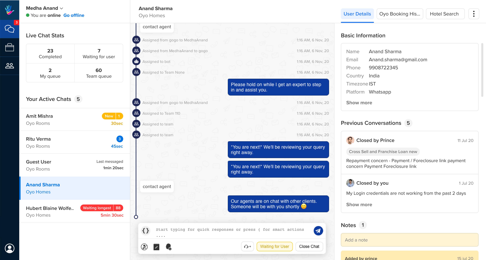

Once the agent clicks on any of the conversations, the chat link opens up in a new tab. The chat link displays the entire history of the chat which user had with the IVA.

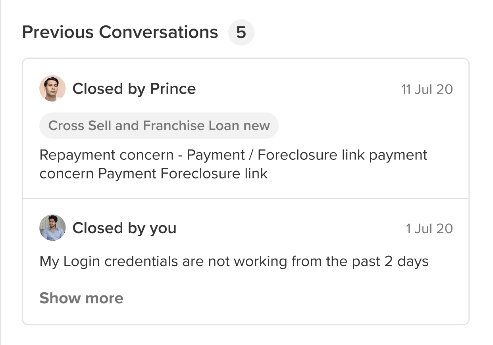

Initially, two latest conversations would be present in the **Previous Conversations** section. The **Show more** option allows the agents to view a maximum of 5 previous conversations of the user.

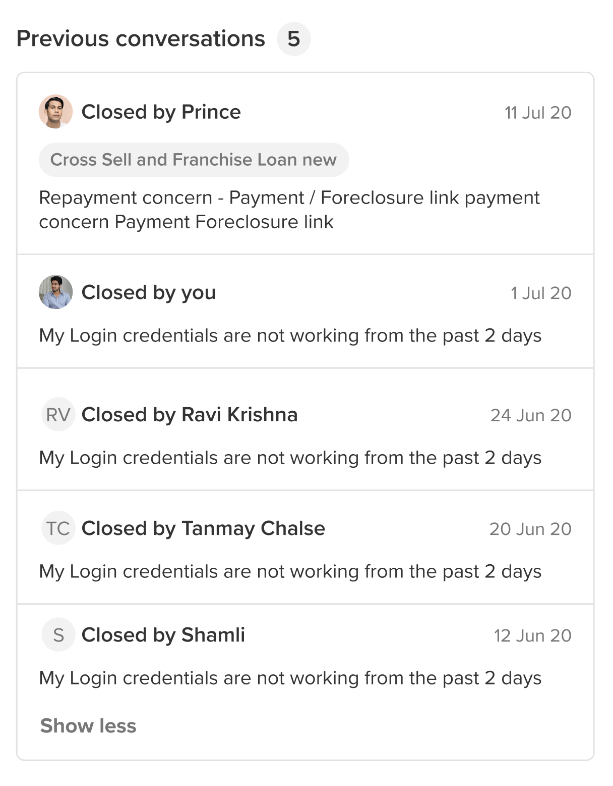

If the user does not have any chat history, the **Previous Conversation** section will be empty and will appear as follows

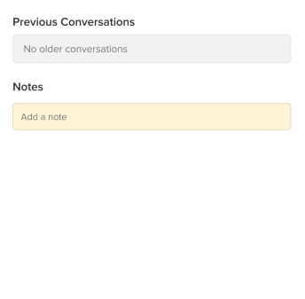

#### Notes

Notes are a stack of all the notes which different agents have recorded while having conversations with the user at distinct times.

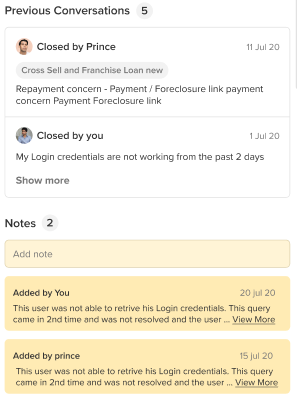

The saved note contains the name of the agent who saved the note. If the note goes beoyond 2 lines, a **View More** Button appears. **View More** will expose the entire content of the note. 

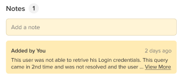

When **View More** option opens up the entire note, a **Show Less** option becomes available. **Show Less** option minimizes the open note.

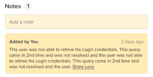

When there are more than 2 notes present, a **Show More** option appears on the bottom on the visible notes. Upon clicking **Show More** all the notes will get displayed in the Notes section.

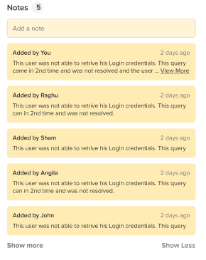

The **Show Less** option will minimize the Notes content and only display 2 latest notes.
