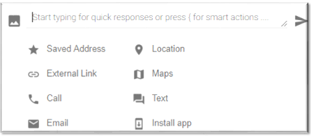

> Please note that we plan to deprecate smart actions. Some smart actions are specific to the Native SDKs and don't work on our Web SDK.

To open smart action, click on the icon at the left hand side of the action toolbar

Once you click on it, below window will pop-up

## Image Smart Action

Image smart action is used to share an image with the user. The agent can drag and drop the image file on the pop-up that opens on clicking this smart action. You can also add a custom text for the user here. Now, click *Save* and then send it to the user.

## Attachment Smart Action

Attachment smart action is used to share .pdf files with the user. The agent can drag and drop the file on the pop-up that opens on clicking this smart action. You can also add a custom text for the user here. Now, click *Save* and then send it to the user.

## External Link Smart Action

Use external link smart action to send links to the user. In *URL* field you have to paste link and in the *Custom Text for User* field, mention about the link provided.

Pasting a link without using the smart action automatically converts it to one without the custom text.
