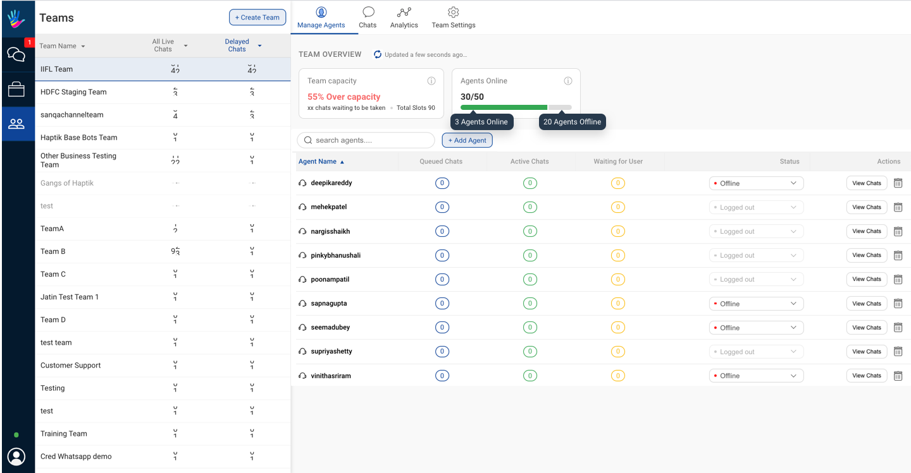
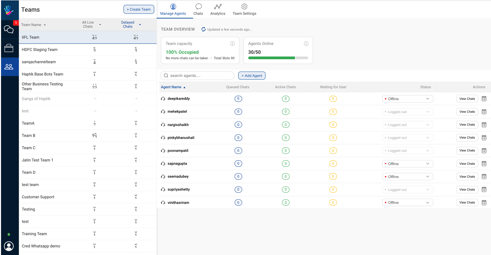
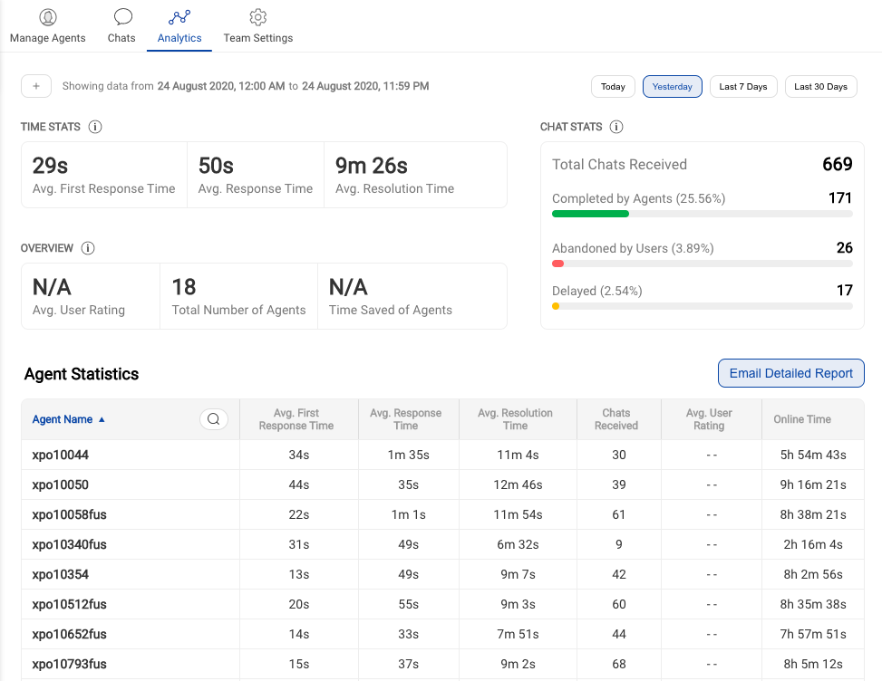
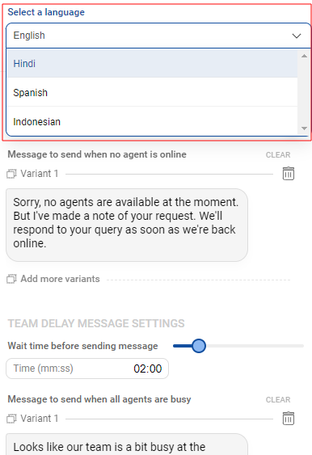
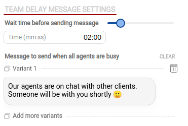
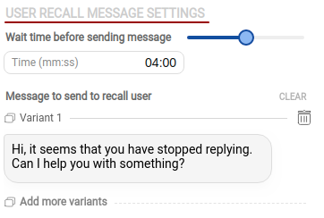

# Teams in Smart Agent Chat

Read this document to know about the **Team** feature in Smart Agent Chat. Team is a feature used by Team Leaders who are responsible to manage a team of agents.

## What is a team?
A team is a group of agents who are trained to handle user queries related to a specific topic. The team can be divided based on the subject matter/location of a user/expertise of agents. The logic for team routing can be defined as per the business requirement. 

## Chat assignment to a team

There are three ways in which a chat can be assigned to a team

1. Routing from a bot's node
2. Manual Assignment
3. Team routing from Business (When a business has no bots)

## Business Configurations for Enabling Chat Assignment to a Team

A team can receive chats from a business in 2 possible configurations

- If a Business is **Bot + Human Assisted** 

- If a Business is **Completely Human Assisted**

_Note: If a Business is **Completely Bot Assisted**, the chat will never be assigned to a team._

> Every Business has a default team in case no team is detected. For no bot condition, the default team is the only team a partner can have.

## How to create a team?

**Step 1 - Write Team name**

The team name is used for internal purpose for the Team Leaders & Agents. A user will never be able to see the team name on the chat window.

**Step 2 - Select Team Owner (Client)**

Select the Partner(Client) to which the team belongs.

> **What is a Default Team?**
> 
> There can be a situation when the team routing logic fails and no team is shortlisted to assign a chat. In that case, the chat is assigned to the default team. Create the default team on Smart Agent Chat. Open General Settings on Business manager & set the default team.

## How to Manage Agents of a Team?

1. Add agents
2. Remove agents
3. View no. of queues, active, waiting for user chats
4. View agent status
5. View agent chats

### Chat handling Capacity and Online Agent slots

The Chat handling capacity for a Team here helps figure the required number for agents at any given instant i.e. for under capacity scenario, the TLs can let some agents go offline. And in case a Team goes over capacity, TLs can call upon agents to be online.

Check the image above. Here, you get 2 values in the Capacity card - 

1. Chat handling capacity: This is a %age value that signifies if your team capacity is ideal or your team cannot handle the current incoming chat volume. For example, if the number value is in red and the copy states `over capacity`, it means the chat volume supercedes the available online agents' capacity 

2. Chats waiting to be taken: Total number of chats in queue + chats in waiting i.e. all users who might need an agent at any given instant

3. Total Slots: Total concurrency of each online agent in the team. Say, if a team had 4 agents with each having a concurrency of 3. The total available slots for the team would be 12. 

> Note: The Online agents' ratio tells you the number of agents online by total number of agents in a given team. 

### How is Team capacity calculated?

Let's understand the formula to get Chat handling capacity by a example -

i. Total concurrency for online agents in the team = A

ii. Queued + Assigned Chats total for all agents in the shown team = B

iii. Availability is calculated as = (A-B)/A x 100

The point `iii` above gives the availability %age value. This value in green means the team can handle the incoming chat volume. 

## How to monitor Team Chats?

1. View Team chats
2. Filter chats' list based on
    1. Chat status
    2. Agents
3. Take actions on chat
    1. Assign chats to 
        1. Self
        2. Any agent in a Team
        3. An agent in a Team
    2. Report inappropriate (to be deprecated)
    3. View User details

## How to analyse Team metrics?

1. View Team level statistics
2. View Agent level statistics
3. Set duration

### Tips to manage a Team

✅ Track No. of Delayed Chats and optimise agent strength per Team

✅ Track No. of Live Chats received at a given time

✅ View Response Times for a given time frame to mointor agent performance

✅ View Resolution Times on a Team/Agent level 

✅ View Individual Chats to get quality feedback

✅ Analyze end of day Team-wise analytice values here.

You can filter the summary and agent metrics by *Custom time* or *Custom date*. Refer the image below for how to check hourly/daily **Team analytics**.

> Tip: You can choose hourly slots on a date in the Time picker to get the metric values for the chosen Date and Time.

## How to make changes in the Team Settings?

**Step 1 - Select a language (Optional)**

If you have multilingual IVA, you can first select the language from the dropdown to configure the following messages.

**Step 2 - Setup Team Offline message**

If a team status id is defined as offline, the team should configure it. When users send a message and all agents have logged out, you can setup a default message for the end user. For example, this message could say `"Sorry, no agents are available at the moment. We will respond to you as soon an agent is online".`

This message will come when none of the agents assigned to that business is Online. This is also customizable and also we can adjust whether we want to complete the chat in this case or not.

> Ideally, we suggest agents to go offline first and then logout. So, first an agent closes chats in their queue. And then they logout as soon as they're to end their daily shifts. 

There is a toggle of Marking Chat as complete. This means -

- If the Toggle is **ON**, i.e Green colour - All the chats will be completed when agents are Offline.

- If the Toggle is **OFF**, i.e Red colour - All the chats will remain in Pending/Queued State when agents are Offline.

**Step 3 - Setup Team Delay Message and Delay Time**

Similar to the Team Offline message, you can configure the delay message that is sent to users with a set delay time. This message will be sent to the user when all agents are busy will other chats. This is customizable and we can adjust the time after which this message will be sent.

> Note: Offline message will appear immediately after the user has initiated an agent chat, whereas Delay Message will appear after the specified time interval.

**Step 4 - Setup User Recall Message and Recall Time**

Similar to the Delay message, you can configure the recall message to get the user back in the conversation. This message is sent once the chat has started with the agent but the user has stopped replying in between to the Agent. The time can be configured between 0s to 8m. 

After making all the adjustments, Don't forget to Save all the changes which you have done.

## Managing Offline Hour chats

In the Team settings, you can turn the toggle to complete all chats when no agent is online. But there can be an edge case as mentioned below. We need to understand when this edge case occurs, and assign a specific permission to all agents.

A chat would get assigned first to the last agent who took this user's chat. Assuming the agent is available. We mandate agents to go offline before 30 minutes of their shift closure time, and then logout on shift end. This works in sync with our assignment so that logged out agents are not considered for assignment. For when agents are going offline, but not actively logging out, the chats that come in offline hours get assigned but the agents in reality are not available. We should use the `Inactivity_logout` permission that logs out agents on no activity for 15 minutes. 
