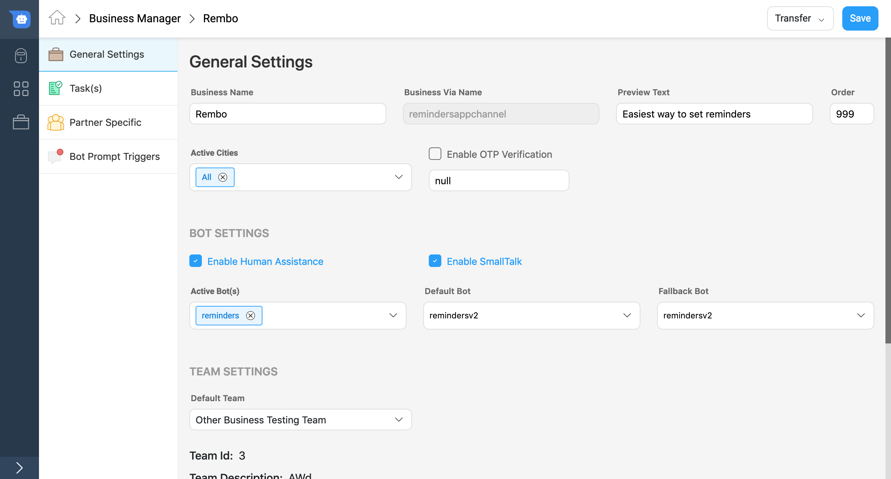
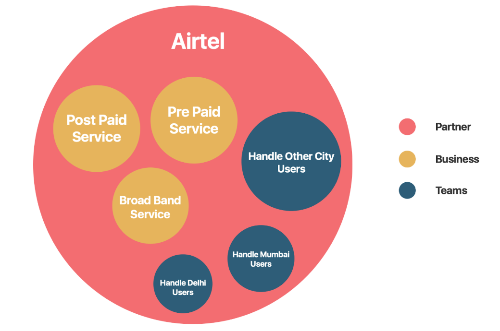

# Teams in Agent Chat

Read this document to know about the **Team** feature in Agent Chat. Team is a feature used by Team Leaders who are responsible to manage a team of agents.

## What is a team?
A team is a group of agents who are trained to handle user queries related to a specific topic. The team can be divided based on the subject matter/location of a user/expertise of agents. The logic for team routing can be defined as per the business requirement. 

## Business Configurations for Enabeling Chat Assignment to a Team

A team can receive chats from a business in 2 possible configurations

- If a Business is **Bot + Human Assisted** 

- If a Business is **Completely Human Assisted**

_Note: If a Business is **Completely Bot Assisted**, the chat will never be assigned to a team._

## Example

In the above example, Airtel is a partner. There are three teams, which lie under Airtel as a Partner. Teams are not directly associated with a business. They are associated with nodes in the chatflow for a particular bot.

Note: Every Business has a default team in case no team is detected. For no bot condition, the default team is the only team a partner can have.

## Chat routing to a team

There are three ways in which a chat can be assigned to a team

1. Routing from a bot's node
2. Manual Assignment
3. Team routing from Business (When a business has no bots)

## How to create a team?

### Step 1 - Write Team name

The team name is used for internal purpose for the Team Leaders & Agents. A user will never see the team name of the team assigned to him/her.

### Step 2 - Select Team Owner (Client)

Select the company to which the team belongs. This is used by agencies who deal with multiple clients at a given time.

### Step 3 - Select Team Status (Online/ Offline)

Team status defines if the team can receive chats from a business or not.

Online - Team will receive chats from a business
Offline - Team will not receive chats from a business

### Step 4 - Setup Team Offline message

If a team status id is defined as offline, the team should configure it. When users send a message and all agents have logged out, you can setup a default message for the end user. For example, this message could say `"Sorry, no agents are available at the moment. We will respond to you as soon an agent is online".`

   > Ideally, we suggest agents to go offline first and then logout. So, first an agent closes chats in their queue. And then they logout as soon as they're to end their daily shifts. 

### Step 5 - Setup Team Delay Message and Delay Time

Similar to the Team Offline message, you can configure the delay message that is sent to users with a set delay time.

## How to Manage Agents of a Team

1. Add agents
2. Remove agents
3. View no. of queues, active, waiting for user chats
4. View agent status
5. View agent chats

## Team Chats

1. View Team chats
2. Filter chats' list based on
    1. Chat status
    2. Agents
3. Take actions on chat
    1. Assign chats to 
        1. Self
        2. Any agent in a Team
        3. An agent in a Team
    2. Report inappropriate (to be deprecated)
    3. View User details

## Team Analytics

1. View Team level statistics
2. View Agent level statistics
3. Set duration

## What is a Default Team?

There can be a situation when the team routing logic fails and no team is shortlisted to assign a chat. In that case, the chat is assigned to the default team.

### Step 1 - Create a Team in Agent Chat

Make a team in agent chat which is supposed to take chats which are not assigned to any team (due to any technical reason).

### Step 2 - Select Default Team in Business manager

Open General Settings in Business manager & set the default Team.

## Tips to manage a Team

✅ Track No. of Delayed Chats and optimise agent strength per Team

✅ Track No. of Live Chats received at a given time

✅ View Response Times for a given time frame to mointor agent performance

✅ View Resolution Times on a Team/Agent level 

✅ View Individual Chats to get quality feedback

✅ Analyze end of day Team-wise analytice values here.

You can filter the summary and agent metrics by *Custom time* or *Custom date*. Refer the image below for how to check hourly/daily **Team analytics**.

> Tip: You can choose hourly slots on a date in the Time filter to get the metric values for the chosen Time slot.
