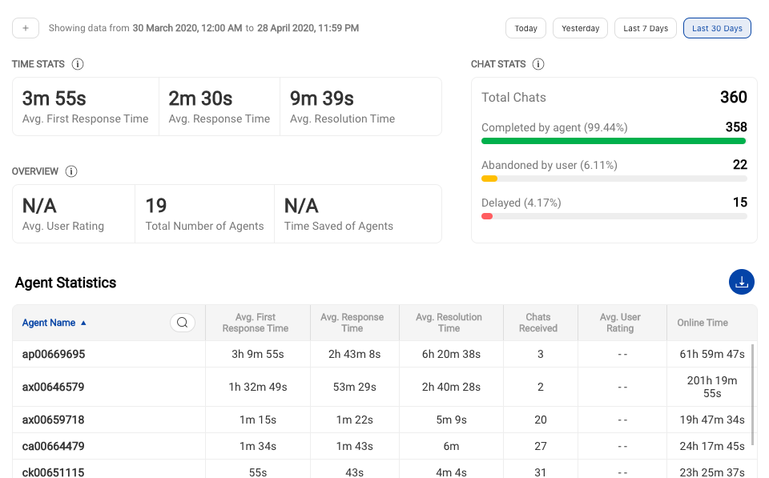

# Teams in Agent Chat

Read this document to know about the **Team** feature in Agent Chat. Team is a feature used by Team Leaders who are responsible to manage a team of agents.

## What is a team?
A team is a group of agents who are trained to handle user queries related to a specific topic. The team can be divided based on the subject matter/location of a user/expertise of agents. The logic for team routing can be defined as per the business requirement. 

## Business Configurations for Enabeling Chat Assignment to a Team

A team can receive chats from a business in 2 possible configurations

- If a Business is **Bot + Human Assisted** 

- If a Business is **Completely Human Assisted**

_Note: If a Business is **Completely Bot Assisted**, the chat will never be assigned to a team._

## Example

In the above example, Airtel is a partner. There are three teams, which lie under Airtel as a Partner. Teams are not directly associated with a business. They are associated with nodes in the chatflow for a particular bot.

Note: Every Business has a default team in case no team is detected. For no bot condition, the default team is the only team a partner can have.

## Chat routing to a team

There are three ways in which a chat can be assigned to a team

1. Routing from a bot's node
2. Manual Assignment
3. Team routing from Business (When a business has no bots)

## How to create a team?

### Step 1 - Write Team name

The team name is used for internal purpose for the Team Leaders & Agents. A user will never see the team name of the team assigned to him/her.

### Step 2 - Select Team Owner (Client)

Select the company to which the team belongs. This is used by agencies who deal with multiple clients at a given time.

### Step 3 - Select Team Status (Online/ Offline)

Team status defines if the team can receive chats from a business or not.

Online - Team will receive chats from a business
Offline - Team will not receive chats from a business

### Step 4 - Setup Team Offline message

If a team status id is defined as offline, the team should configure it. When users send a message and all agents have logged out, you can setup a default message for the end user. For example, this message could say `"Sorry, no agents are available at the moment. We will respond to you as soon an agent is online".`

   > Ideally, we suggest agents to go offline first and then logout. So, first an agent closes chats in their queue. And then they logout as soon as they're to end their daily shifts. 

### Step 5 - Setup Team Delay Message and Delay Time

Similar to the Team Offline message, you can configure the delay message that is sent to users with a set delay time.

## How to Manage Agents of a Team

1. Add agents
2. Remove agents
3. View no. of queues, active, waiting for user chats
4. View agent status
5. View agent chats

## Team Chats

1. View Team chats
2. Filter chats' list based on
    1. Chat status
    2. Agents
3. Take actions on chat
    1. Assign chats to 
        1. Self
        2. Any agent in a Team
        3. An agent in a Team
    2. Report inappropriate (to be deprecated)
    3. View User details

## Team Analytics

1. View Team level statistics
2. View Agent level statistics
3. Set duration

## What is a Default Team?

There can be a situation when the team routing logic fails and no team is shortlisted to assign a chat. In that case, the chat is assigned to the default team.

### Step 1 - Create a Team in Agent Chat

Make a team in agent chat which is supposed to take chats which are not assigned to any team (due to any technical reason).

### Step 2 - Select Default Team in Business manager

Open General Settings in Business manager & set the default Team.

## Tips to manage a Team

✅ Track No. of Delayed Chats and optimise agent strength per Team

✅ Track No. of Live Chats received at a given time

✅ View Response Times for a given time frame to mointor agent performance

✅ View Resolution Times on a Team/Agent level 

✅ View Individual Chats to get quality feedback

✅ Analyze end of day Team-wise analytice values here.

You can filter the summary and agent metrics by *Custom time* or *Custom date*. Refer the image below for how to check hourly/daily **Team analytics**.

> Tip: You can choose hourly slots on a date in the Time picker to get the metric values for the chosen Date and Time.

## Team analytics (Agent performance)

1. **Total Chats** 
    
    All chats received by the Team in a selected time period fall under this metric. This will include chats in waiting/pinned/queued for the chosen time duration as well as all completed chats by agents or bot or autocomplete during this period.

2. **Completed by agent** 
    
    Count all chats completed by agents (excluding the bot / gogo) during a selected time period for a team to get this metric. For example, if chat disposition exists for a chat that means this conversation was marked complete via the agent.
    
> Completed by agents = No of chats actually closed by that agent.

3. **Abandoned by user**
    
    For all conversations with claim_name not “gogo“ and user_message_count = 0 that means all chats wherein user gets an agent assigned but the user drops-off before sending a message would be counted as an abandoned chat.
    
> Consider another scenario when in Conversation A - User chats with Agent 1 and Agent 1 logs out after replying back to user’s query. In the same Conversation A, user comes back and sends a message, now say this chat goes to Agent 2 and the user doesn’t return. Now, if the chat goes to complete state, we consider this chat as abandoned for Agent 2.

4. **Delayed**
    
    This metric gets us a count of all instances where the `first_agent_response_time` is greater than 'Delay Time value' as setup from the Team settings i.e. the delay message time value.
    
5. **Time saved of agents**

    All chats where claim_name = "gogo" and add up all the "agent_resolution_time", that would be the total amount of time, gogo (Haptik bot) was responding instead of an agent.
    
> Please do not confuse this with the RoI calculations shared by the Customer Success manager. 

6. **Agent Online Time**

    When agents are receiving chats, we total this time i.e. to give you a sense of agent's online activity. This is a useful input to understand agent productivity. 
    
7. **Avg. First Response Time** (FRT)

    FRT is the first response time taken by the agent to send the first response to an end user. Only the chats whose first response was sent during the selected time range will be taken into account. Chats may have been created anytime (inside and outside the selected time range). Queue time is included in this metric. As we check this from first user message timestamp to the first agent response timestamp.
    
8. **Avg. Response Time** (RT)

    RT calculation is the average time taken by the agent to respond in a chat to all messages and not just the first message. Only the chats whose responses were sent during the selected time range will be taken into account. Chats may have been created anytime (inside and outside the selected time range). For the user’s 2nd, 3rd and so on messages, the response time is simply the delta in the user message timestamp and the agent’s response timestamp. 
    
9. **Avg. Resolution Time**

    This metric 'Average resolution time' should be the average time taken by the agent till there are no messages sent in a chat session. Only the chats that were completed during the selected time range will be taken into account. Chats may have been created anytime (inside and outside the selected time range). Resolution time is simply calculated from the user’s first message sent timestamp till the last agent/user message timestamp in a chat.
    
10. **Chats received**

    For an agent, we count the number of chats pinned to them in a given time duration, and this total count would be shown as an agent statistic in the agent table on Team analytics section.
    
   
## Managing Offline Hour chats

In the Team settings, you can turn the toggle to complete all chats when no agent is online. But there can be an edge case as mentioned below. We need to understand when this edge case occurs, and assign a specific permission to all agents.

A chat would get assigned first to the last agent who took this user's chat. Assuming the agent is available. We mandate agents to go offline before 30 minutes of their shift closure time, and then logout on shift end. This works in sync with our assignment so that logged out agents are not considered for assignment. For when agents are going offline, but not actively logging out, the chats that come in offline hours get assigned but the agents in reality are not available. We should use the `Inactivity_logout` permission that logs out agents on no activity for 15 minutes. 
