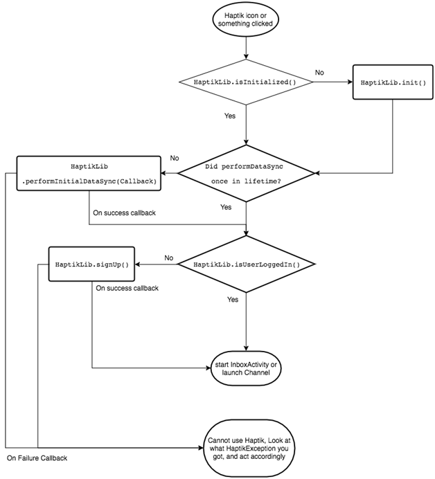

<AUTOGENERATED_TABLE_OF_CONTENTS>

<a name="haptik-signup-flow-at-a-glance"></a>

**Sign Up Flow: At a glance**

 Below is the flow chart which shows what flow MUST be followed on app
 start and before showing inbox view



## Configuring Activities

The following Activity needs to be added to your Manifest. Adding a parent will make sure that the UP button in the ChatActivity will take the user to the correct activity. If you implement an Activity which will host the InboxView then that would be the ideal candidate to be the parent of the ChatActivity.

```xml
<application>
.
.
.

<activity android:name="ai.haptik.android.sdk.messaging.ChatActivity" android:parentActivityName="ENTER THE ACTIVITY YOU WANT AS THE PARENT HERE">
    <meta-data android:name="ai.haptik.android.sdk.messaging.backAsUp" android:value="true"/>
</activity>

.
.
.
</application>
```

The meta-data tag which is part of the ChatActivity is used to define the behaviour of the back button when the user is in the ChatActivity. There are two possible behaviours that can be assigned to the back button:

- The back button will behave the same way as the up button
- The back button will follow the default Android behaviour of a back button.

For the first option the **value** field needs to be set to true and for
the second option it needs to be set to false. Incase you don’t add this
meta-data tag the value is set to true.


<a name="offline-behavior"></a>

## 3. Offline Behaviour

All offline behavior will be handled by the Haptik SDK, such as Message Delivery, QoS(Quality of Service) and MQTT Reconnection etc.

<a name="analytics"></a>

## 4. Analytics

We provide `AnalyticsCallback` class which has various methods which gets triggered on various scenarios.

One important method is `logEvent(String, Map<String, Object>)`. This method gets called on every analytics event which gets triggered from SDK.

<a name="message-event-listener"></a>

<a name="sending-message-programmatically"></a>

## Sending Message Programmatically

// Using this method, you can send a message from user side programmatically without even going into messaging UI.

```java
sendMessage(String message, String businessViaName)
```

<a name="share-functionality"></a>


