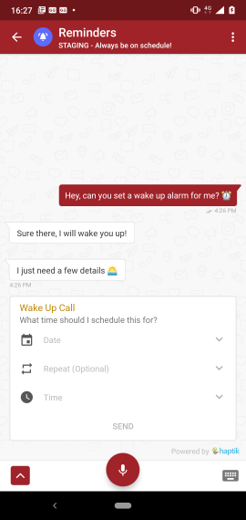

<AUTOGENERATED_TABLE_OF_CONTENTS>

## 1. Introduction

Haptik makes it easy to add AI powered chatbot for your business. Haptik
provides an end to end solution for chatbots right from
1. Designing the bot. 
2. Developing the bot.
3. Provides a dashboard for your chat assistants to manually chat with
   your consumers should the need arise.
4. Analytics dashboard to monitor the statistics of the chats.
5. UI for your users to interact with the bot, in the form of SDKs for
   Android, iOS and Web.
   
This document shall give you an overview of the technical concepts and
terms that are used in Haptik and steps to integrate the Haptik Android
SDK in your code.

## 2. Technical Overview

Haptik SDK provides UI and APIs to consume the abilities of a
chatbot in your application. It is as simple as handing over the control
to the Haptik SDK when a button is clicked and then it will handle all
the bot related actions, even the Notifications!!!

However, during the integration of the SDK the following terms will help
you understand the documentation easier.

1. Initialize Haptik SDK:
   - This is an important step when you start integrating the Haptik
     SDK.
   - If you access any Haptik feature without performing this step, it
     will cause the app to crash.
     
2. Guest User Sign Up
   - To speed up the process of sign up Haptik skips user verification during sign up, this is called as a Guest Sign up.
            
3. Messaging Screen

   
    
  
