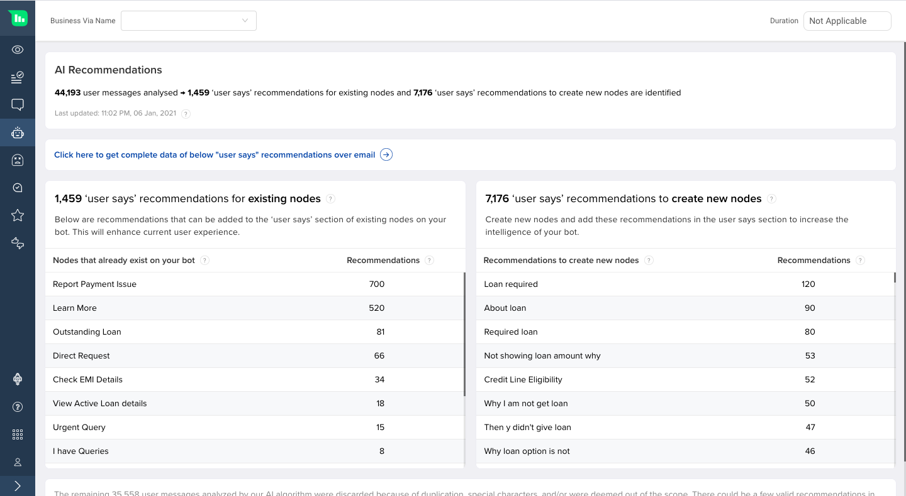
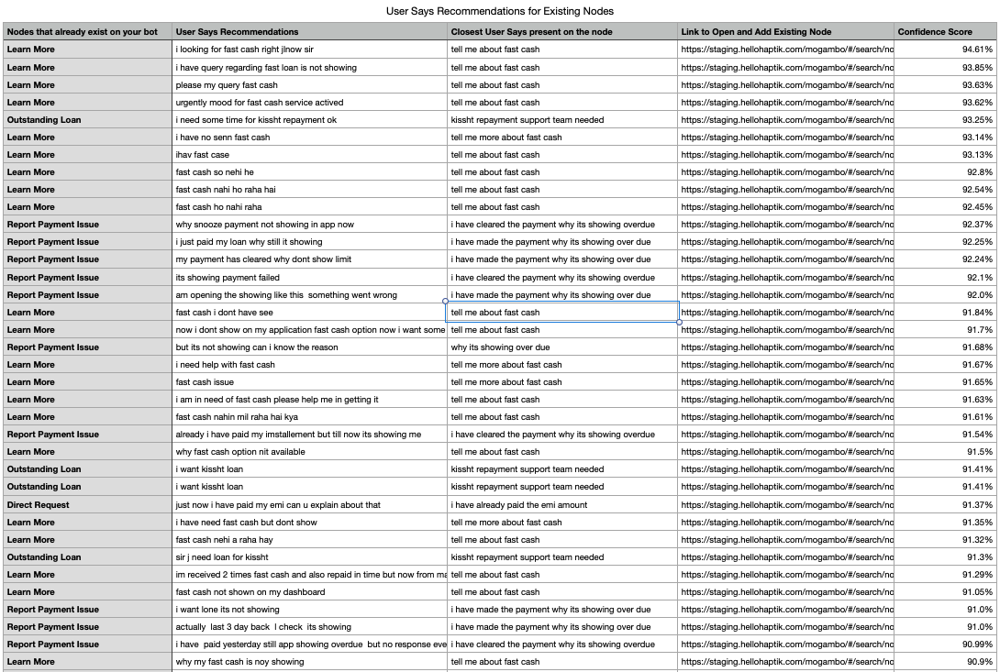
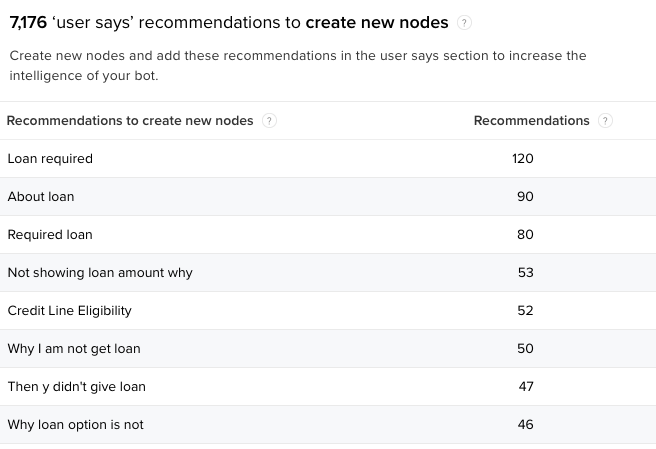
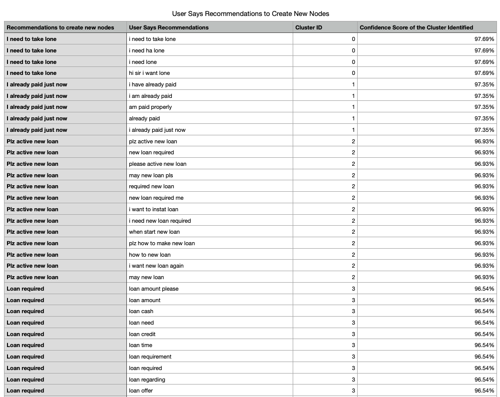

## Introduction

Intelligent Ananlytics is the tool which provides information about how your IVA is performing. It also provides feedback on your IVA and points out the problem areas. Using these learnings, you can improve conversations & interactions that users have with the IVA and take take better decisions to build a superior user experience. 

AI Recommendations is one such feature on Analytics which identifies issues with your IVA regarding missing user intents and training deficit on existing intents. It uses an algorithm that intelligently analyses user messages which the bot was not able to understand. Instead of manually analyzing 1,000s of interactions every day to find out those problem areas, we optimize this process with AI. 

The AI Recommendations algorithm provides you all the key insights to understand user interactions to train your IVA better and enhance its intelligence further.

So to sum up, 

- The algorithm tells you what users are chatting about, which you have not accounted for in the IVA. In other words, missing intents. By adding these intents, the number of IVA breaks reduces over time.

- The algorithm also tells you which intents need more training data to make your IVA more intelligent.

## How to use AI Recommendations?

As shown in the above image, you can see two data sets. On the left side, you find intents which require more training data. On the right side, you find missing intents which can be added on the IVA. 

To start using AI Recommendations, download the sheet by clicking on the link shown in the below image. You will receive two CSV files.

### User Says recommendations for Existing Nodes

Existing nodes are intents which are already present on the bot. User says recommendations for existing nodes are phrases that can be added to the ‘user says’ section of these existing nodes.

This will help your bot fetch response to a user’s message correctly from the right node because it will be trained with more utterances of the intent on the same node, thus making the training model stronger.

#### Nodes that already exist on your bot

This is the list of node names existing on the bot. These are already trained with the relevant “user says” messages and correspond to a user’s intent on Conversation Studio.

#### Recommendations

Recommendations are user messages that broke your bot or caused smart assist to be triggered. The AI Recommendations algorithm suggests that these should be added to the ‘user says’ section of existing nodes on your bot. The volume of the similar intents is also shown in this section. In order to see all the recommendations, you can click on the link shown above to get the detailed report over email.

The downloaded CSV contains 5 columns -

1. Nodes that already exist on your bot

2. User Says Recommendations

3. Closest User Says present on the node - These are the User Says already existing on the node.

4. Link to Open and Add Existing Node - This is the link of the node so that you can directly navigate to the required node to add the User Says.

5. Confidence Score - This is the confidence score of AI Recommendations algorithms of matching the recommended user says to the existing nodes.

Here is a snippet of the CSV - 

### User Says recommendations to Create New Nodes

The Create New Nodes section helps you identify intents which are out-of-scope of the bot as well as identify what are the new user utterances surfacing over the bot.

These messages will help you identify and understand what should be the new capabilities that can be added to the bot.

#### Recommendations to create new nodes	

The AI Recommendations algorithm has identified similar intents and clustered them together to understand how we can make them into new nodes. These recommendations can be added as new nodes to increase the intelligence and capability of your bot to reply to users queries.

#### Recommendations

You can see the volume of the similar new intents in this section. In order to see all the recommendations, you can click on the link shown above to get the detailed report over email.

The downloaded CSV contains four columns -

1. Recommendations to create new nodes - These are the recommended names of new nodes that can be created with the corresponding user says in the next column.

2. User Says Recommendations - These are the user messages to which the IVA responded with Smart Assist and Bot Break Messages. Then can be used as User Says on the new nodes.

3. Cluster ID	- This helps you understand the count of clusters formed. AI algorithm has identified similar intents and clustered them together to understand how we can make them into new nodes.

4. Confidence Score of the Cluster Identified	- This column will help you understand the similarity in the messages to cluster them together.

Here is a snippet of the CSV - 

## Why use AI Recommendations?

AI Recommendations will not only reduce the manual effort required to go through every single message to identify IVA breaks but also lead to algorithmically improving the training data based on statistically analyzed user data.

Using AI Recommendations you can - 

- Identify the Out of Scope queries and find new user intents that can be added to the IVA in order to improve the user experience. This can reduce the IVA maintenance by 30%.

- Categorize similar user utterances to a single bucket of intent that will lead to less bot breaks, and in turn increase the Smart Funnel completion rate of in-scope intent.
