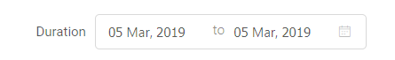
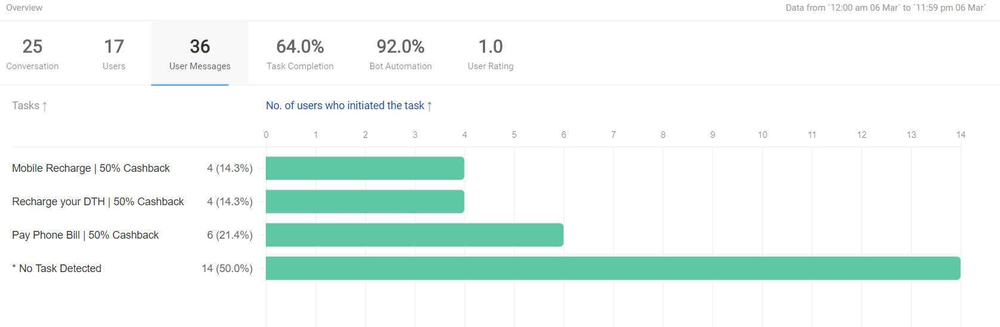
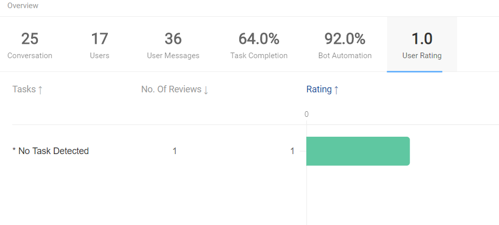

## Introduction

The first section in the Analytics tool is the **Overview** section. As the name suggests, this section helps you get a quick overview of the different aspects of your IVA's performance. 

The Overview section provides information about:

* Conversations
* Users
* User Messages
* Bot Automation
* User Rating

You can later use following sections to get more detailed information on any of these sub sections.

### Filters

On top of all screens inside the Analytics tool you will find filter options. These filter options can help you filter your data by Business or Bots from the filters on the left hand side. 

You can select `Channels` or `Bots` from the first dropdown on the left hand side and then select the particular business or bot from the dropdown next to it.

On the right hand side of the filter section, you will find the duration filters. Using these settings you can filter the time period of the data presented. There is a Compare feature here. You can compare the performance of all metrics between the selected duration and its previous duration.

## ***Conversation***
The first tab inside the Overview section is the Conversation tab. Here you can find a graph that gives you information about the user messages, conversations and automation percentage at a given time.

**Bot state**
A conversation is defined as a series of messages exchanged between the IVA and the user before 8 minutes of inactivity. This means we close a conversation when there are no messages exchanged between the IVA and the user for 8 minutes. 

**Agent state**
In agent state, a conversation is closed only when the agent clicks “Close Chat” or after 8 mins inactivity for chats that are in “Waiting State”.

> Automated system messages (like "Chat Assigned", "Chat Completed", "Delay", "Follow Up" etc.) are not to be included when calculating the conversation complete time.

The data is represented in the form of a line graph with 4 different lines. The 4 different lines correspond to 
1) Number of Users
2) Number of Conversations
3) Number of User Messages
4) Bot Automation

The Bot automation metric gives you the percentage of conversations without bot breaks or human intervention (agent). **Bot Transfers** are shown on the graph too with a vertical line.

> Knowledge Tip: A conversation is a set of messages used to accomplish a task.

In the graph the X axis is the time and the Y axis represents data about Users, Conversations, Messages and Automation. You can get data at any given time point by hovering on the graph.

## ***User***
The next tab in the overview section is the Users tab. This tab shows the number of unique users for the filtered channel or bot in the given duration period.

The graph for this data is an upcoming feature and will be documented here once it is available.

## ***User Messages***
The next tab in the Overview section is the User Messages tab. This tab measures what tasks were most initiated by user. It shows a list of tasks in the chatbot along with the number of users who initiated the task.

At the top of the tab you can see the total number of task activations and this is divided on a task to task basis below it.

> Tip: This tab can help you understand what tasks are being tapped on by the user. You should experiment the title of task or the icon and see how that nudges the task activation numbers.

## ***Bot Automation***
The next tab is Bot Automation. Bot Automation percentage tells us about what percentage of the conversations did not have either a bot break or an agent involved for the selected duration of time.

> Bot Automation Formula - No. of conversations did not have a bot break or a an agent response/ Total no of conversations

Below are the scenarios where bot breaks could possibly take place -

- Scenario 1
When a bot fails to answer a query which it was trained on

- Scenario 2
When there is an API failure and the bot is not able to give an appropriate response

- Scenario 3
When a conversation gets transferred to an agent from a bot

> When bot gives a smart assist message, it is not considered as a Bot Break. You can read more about Smart Assist and its types [here].(https://docs.haptik.ai/bot-builder/basic/smart-assist)

The graph for this tab is an upcoming feature and will be documented here once it is ready.

## ***User Rating***
The final tab is User Rating. This tab tells you how users rated the different tasks in the chatbot. The rating is optional and is given on a scale of 1-5 stars.

On the top of the tab you can see the average rating given across all tasks and below it you have the data split from a task to task basis.

> Tip: You can try to improve the task flow by making changes. The user rating changes for the task will help you measure the effectiveness of the changes.
