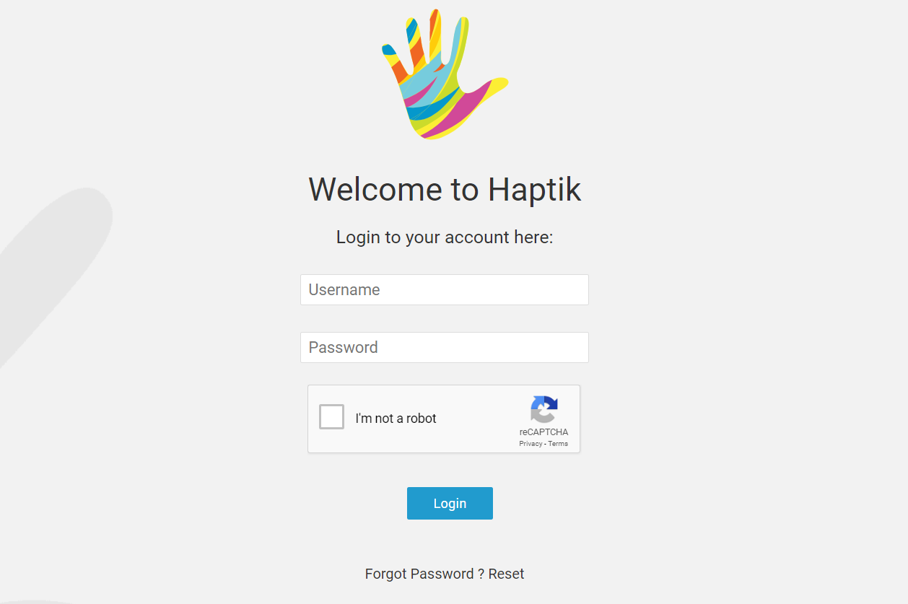
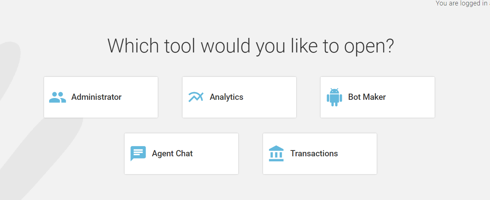
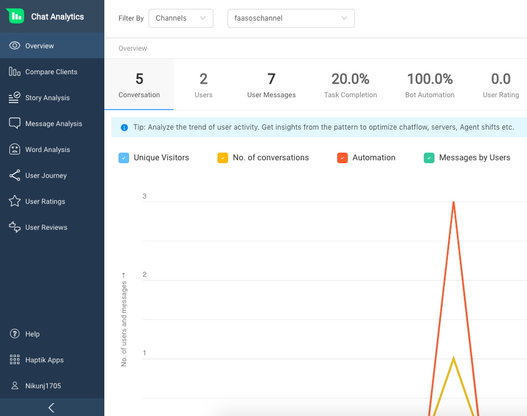

In this document we will discuss about how you can start using the analytics tool.

## Getting Credentials
The first step in starting to use the analytics tool is to get the credentials from the Haptik team. 

Haptik team will provide you with a username and password. They will also provide you with the website link where you can access the tool.

## Accessing the Tools
Once you have the credentials the next step is to open the web link provided by the haptik team. After you open the link you will be asked to enter your credentials. You can use the credentials provided by the Haptik team to login to the site.

## Opening Analytics
After you have logged in with the credentials. You will be presented with a screen with all the tools you have access to. From this menu click on the `Analytics` option to open the analytics tool.

After clicking on `Analytics` you should be able to see the analytics dashboard with a menu to open different parts of the tool.

You can learn about getting started with using the tool [here](https://docs.haptik.ai/bot-analytics/).