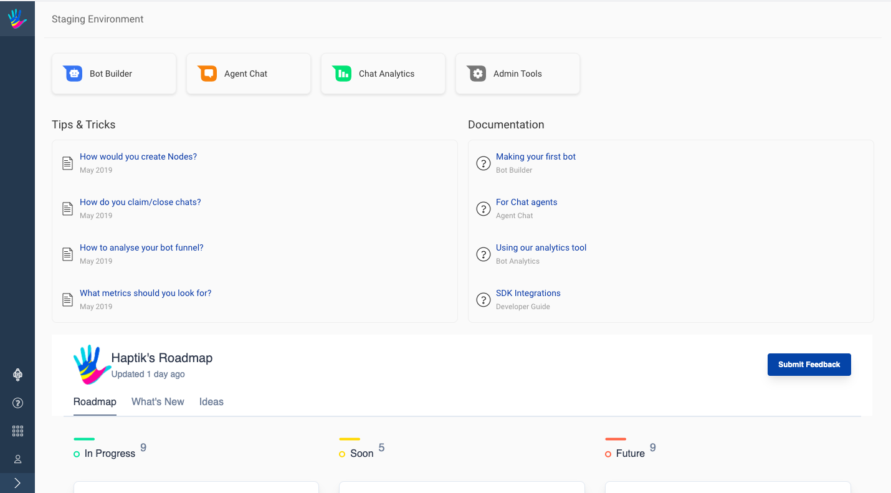
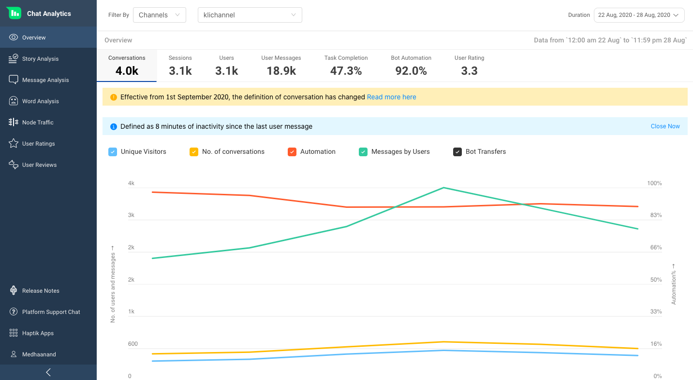

Analytics by Haptik empowers teams to get a comprehensive overview of how the IVAs are performing. Get in-depth insights into how users interact with your IVAs, identify problem areas or features that can be improved and also collect first-hand user feedback about your IVA experience in real-time. The user messages/conversations with historical data can help answer the toughest questions about users. Boost your IVA's conversations' success with this tool. 

Through this document, we shall explore the different types of metrics available for tracking and analyzing the IVA using the real-time analytics tool.

You can skip straight to a quick video about the tool [**HERE**](https://youtu.be/0xodi9IC5eg).

The Analytics tool consists of multiple sections with each section containing metrics and data about a different aspect of the IVA. The multiple sections include:

- Overview
- Story Analysis
- Message Analysis
- Word Analysis
- Query Completion
- Node Traffic
- User Ratings
- User Reviews

## Getting Credentials
The first step in starting to use the analytics tool is to get the credentials from the Haptik team. 

Haptik team will provide you with a username and password over email. Also a url will be shared, using which you can access the tool.

## Accessing the Tools
Once you have the credentials the next step is to open the url provided by the Haptik team. After you open the link you will be asked to enter your credentials. You can use the credentials provided by the Haptik team to login to the site.

Below is the home screen you will get to see once you have successfully logged-in.

## Opening Analytics
After you have been presented the home screen with all the tools you have access to, click on the `Chat Analytics` option to open the analytics tool.

After clicking on `Chat Analytics` you should be able to see the analytics dashboard with a menu to open different parts of the tool.

Now that you can access the tool, you can go through the sections provided in this documentation to know more about the various screens on `Chat Analytics` tool. You can start [here](https://docs.haptik.ai/bot-analytics/overview).
