## Introduction

The first section in the Intelligent Analytics tool is the **Overview** section. As the name suggests, this section helps you get a quick overview of the important metrics to measure the IVA's performance.

The **Overview** section provides information about:

* Unique Users
* Conversations
* User Rating
* Queries
* Bot Automation

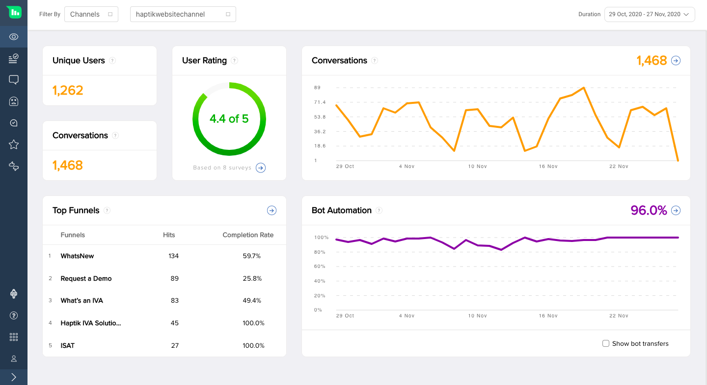

### Filters

On top of all screens inside the Intelligent Analytics tool you will find filter options. These **filter options** can help you filter your data by Business or Bots from the filters on the left hand side. 

You can select `Channels` or `Bots` from the first dropdown on the left hand side and then select the particular business or bot from the dropdown next to it.

### Duration

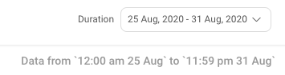

On the right hand side of the filter section, you will find the duration filters. Using these settings you can filter the time period of the data presented. 

There is a compare feature available which will help you to compare the performance of all metrics between the selected duration and its previous duration.

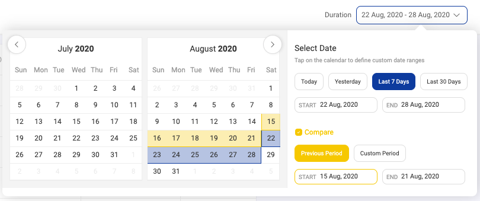

## ***Unique User***

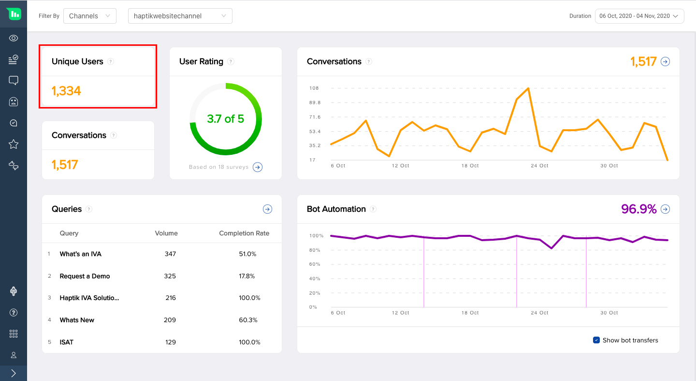

The first section in the overview section is the unique users section. This section shows the number of unique users for the filtered channel or bot in the given duration period.

## ***Conversations***

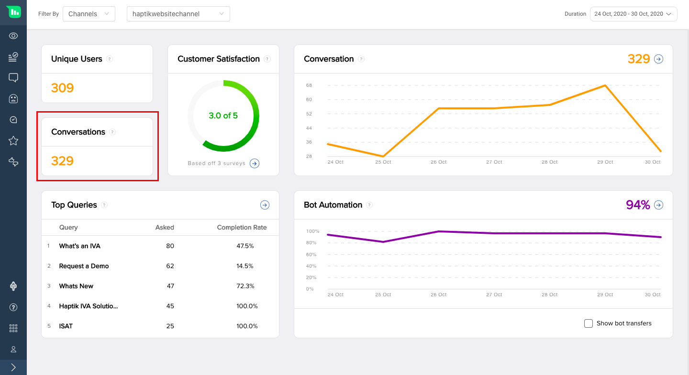

A conversation is defined as a series of messages exchanged between the IVA and the user before 8 minutes of inactivity.

- **Bot state**

In bot state, we close a conversation when there are no messages exchanged between the IVA and the user for 8 minutes. 

- **Agent state**

In agent state, we close a conversation either only when the agent clicks “Close Chat” or after 8 mins inactivity for chats that are in “Waiting State”.

> Automated system messages like "Chat Assigned", "Chat Completed", "Delay", "Follow Up" etc. are not to be included when calculating the conversation complete time.

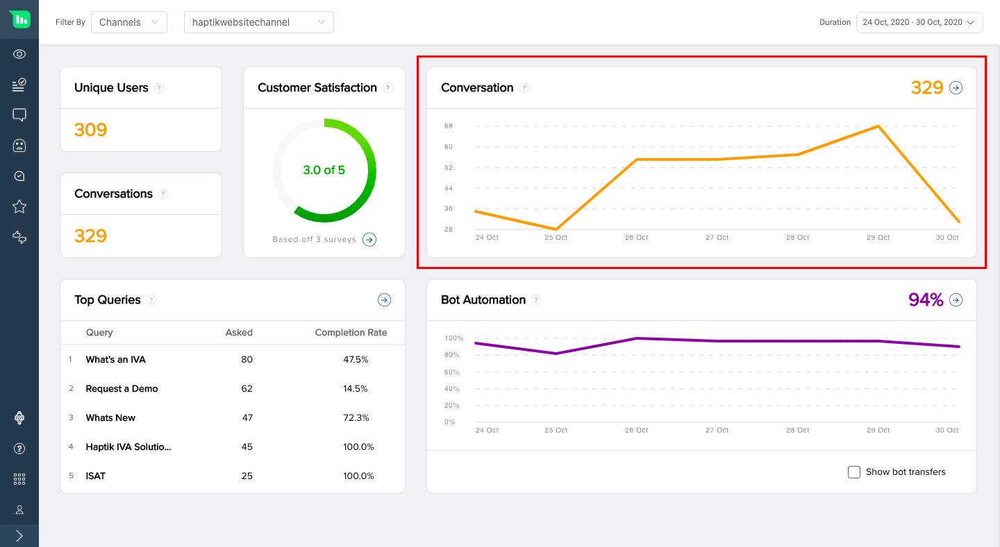

In the graph, the X axis is the time and the Y axis represents data about Conversations. 

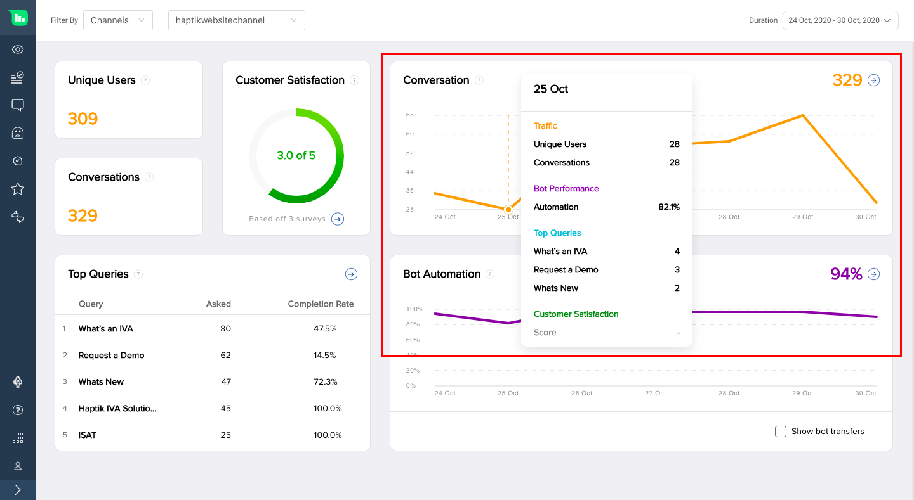

You can get data at any given time point by hovering on the graph. 

- **Traffic**: It will give the number of Unique Users and Conversations at the selected point of date-time.

- **Bot Performance**: It will give the Bot Automation at the selected point of date-time.

- **Top Queries**: It will give the top queries asked by users at the selected point of date-time.

- **Customer Satisfaction**: It will give the customer satisfaction score at the selected point of date-time.

## ***User Rating***

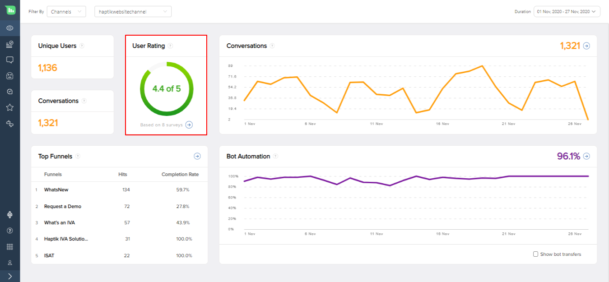

This section gives the average User Rating. The rating is optional and is given on a scale of 1-5 stars.

## ***Queries***

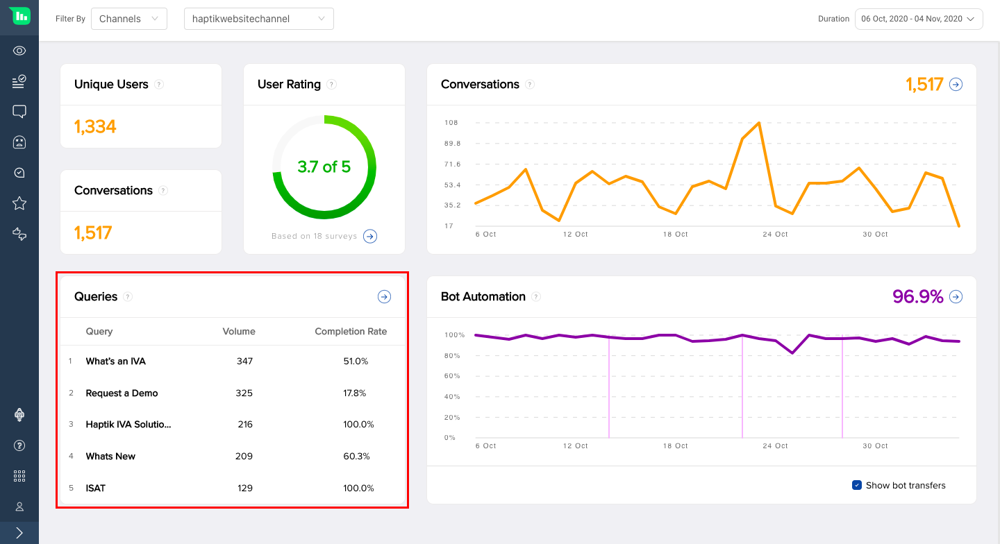

This section gives the top queries coming on the bot.

> Query is a step or a series of steps designed to see the effectiveness of the bot to help user’s reach their goal.

Along with the query name, volume and completion rate are also shown.

> **Volume**: Defines the number of times a particular query has been raised by all the users on the bot.
>
> **Completion rate**: Defines the number of instances where the user reached their end goal.

## ***Bot Automation***

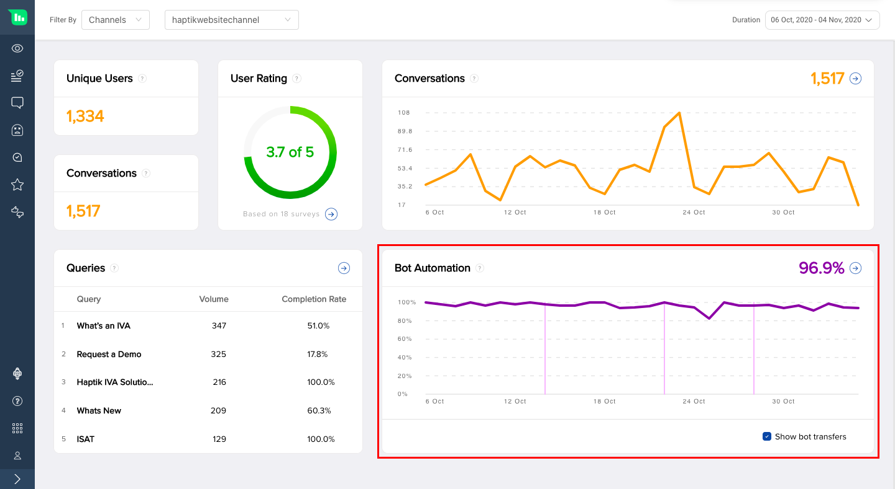

The next section is Bot Automation. Bot Automation percentage tells us about what percentage of the conversations did not have either a bot break or an agent involved for the selected duration of time.

In the graph, the X axis is the time and the Y axis represents Bot Automation %. 

> **Bot Automation Formula** = No. of conversations did not have a bot break or have an agent response / Total no. of conversations

Below are the scenarios where bot breaks could possibly take place -

**Scenario 1**:When a bot fails to answer a query which it was trained on

**Scenario 2**:When there is an API failure and the bot is not able to give an appropriate response

**Scenario 3**:When a conversation gets transferred to an agent from a bot

> When bot gives a smart assist message, it is not considered as a Bot Break. You can read more about Smart Assist and its types [**here**](https://docs.haptik.ai/bot-builder/basic/smart-assist).

As we do not count Smart Assist as a broken message. In case you want to access these messages, you can follow below steps

- Click on the Message Analysis section
- Use the Confidence Score toggle to find the below messages
  1. 0-30 for Bot Break and Smart Assist messages
  2. Above 30 for all other messages
  
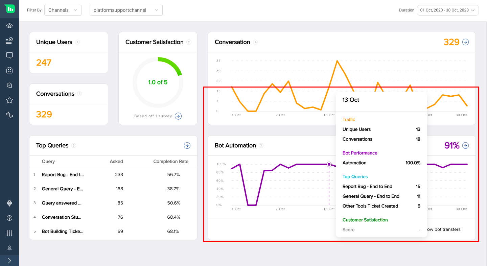

You can get data at any given time point by hovering on the graph.

### Bot Transfers

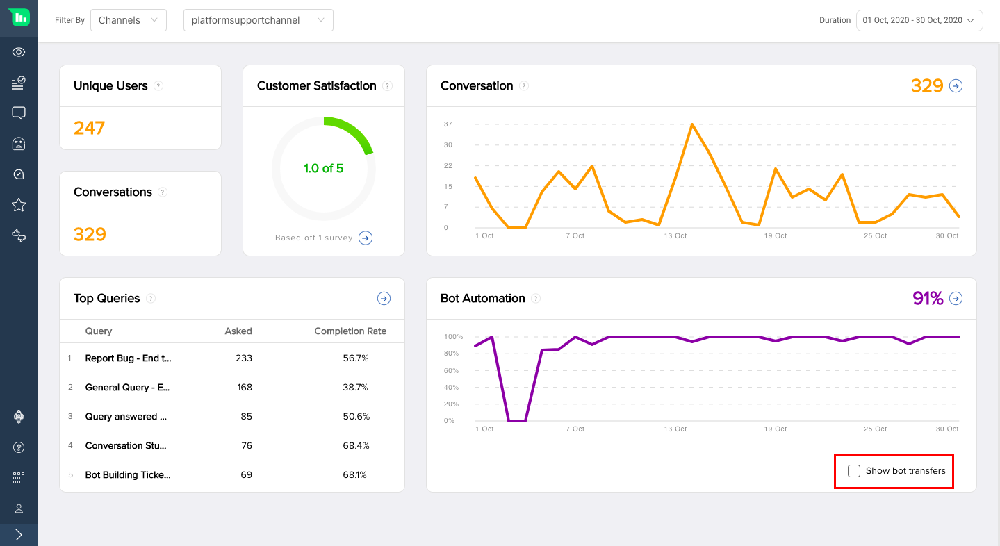

Bot Transfers are shown on the graph too with a vertical line along with a toggle filter to see the details with and without. Checking these lines on the graph will help us understand if there have been any changes in the bot's performance due to bot transfers.
