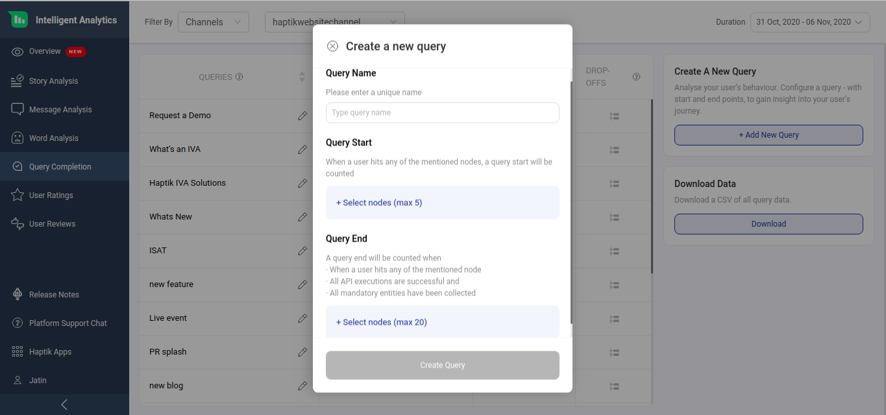

## Introduction

For a business which has deployed an IVA solution, it is imperative to know if the IVA is being able to resolve users’ queries i.e. when users are asking questions, is the IVA able to respond with appropriate responses and not requires a human intervention.

**Query Completion** helps us track how users navigate across different nodes and end up getting their query answered. In other words, it indicates the effectiveness of an IVA. This feature will play an important role to enhance our user journeys and IVA content. Various metrics like completion rate, drop-off rate, drop-off nodes, and query volume help us achieve the same . 

> Nodes are interlinked building blocks of an IVA. Each node takes care of one intent coming from the user and responds appropriately.

All these queries are visible for the duration and business/IVA you have selected on top. Also you can use the **Compare** feature to make comparisons for your IVA's performance between the selected duration and previous duration.

## Queries

A query is a question or a request for information by a user.  On Analytics,  it is a step or a series of steps designed to help user’s reach the end of the flow that gives them the appropriate answer.

For example, a user interacts with a banking assistant and wants to check their account balance. In this case the query name will be “to check account balance”.

## Creating Queries

You can create your own custom queries depending on which IVA usecase you want to track. You can click on "Create a new Query" as shown below.

A query has two parts to it. 

- **Query Start**: User asking for account balance 

- **Query End**: IVA’s response with the account balance

You can specify up to 

- **5 start points**: a set of nodes denoting the beginning of a Query (Query Start). A start point has to be unique for every query ie. multiple queries cannot have the same start point.

- **5 end points**: set of nodes denoting completion of the Query (Query End). 

You can keep adding nodes by clicking on the **+** button as shown below 

For example, if you’d like to track a query of checking account balance the start point could be the node that captures the intent of checking account balance. The end points could be 2 nodes - one that disburses ‘current account balance’ and the other that disburses ‘savings account balance.’

You can also search for nodes on this window as shown below

Once you are done selecting the nodes click on "Create Query" as shown below

> You need to be mindful while creating a new query and choosing the start and end points of those queries keeping real life user messages under consideration as these queries will help you gauge the effectiveness of the IVA.

## Completion Rate

This indicates the effectiveness of the IVA design and flow as it shows what were the queries that were completed by the IVA

Formula =  (A / B) * 100

A = Number of instances where the user query reached the end point and all conditions* are met
B = Number of instances where the user started his journey for a particular query 

i.e. Formula =  (Total no. of queries completed /  Total no. of queries initiated) * 100

**Conditions that need to be met for a query to be counted as complete**

- The user must have arrived at any of the start points
- All API executions through the flow must be successful
- All mandatory entities through the flow should have been collected
- The user must have arrived at any of the end points

For example, if your account balance query contains node A, B, C, F, G, H, and you’ve set up a query with start points as A, B & end points as G,H, here’s how query start and end will be calculated:

## Query Volume

This is the no. of times the start point of a query has been visited by the user.

Scenario 1: If a user visits the same start point sequentially we do NOT increment the query start count

**Example:**

Query Path: A -> C
User Session: A -> A -> A -> C (END)
Result: Query1 completed (Here repeated counts of A are not counted as new query start)
Result: Query Volume -> 1. 

Scenario 2: If a user visits the same start point twice but not sequentially we increment the query start count

**Example:**

Query Path: A -> C
User Session: A -> B -> A -> C (END)
Result: Query started at A and user went to B. User restarted the query at A and completed the query by reaching C.
Result: Query Volume -> 2

## Sorting of Queries

By default, you will see the query with the highest Query Volume on top. This is done in order to quickly check the completion rate of the most visited query. 

If required, you can change the order of other fields and sort it as per your requirement.

## Drop Off 

To understand why a query was not completed, it’s important to know points at which the users are abandoning, restarting or diverting to a different flow. Understanding of WHY the query is not reaching its completion can be found in the drop off section. The insights on messages shared between the IVA and the user along with the Drop Off Nodes can help tweak the conversation design and flow to optimise for better results.

### How are Drop-Offs calculated?

A user could abandon a conversation due to any of the below reasons. The last visited node is marked as the drop-off node under all of these scenarios:

> When any query definition is changed, the drop offs for all other queries will need to be recalculated.

### Drop-Off Points

> Code Node - If Code error , it will show as NULL

> We do not show type of nodes under Drop Off Point

Bot Says and Variants
Entity Variants
Final Response and Variants 
Entity re-prompt dropoff tagging - Message content unavailable
Integration API Response Message -  Not Included
Follow-up Message - Not Included

> No Node Detected -
If no nodes were matched as per User says
Smalltalk
Do any of the smart assists get tagged under no nodes?
 
Some scenarios where node list is empty, the following scenarios happen
If no nodes were matched as per User says
Smalltalk
Do any of the smart assists get tagged under no nodes?

## Deleting Queries

## Download Report

You will be able to download the Query Completion data. It will be available from 10th September on the dashboard. This report will help you understand the reasons of the drop-off in your query.

