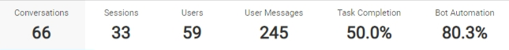

We needed a standard way to track and measure a user's activity. Hence, we introduced "Sessions" as a metric on our Intelligent Analytics tool. This will allow us to track the stickiness of the user. What is the repeat rate of the user. etc

    We started tracking Sessions from 22 Aug 2019. Before this date, we didn't have sessions as a metric. 

## How to define a session?
We can borrow the definition of a session from other applications. “A session is a period of time within which a user interacts with an application. Usually triggered by the opening of an application, a session records the length and frequency of use in an application to show developers, marketers and product managers how much time users spend within an application.”

## Impact Area
1. Move away from conversations to sessions on our Intelligent Analytics tool 
2. Measure session length and change in length to measure impact of bot changes.

## What is a session for every chat regardless of the SDK/Client?
A session is considered closed when 8 minutes passes from the last message. This would mean that we calculate sessions purely on the basis of inactivity i.e. we close a session after 8 minutes of inactivity from the last user, bot or agent message. Hence measuring sessions should be a job of the Intelligent Analytics tool as well as the frontend.

Please note that we have permissioned this out. Every user on our platform has access to certain features. Your user account's permission group need to have *teja_edit_columns_for_messages* feature added for viewing the sessions count on our Intelligent Analytics tool. 
