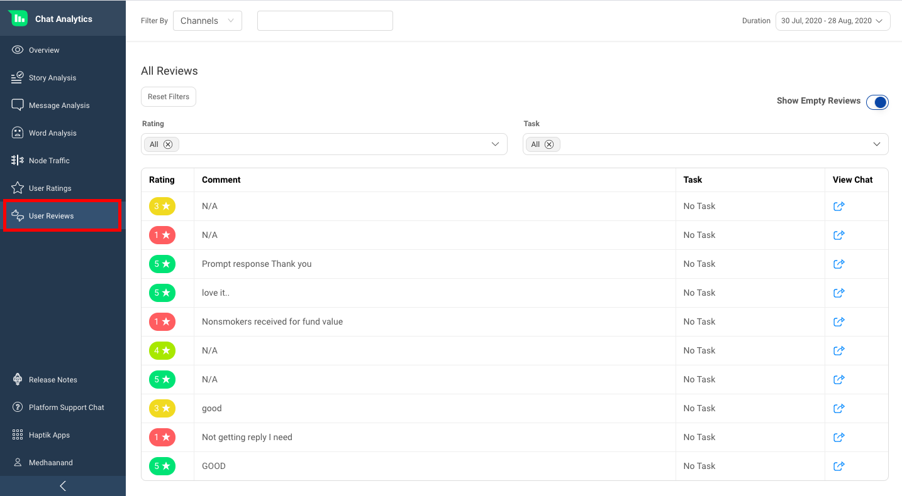
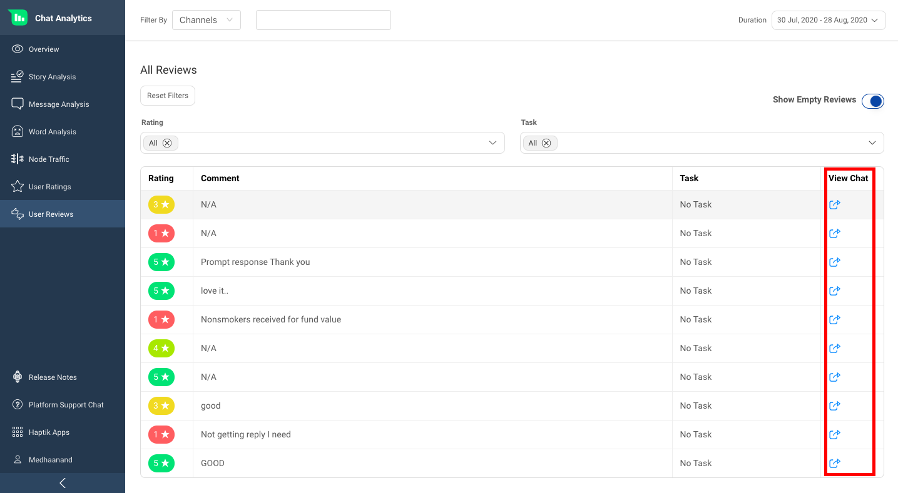
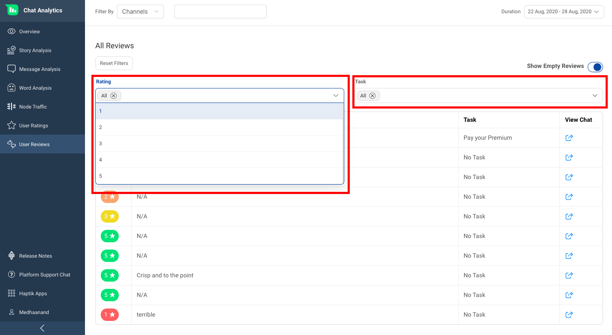

Qualitative feedback is as important as quantitative feedback.

User Review section shows you the feedback that users give at the end of their conversations with the IVA. Reviews have the power to make or break a company’s credibility.

Reading negative feedback, you can use it to make changes to either the product, services or to the IVA design.

The User Review feature allows you to access the complete details of the positive or negative reviews. Through the chat links provided, you can read the entire conversation, to better understand the context of the review.

If you want to remove Empty Reviews and just want to check conversations where user left some comments, you can do that by using the **Show Empty Reviews** toggle as shown below.

Selection based on Ratings and Tasks are also available for more focussed analysis as shown below.

This feature is especially powerful to identify IVA roadblocks and challenges and identify optimization opportunities based on first-hand customer feedback.
