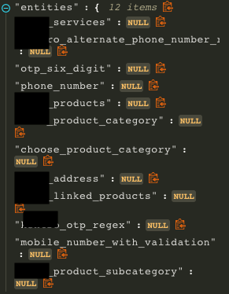
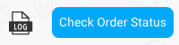
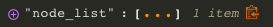

Oh no! Your bot’s not working the way you expected it to? Follow this step by step guide to debug your bot. The failure of the bot can be bucketed into 5 categories

1. **Wrong Bot** getting detected 

	If an undesired bot (domain) is detected, then open the business manager and make sure you have selected the right bot.

	

	Example scenarios - The bot was detected successfully or no active bot was detected, thus default bot was selected No active bot was detected and no default bot was configured. Thus, the fallback bot was selected.

2. **Wrong Node** detected

	There could multiple things going wrong here

	* _User says error_: User says added on a particular node should be added on another node.

    	* If user query is in the scope of the bot, add independent responses in the desired node to make sure that the node is detected.

    	* If user query is out of the scope of the bot, add negative responses in the detected node to make sure the node is not detected for this user says next time.

	* _Connections error_: User transitioned from Node A to a start node instead of moving to connected Node B. This happens because B was not a start node 

 

3. **No Node** detected 

	In cases where no node is detected, chances are that the right node does not have variation that matches the user says. Add the user says to the relevant node and if you want the node to be detected on a new user message, make the node a start node.

4. **No Entity** detected 

	

	When entities are not detected on a node - 

	* For _local entities_ with entity values - Check if the right values are populated in the entity dictionary on the detected node.

	* For _system entities_ - Check if the entity is present on the detected node. 

    	* If it is not present, add it to the node.

    	* If it is present and entity was not detected, reach out to ML support.

5. **Wrong Entity** detected 

	When wrong entity is detected, check if the right entity is present on the detected node.

In any of the cases mentioned above, the following information / concepts might be useful while building debugging guidelines

**Debugging Example**

Lets say you have a node which has following sentences:

* Benefits of SIP
* SIP's benefits
* tell me about benefits of SIP

And while you were testing your bot, following testing
 guidelines, you found out that the bot is giving false
  positives for following sentences:

* Benefits of bvdfbv fjdb
* cricket's benefits
* benefits

then what you should do is:

* Add variations of your sentence with different sentence
 structure + different words with the sentence meaning the same, Eg:
    * Tell me about the advantages of SIP
    * how will i benefit with SIP
    * How is SIP beneficial
    * Good things about SIP
    * I’ve heard SIP is good. Can you tell me how?

* Add negative variations in negative response, Eg:
    * Bhdcbdhvb SIP
    * SIP
    * Benefits njvjdfvnj jnvjdfvjfv SIP SIP
    * how
    * good

#### **Disambiguate message**

How you see the Node list for a user’s message (clicking "*Log*" icon on image above), the bot builder would be able to see all nodes considered for disambiguation message and their specific metadata in “*Log”* view. 

Example Disambiguation logs: 

When you get more than 1 node(s) in the node_list, we send a disambiguate message. In this scenario, you would be able to check

1. More than 1 node detected for disambiguation

2. User says variant matched for each detected node

3. Individual scores for each detected node

For cases when we sent a disambiguate message, but we should not have disambiguated you should add the user’s message as a *user says* variant in the relevant node which ideally should have been detected. 

And scenarios where we did not disambiguate, but **we should have sent a disambiguation message** can’t be found directly. However, as a bot builder we can look for the following to filter cases where disambiguation was needed -

1. User messages on which Bot break happened

2. Bot responses with negative user feedback 

3. Conversations with 1 or 2 rating i.e. low end conversation feedback

> **_Pro Tip -_**
> 
> *Spell correction and normalisation*
> 
> 1. *Training email will contain details related to spelling corrections done by our systems. To learn more, checkout spell correction section*
> 
> 2. *Real time logs will contain dictionary with original words from user query and corresponding spell corrections performed by the system.*
> 
> *If the corrected spelling is wrong, please reach out to ML support with screenshots and details related to expected behavior.*

