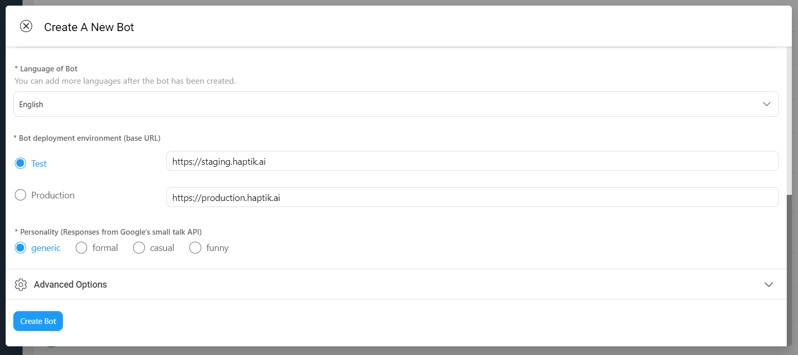
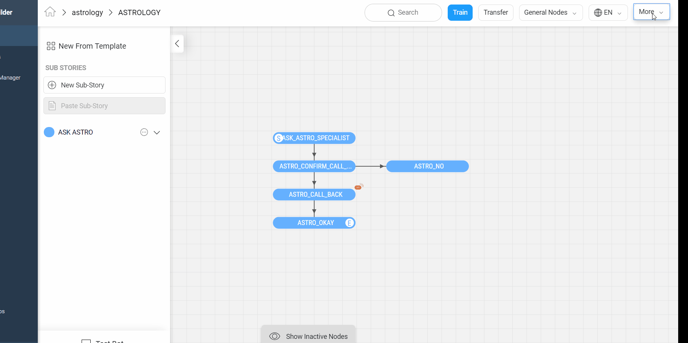
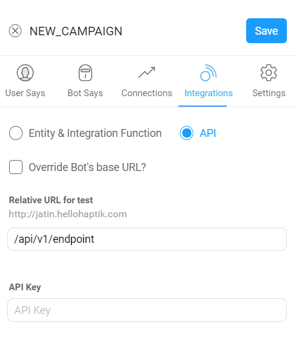

## Node Integrations
Once a particular node has been detected and the mandatory entities have been collected, these entities can be given to custom code to execute your own business logic.

There are 2 different ways to execute this business logic.

### API Functions

_This is internal to Haptik Developers_

### Webhooks

A node can be configured to call a webhook once the required entities have been collected.

To deploy a live webhook that can receive webhook events, your code must be hosted on a public HTTP server that has the following:

- A Valid SSL Certificate
- An open port that accepts `GET` and `POST` requests

There are two ways to use webhooks to integrate external code in your bot. The two ways are:

#### 1. Relative URLs

In the first method, you can set a common base URL for the bot. And then you can add relative paths in the node where the integration is required. This method allows you to set two base URLs, one for the test environment and one for the production environment.

Having environment specific base URLs allows you to easily test your bot with code from different environments. Also because only the production base URL will be used in production, this helps you avoid issues of accidentally having a production bot linked to non production code.

In your test environment you can configure which environment's base URL to use. However, in production only the production environment's base URL will be used. This is to ensure that the bots in production are only referring to production code.


##### Setting up base URL
You can set the environment specific base URLs while creating the bot as shown below.

1. Click on Create Bot
2. Fill details and scroll down to the `Bot deployment environment` section.
3. Enter the environment specific base URLs.




For existing bots you can set or update these URLs by using the `edit bot` option from the top menubar in the bot builder tool.



##### Adding integration endpoint

1. Click on node on which you want to add integration function
2. Select Integration
3. Select API and put API endpoint like shown in image



***Note***: The endpoint uses the environemnt specific base URL of the bot. You can see the URL in the label of the textbox.

#### 2. Override base URLs and use absolute URLs
The second method is to use absolute URLs. There might be times where you want to use an API endpoint on a domain which is different from the base URL. In such cases you can override the base URL as shown below. Just select the override base URL option and enter the full URL including the path in the text box.


Specify the security challenge that will be verified

**Request Method**

POST

**Request Headers**

| Header          | Description                                                  |
| --------------- | ------------------------------------------------------------ |
| Content-Type    | application/json                                             |
| X-Hub-Signature | sha1=signature (The HMAC hex digest of the request body. This header will be sent if the node is configured with a secret. The HMAC hex digest is generated using the sha1 hash function and the secret as the HMAC key.) |


**Request Parameters**

```json
{
  "node": "system name of the node",
  "event": "API_INTEGRATION",
  "user": {
    "user_id": "User ID",
    "user_name": "haptik username",
    "full_name": "",
    "device_platform": 5,
    "language_code": "User's current language",
    "auth_id": "Authentication ID, If AuthInfo Is present else empty string",
    "auth_code": "Authentication Code, If AuthInfo Is present else empty string"
  },
  "conversation_no": 1,
  "entities": {
    "product_id": [
      {
        "detection": "message",
        "original_text": "71",
        "entity_value": "71"
      }
    ],
    "email": [
      {
        "detection": "user_profile",
        "original_text": "test@test.com",
        "entity_value": "test@test.com"
      }
    ],
    "product_name": [
      {
        "detection": "default",
        "original_text": "headphones",
        "entity_value": "headphones"
      }
    ]
  }
}
```

**1. node** - Unique system name of the calling node

> **Nodes** are the interlinked building blocks of a bot. Each node acts like a gatekeeper who detects user inputs, sends out appropriate responses, and directs users to the next node. They are the points where conversation converges or diverges basis the information users input to the bot. Nodes are comprised of several important sub-components, which house important pieces of information. [Read More](https://docs.haptik.ai/bot-builder/basic/creating-nodes#what-is-a-node)

**2. entities** - The entities dictionary will have a key for each entity that is detected e.g. movie_name, venue, phone_number, etc. The value for each entity is a list of dictionary as shown below.

> **Entities**: An entity represents the set of values from which a user’s response must come in order for that user to progress onwards in a conversation. Depending on the context of the conversation, the required response can either be a single value or limited group of specific values from the entity, or any value from within the entity. Entities are always added in connection with the bot’s query the required response is associated with, so that they may detect whether the required response was given. [Read More](https://docs.haptik.ai/bot-builder/basic/entities)

**3. event** - event type e.g. API_INTEGRATION

**4. user** - Dictionary containing user data

**5. conversation_no** - Identifier for the current conversation of the user with this Business

**entity output format**

```json
[
    {
        "entity_value": entity_value,
        "detection": detection_method,
        "original_text": original_text
    }
]
```

Consider the following example for detailed explanation:

"I want to order from mcd"

- entity_value: This will store the value of entity (i.e entity value) that is detected. For example, Mc’Donalds.
- detection: This will store how the entity is detected i.e. whether from message, structured value or fallback value.
- original_text: This will store the actual value that is detected. For example, mcd.

**Response Parameters**

A `200 OK` HTTP Response must be sent back to the Haptik Servers, Failing which a bot break response will be sent to the user. Webhook response must be sent in 30 seconds or less, failing which a bot break response will be sent to the user.
The following additional fields can be specified by the Webhook to control behaviour of the bot and send messages to the user.

```json
{
    "response": [
        "message1",
        "message2",
        ....
    ],
    "status": True/False,
}
```

| Name     | Type    | Description                                                  |
| -------- | ------- | ------------------------------------------------------------ |
| response | array   | List of messages to be sent to the user                      |
| status   | boolean | If status is True, then the decorator will assign the response to success_response. If status is False, then the decorator will assign the response to failure_response |

**status** - Depending on whether the node is an end node or not, the True/False flag can affect the status of the chat.

> If the node is an **end node** and if the integration response returns **status True**, then the chat will be **moved to complete state.**
>
> If the node is an **end node** and if the integration response returns **status False**, then the chat will remain in **Bot state**.
>
> If the node is **not an end node**, then the chat **remains in Bot state** after sending the response irrespective of the status.

**response** -Response will be array of string(s) or hsl(haptik specific language).

for example:

1. Response with single line

   ```python
   {
       "status": True,
       "response": ["phone number seems invalid, please try again"]
   }
   ```

2. Response with multi-line
    ```python
    {
        "status": True,
        "response": ["phone number seems invalid", "please try again"]
    }
    ```

3. Response for Multi-Lingual Bot
    ```python
    language_code = request_body['user']['language_code'] #assuming request_body contains post-data
    if  language_code == 'en':
      message = ["phone number seems invalid, please try again"]
    elif language_code == 'hi':
      message = ["फ़ोन नंबर अमान्य लगता है, कृपया पुनः प्रयास करें"]
    else:
      message = <Any Message as per use case>

   {
      "status": True,
      "response": message # One we created above from conditional logic^^
   }
    ```

3. Response with advanced UI elements [for more detail read here](https://haptik-docs.readthedocs.io/en/latest/bot-builder-advanced/message-elements.html)


 ```json
   {
     "status": true,
     "response": [
       '{
         "text": "COMPLETE BLOOD COUNT; CBC",
         "type": "BUTTON",
         "data": {
           "items": [
             {
               "actionable_text": "View Price",
               "location_required": false,
               "is_default": 0,
               "uri": "LAUNCH_CHANNEL",
               "type": "TEXT_ONLY",
               "payload": {
                 "gogo_message": "",
                 "message": "I want to check the price of this test"
               }
             },
             {
               "actionable_text": "View Details",
               "location_required": false,
               "is_default": 0,
               "uri": "LINK",
               "type": "APP_ACTION",
               "payload": {
                 "url": "XYZ.COM",
                 "gogo_message": ""
               }
             }
           ]
         },
         "isNew": false
       }'
     ]
   }
   ```

As per our pipeline, if there is no response at specific stages, then it will be treated as a Botbreak scenario. So if your Bot Says section on Mogambo doesn't have any response or the integration function doesn't return any response, then a Botbreak message will be sent or the chat will be moved to Pending state depending on whether Human assistance is disabled or enabled respectively.

> So if human_assistance is OFF on business manager => Botbreak message will be sent.
>
> If human_assistance is ON on business manager => Chat will be moved to pending and assigned to an agent.

**Validate Webhook**

The HTTP request will contain an X-Hub-Signature header which contains the SHA1 signature of the request payload, using the secret_key entered for the node, and prefixed with sha1=. Your API can verify this signature to validate the integrity and origin of the payload.

**Sample python code for webhook**

```python
# !/usr/bin/env python

"""
Simple HTTP server in python for handling haptik webhooks.

Usage::
./test_server.py [<port>]

"""
import cgi
import json
import hmac
import hashlib
from BaseHTTPServer import BaseHTTPRequestHandler, HTTPServer


class WebhookServer(BaseHTTPRequestHandler):
    def _set_headers(self, status_code, content_type):
        self.send_response(status_code)
        self.send_header('Content-type', content_type)
        self.end_headers()

    def do_GET(self):
        self._set_headers(status_code=200, content_type='text/html')
        self.wfile.write("<html><body><h1>Test Server</h1></body></html>")

    def do_POST(self):
        content_type, pdict = cgi.parse_header(self.headers.getheader('Content-Type'))

        if content_type != 'application/json':
            self.send_response(400)
            self.end_headers()
            return

        length = int(self.headers.getheader('Content-Length'))
        if not length:
            self.send_response(400)
            self.end_headers()
            return

        body = self.rfile.read(length)
        data = json.loads(body)
        secret_key = 'test'
        hash_value = hmac.new(secret_key, body, hashlib.sha1).hexdigest()
        sha1_signature = 'sha1=' + str(hash_value)
        request_signature = self.headers.getheader('X-Hub-Signature')
        if sha1_signature != request_signature:
            self.send_response(401)
            self.end_headers()
            return

        entities = data['entities']
        product_name = entities['product_name'][0]['entity_value'] if entities.get('product_name') else None
        if product_name == 'speaker':
            message = 'The Wireless Radio Alarm Clock Speaker can be yours only for Rs.1599'
        elif product_name == 'powerbank':
            message = 'The Ambrane Powerbank can be yours only for Rs.1799'
        else:
            self.send_response(400)
            self.end_headers()
            return

        response = {"status": True, "response": [message]}
        self._set_headers(status_code=200, content_type='application/json')
        self.wfile.write(json.dumps(response))

    def run(server_class=HTTPServer, handler_class=WebhookServer, port=80):
        server_address = ('', port)
        httpd = server_class(server_address, handler_class)
        print 'Starting test server...'
        httpd.serve_forever()

if __name__ == "__main__":
    from sys import argv
    if len(argv) == 2:
        run(port=int(argv[1]))
    else:
        run()
```


### Custom Code

A node can also be configured to execute custom code once the required entities have been collected.

To be able to do so, you can use the in-built code editor in Mogambo or paste Python3.6 specific code into the editor and save.

The only requirement is, the code should follow the below format. If any syntax errors or exceptions are raised by the main function, this will result in a botBreak message.

```python
import  json

def main(event, context):
    """
    event['body'] is a string dict with the following keys:
    node, event, user, entities.

    Currently, we pass user_id, user_name, full_name, device_platform and language_code in the user dictionary.

    Args:
        event (dict): Data corresponding to this event
        context

    Returns
        (dict): response with statusCode and the response for the User
    """
    body = json.loads(event['body'])
    entities = body['entities']
    user_data = body['user']
    final_response = {'status': True, 'response': write_here()}
    response = {'statusCode': 200, 'body': json.dumps(final_response), 'headers': {'Content-Type': 'application/json'}}
    return response

def write_here(*args):
    """
   WRITE YOUR CODE HERE and update the final_response dict
   """
    # hsl_list = ['Hello', {}]
    button_hsl = {
        "text": "COMPLETE BLOOD COUNT; CBC",
        "type": "BUTTON",
        "data": {
            "items": [
                {
                    "actionable_text": "View Price",
                    "location_required": False,
                    "is_default": 0,
                    "uri": "LAUNCH_CHANNEL",
                    "type": "TEXT_ONLY",
                    "payload": {
                        "gogo_message": "",
                        "message": "I want to check the price of this test"
                    }
                },
                {
                    "actionable_text": "View Details",
                    "location_required": False,
                    "is_default": 0,
                    "uri": "LINK",
                    "type": "APP_ACTION",
                    "payload": {
                        "url": "XYZ.COM",
                        "gogo_message": ""
                    }
                }
            ]
        },
        "isNew": False
    }
    return [json.dumps(button_hsl)]

```

##### Supported Packages 
1. *Default* - [List of Packages here](https://gist.github.com/gene1wood/4a052f39490fae00e0c3#file-all_aws_lambda_modules_python3-6-txt)
2. *Extra packages* -  
chardet-3.0.4 
gspread-3.1.0 
httplib2-0.13.1 
idna-2.8 
mysqlclient-1.4.2 
oauth2client-4.1.3 
pyasn1-0.4.6 
pyasn1-modules-0.2.6 
pytz-2019.2 
redis-3.2.1 
requests-2.22.0 
rsa-4.0 
six-1.12.0 
unicodecsv-0.14.1 
urllib3-1.25.3


#### Pre-Transfer

`Train Bot` prepares the code for production. Hence, you should make sure to call `Train Bot` if there are any changes in the custom code integration before transferring the bot to production.
## Additional APIs

### Move a chat to pending

This API allows you to move chats for a Bot to an Agent via a `POST` request to the Haptik Platform.

Example URL: `https://<base-url>/integration/external/v1.0/send_chat_to_agent/`

> Note: The `base-url` will be provided by Haptik at the time of integration.


#### Headers

```
Authorization: Bearer <TOKEN>
client-id: <CLIENT_ID>
Content-Type: application/json
```

- Authorization - The Authorization header of each HTTP request should be “Bearer” followed by your token which will be provided by Haptik
- client-id - The client id for your account which will be provided by Haptik
- Content-Type - application/json

#### Request

```json
{
    "team_name": "<Name of the team>",
    "user_name": "<haptik user name>",
    "business_id": <business_id>,
}
```

- user_name (string): Identifier for the User provided by Haptik when invoking the Integration API
- business_id (number): This is a numeric identifier for the channel where the User is messaging
- team_name (string): Name of the team to which the chat is to be assigned. Can be fetched from the Teams page of Agent Chat Tool.

#### Response

A successful request to the API will return a `200` status code with a JSON response object.

```json
{
    "success": true
}
```
- success: Indicates if the API was a success or failure

#### Error Response

If there is any error in the Headers or the Request body, then the Error message will be returned in a JSON as shown below:

```json
{
  "error_message": "user is not registered"
}
```

Here is a list of some possible error messages
|Error Message|Details|
--------------|-------|
|client_id missing in headers|client-id is not passed in the Headers of the request|
|invalid client_id in headers|Incorrect client-id is passed in the headers
|invalid authorization in headers|The Authorization header is not correct
|token missing in headers|The Authorization token is not provided
|invalid token provided|The Authorization token provided is incorrect
|user_name missing in the request|The user_name is not provided in the request body
|business_id missing in the request|The business_id is not provided in the request body
|team_name missing in the request|The team_name is not provided in the request body
|invalid user_name|The user_name provided is not valid for the Partner
|invalid business_id provided|The business_id provided is not valid for the Partner
|business "<business_id>" is inactive|The business is inactive for the Partner
|invalid team_name provided|The team_name is not valid for the Partner
|team "<team_name>" is inactive|The associated Team is inactive
|user has not sent a message|The user has not had any chat on that Business

#### Sample CURL command

```
curl -X POST \
    https://<base-url>/integration/external/v1.0/send_chat_to_agent/ \
  -H 'Authorization: Bearer <TOKEN>' \
  -H 'client-id: <CLIENT_ID>' \
  -H 'Content-Type: application/json' \
  -d '{
    "team_name": "<Name of the team>",
    "user_name": "<haptik user name>",
    "business_id": <business_id>
}
```

### Get Chat History

This API allows you to get the chat history of the user for a conversation via a `GET` request to the Haptik Platform.

Example URL: `https://<base-url>/integration/external/v1.0/get_chat_history/`

> Note: The `base-url` will be provided by Haptik at the time of integration.


#### Headers

```
Authorization: Bearer <TOKEN>
client-id: <CLIENT_ID>
Content-Type: application/json
```

- Authorization - The Authorization header of each HTTP request should be “Bearer” followed by your token which will be provided by Haptik
- client-id - The client id for your account which will be provided by Haptik
- Content-Type - application/json

#### Request Params

```
"conversation_no": "<Conversation no of the chat for the user>",
"user_name": "<haptik user name>",
"business_id": <business_id>,
"limit": "<number of messages>"(optional)
"respose_type": "<response_type>"(optional)
```
Note: Supported response types are `json` and `text`. The default response type is `json`.

#### Response

A successful request to the API will return a `200` status code with a default JSON response object containing chat data.

```json
{  
  "chat_json": [
        {
            "text": "Search places to visit{task}",
            "sender": "user",
            "message_id": 1742
        },
        {
            "text": "TEXT",
            "sender": "bot",
            "message_id": 1743
        }
    ]
}
```

Text type response 
```
{  
  "chat_text": "user: Search places to visit{task}\nbot: TEXT\n"
}

```

- success: Indicates if the API was a success or failure
- sender values: 
    `bot`: message is sent by the bot
    `user`: message is sent by the user
    `agent(<AGENT_NAME>)`: message is sent by the agent <AGENT_NAME> : name of the agent who sent the message

#### Error Response

If there is any error in the Headers or the Request body, then the Error message will be returned in a JSON as shown below:

```json
{
  "error_message": "user has not sent a message"
}
```

Here is a list of some possible error messages
|Error Message|Details|
--------------|-------|
|invalid client_id|Incorrect client-id is passed in the headers
|invalid token|The Authorization token provided is incorrect
|user_name missing|The user_name is not provided in the request params
|business_id missing|The business_id is not provided in the request params
|conversation_no missing|The conversation_no is not provided in the request params
|invalid user_name|The user_name provided is not valid for the Partner
|user has not sent a message|The user has not had any chat on that Business


#### Sample CURL command

```
curl -X POST \
  https://<base-url>/integration/external/v1.0/get_chat_history/?user_name=<user_name>
  &conversation_no=<conversation_no>&business_id=<business_id>&limit=<limit> \
  -H 'Authorization: Bearer <TOKEN>' \
  -H 'client-id: <CLIENT_ID>' \
  -H 'Content-Type: application/json' \
}
```

## Best Practices

**1. Assign Chat to Agent** In some scenarios, where integration response fails or some unknown exception occurs then instead of sending bot break message we can also directly assign chat to an agent for better user experience. <Coming Soon>

**2.Handle textual content** - Everytime we want to change bot's response, a code change is required. To avoid that pain, we can use **key value stores**. Any person with zero to little tech knowledge can change bot response from key value store (with GUI) by updating the message copy corresponding to that unique message key or ID. This message key can be shared with the developer and fetch the response using that key.

**3. HSLs**  - Haptik defines a superset of UI elements that are available across multiple platforms. These UI elements are then converted to their platform equivalent (js-sdk, android, ios, facebook-messenger, etc..) if they are not available on that specific platform. Eg. Forms are converted to quick replies on the Facebook platform and collected over free form. [for more detail read here](https://docs.haptik.ai/hsl/)
