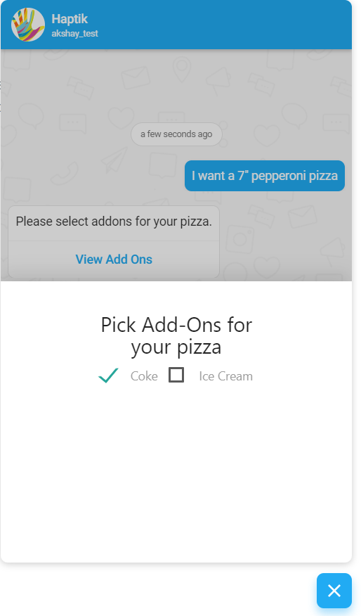

## Overview
Haptik platfrom allows you to open a standard webview, where you can load a webpage right inside the chat window. This let's you offer new and 
better experiences that might not be possible using current HSLs. Using a webview is a quicker way to build custom UI elements compared to building a new HSL.

Webviews can be used to render custom content, take payments or other experiences which may be difficult to offer with HSL messages. 

## Displaying the Webview



### Open a webpage

You can open a web page using a Webview.
> The webpage must be secured i.e. it should start with https.


### Web SDK
You can display a webview by using buttons of type `Open Screen`. To set this follow these steps:

1) Go to bot says and add any new chat element which contains buttons. 
2) Choose the button type as `Open Screen`.
3) Choose screen to open as `Webview`.
4) Enter the link to open.
5) Set the height of the webview. This should be a number between 0 and 1. Here 0 corresponds to 0%, 1 corresponds to 100%.


### Android and iOS SDK
On the android and iOS SDK, the existing functionality can be extended by using native webview of each of the devices.


Apart from the HSL button configuration the Webview can also be displayed by sending a a Smart Action message with the
`SELF_SERVE_WEB` URI

**Smart Action Syntax**

```json
{
  "text": "Enter the message copy here.",
  "type": "BUTTON",
  "data": {
    "items": [
      {
        "actionable_text": "Button message here",
        "location_required": false,
        "uri": "SELF_SERVE_WEB",
        "is_default": 1,
        "type": "APP_ACTION",
        "payload": {
          "url": "<Provide your URL Here>", # This is the URL when the page is hosted
          "link": "",
          "gogo_message": ""
        },
        "emoji": ""
      }
    ]
  }
}
```

> **The Webview needs to be CORS enabled or the link might not work in the chat window.**

## Closing the Webview

### Web SDK
On the Web SDK the webview can be closed and data transferred back to the bot by using the following javascript code:

```javascript
if (window.parent) window.parent.postMessage('<http://haptik-webview//perform-action?action=close&message=HelloWorld!!',> '*')|
```

The action parameter in the URL is used for closing the bot and the message parameter contains the message that needs to be sent when the webview is closed.

### Android and iOS SDK
The webview can be closed by redirecting itself to a url on the
`haptik-webview` domain. The Native application will listen to the a
change on the URL and the webview will be closed and a message, if
present will be sent to the user

```http
http://haptik-webview//perform-action?action=close&message={message}&message_type={message_type}
```

|Query Parameters | Value | Sample |
|-----------------|-------|--------|
| action | The action to be taken on the webview | close|
| message| The message to be sent when the webview is closed | "Thanks for providing the information"|
| message_type | The type of message to be sent | 0| 


#### Message Types

|Message Type | Code |
|-------------|------|
|Regular Message | 0|
|Image    | 1|
|Form     | 17|
|Note     | 21|
|Location | 26|
|TabList  | 31|
|Carousel | 33|
|LaunchBot| 47|
|No Type  | -1|
|Bot Reply Message|18|
|Task Tap Message|38|

## Deploying Webview

You can create your own webpage and host it. The wepage page must be secured i.e. start with https.

> You need to pass the collected information (using entities or fetched from APIs) to the webpage which will be displayed as a webview to the user. Pass the using query parameters.
> 

The following is a sample webpage will be shown as a webview to the user.

`<!DOCTYPE html>
<html lang="en">
<head>
    <meta charset="UTF-8">
    <meta name="viewport" content="width=device-width, initial-scale=1.0">
    <title>Explore Now</title>

    <link rel="stylesheet" href="https://cdn.jsdelivr.net/npm/bootstrap@4.5.3/dist/css/bootstrap.min.css"
        integrity="sha384-TX8t27EcRE3e/ihU7zmQxVncDAy5uIKz4rEkgIXeMed4M0jlfIDPvg6uqKI2xXr2" crossorigin="anonymous">
    <script src="https://code.jquery.com/jquery-3.5.1.slim.min.js"
        integrity="sha384-DfXdz2htPH0lsSSs5nCTpuj/zy4C+OGpamoFVy38MVBnE+IbbVYUew+OrCXaRkfj"
        crossorigin="anonymous"></script>
    <script src="https://cdn.jsdelivr.net/npm/bootstrap@4.5.3/dist/js/bootstrap.bundle.min.js"
        integrity="sha384-ho+j7jyWK8fNQe+A12Hb8AhRq26LrZ/JpcUGGOn+Y7RsweNrtN/tE3MoK7ZeZDyx"
        crossorigin="anonymous"></script>
</head>

<body>
    <div class="container-fluid">
        <div>
            <button onclick="closeWebview()" type="button" class="close" aria-label="Close">
                <span style="font-size: xx-large;" aria-hidden="true">&times;</span>
            </button>

            <div style="text-align: center;">
                
            </div>
            <div class="model-name">
                <strong id="model-name"></strong>
            </div>
            <div id="variant_colors">
            </div>
            <div class="scrolling-wrapper" id="specifications">
            </div>
        </div>
    </div>
    <div class="price-card">
        <div class="row">
            <div class="col">
                <strong id="on-road-price" class="model-price"></strong> <br>
                <span class="model-price-detail" style="opacity: 0.5; font-size: smaller;">Price</span>
            </div>
            <div class="col">
                <button type="button" onclick="bookNow()" class="btn btn-primary model-button">Book now</button>
            </div>
        </div>
    </div>
    <script>
    
<!-- retrive the data you need from URL -->

        const urlParams = new URLSearchParams(window.location.search);
        const variant_specs = JSON.parse(decodeURIComponent(urlParams.get('variant_specs')));
        const variant_colors = JSON.parse(decodeURIComponent(urlParams.get('variant_colors')));
        const model_name = decodeURIComponent(urlParams.get('model_name'));
        const image_url = decodeURIComponent(urlParams.get('image_url'));
        const on_road_price = decodeURIComponent(urlParams.get('on_road_price'));
        const book_now = decodeURIComponent(urlParams.get('book_now'));
        let variant_specs_div = document.getElementById("specifications");
        var modelImageElement = document.getElementById('modelUrl');
        modelImageElement.src = image_url;
        variant_specs.forEach(spec => {
            var outerDiv = document.createElement('div');
            var innerDiv = document.createElement('div');
            innerDiv.className = "card card-block card-1"
            var strongElement = document.createElement('strong');
            strongElement.className = "spec-key"
            strongElement.innerText = spec.label
            var spanElement = document.createElement('span');
            spanElement.className = "spec-value"
            spanElement.innerText = spec.value.substr(0,118)
            innerDiv.appendChild(strongElement);
            innerDiv.appendChild(spanElement);
            outerDiv.appendChild(innerDiv);
            variant_specs_div.appendChild(outerDiv);
        });
        var variant_colors_div = document.getElementById('variant_colors');
        variant_colors.forEach(color => {
            var span = document.createElement('div');
            span.className = "model-color";
            span.style.backgroundColor = color;
            variant_colors_div.appendChild(span);
        });
        var onRoadPriceElement = document.getElementById('on-road-price');
        onRoadPriceElement.innerText = parseInt(on_road_price).toLocaleString('en-IN', {
            maximumFractionDigits: 2,
            style: 'currency',
            currency: 'INR'
        });
        var modelNameElement = document.getElementById('model-name');
        modelNameElement.innerText = model_name
        
<!-- closing function -->    
        function closeWebview() {
            window.parent.postMessage(`http://haptik-webview//perform-action?action=close`, '*');
        }
        function bookNow() {
            console.log("book now", book_now)
            window.open(book_now, '_blank');
        }
    </script>
</body>

</html>
`

